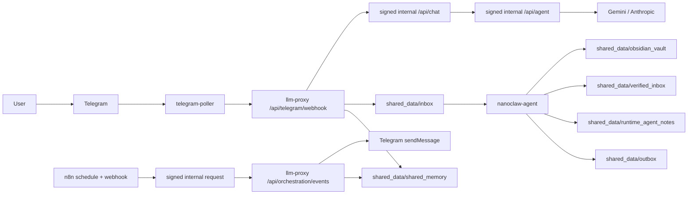

# NanoClaw v2

NanoClaw v2는 `minerva`, `clio`, `hermes` 3개 역할을 분리해 운영하는 Telegram 중심 오케스트레이션 시스템입니다.
사용자 UX는 `Minerva` 하나로 보이고, `Clio`와 `Hermes`는 내부 worker로 동작합니다.

핵심 원칙
- Canonical Agent ID 고정: `minerva`, `clio`, `hermes`
- 단일 게이트: Telegram/n8n -> `llm-proxy`
- 내부 이벤트는 token + HMAC + timestamp + nonce 체인으로만 통과
- 내부 운영 API(`/api/chat`, `/api/agent`, `/api/search`, `/api/runtime-metrics`, `/api/orchestration/events`)는 signed internal gate 뒤에 둠
- 외부 수집 결과는 명령이 아니라 데이터로만 처리
- 최소 권한 런타임: `read_only`, `cap_drop: [ALL]`, `no-new-privileges`, `tmpfs`
- 사용자용 Obsidian vault와 agent/runtime/support 데이터를 분리

## 한눈에 보는 구조


## 지금 구현된 것
- Telegram 일반 대화: `/help`, `/reset`, Minerva 대화, rate-limit, history
- Telegram 인라인 버튼 3종
  - `Clio, 옵시디언에 저장해`
  - `Hermes, 더 찾아`
  - `Minerva, 인사이트 분석해`
- Clio knowledge review Telegram 명령: `/clio_reviews`
- Clio note suggestion Telegram 명령: `/clio_suggestions`
- Clio suggestion 점수/근거/보류 cooldown/자동 Telegram 알림
- Hermes P0/P1/P2 스케줄 수집 + Tavily 검색 + 안전 필터
- Hermes daily briefing은 `tier config -> shared collector -> template -> dedup -> signed orchestration` 구조로 정리됨
- Google Calendar read-only Telegram 명령
  - `/gcal_connect`, `/gcal_status`, `/gcal_today`
- 승인 큐 2단계 확인, 이벤트 컨트랙트 검증, 런타임 메트릭 API
- Minerva working memory 주입, Clio/Hermes role memory 분리
- Clio v2 template-driven Obsidian note 생성
- `/api/orchestration/events` internal auth 강제 + fail-closed 시크릿 로드
- read-only morning preflight와 repair/E2E 검증 분리

## Obsidian 운영 원칙
사용자-facing vault:
- [shared_data/obsidian_vault](/Users/isanginn/Workspace/Agent_Workspace/shared_data/obsidian_vault)

사람이 다시 읽고 재사용할 노트만 이 경로에 둡니다.
- `01-Knowledge/`
- `02-References/`
- `03-Projects/`
- `04-Writing/`
- `05-Daily/`
- `06-MOCs/`
- `Home.md`

다음은 vault 밖에 둡니다.
- runtime note
- verification artifact
- agent support/template file
- queue/raw state/log

runtime/support 경로:
- [shared_data/runtime_agent_notes](/Users/isanginn/Workspace/Agent_Workspace/shared_data/runtime_agent_notes)
- [shared_data/runtime/obsidian_support](/Users/isanginn/Workspace/Agent_Workspace/shared_data/runtime/obsidian_support)
- [shared_data/archive](/Users/isanginn/Workspace/Agent_Workspace/shared_data/archive)

## 빠른 시작
```bash
bash scripts/runtime/compose.sh build
bash scripts/runtime/compose.sh up -d
bash scripts/runtime/compose.sh ps
```

기본 Telegram 수신 경로는 `telegram-poller`이며, 공개 webhook URL 없이 동작합니다.
컨테이너에는 `.env.local` 전체를 넣지 않고, `docker-compose.yml`에서 서비스별 화이트리스트 키만 주입합니다.
호스트 시크릿은 `.env.local` 평문 대신 macOS Keychain/1Password ref를 사용할 수 있으며, `scripts/runtime/compose-env.sh`가 compose 실행 직전 이를 로드합니다.
n8n의 Hermes daily workflow는 `NODE_FUNCTION_ALLOW_BUILTIN=crypto`를 사용해 내부 이벤트 서명을 생성합니다.

## 기본 검증
```bash
npm run verify:daily
npm run verify:smoke
npm run verify:orchestration
npm run verify:telegram:inline
npm run verify:telegram:chat
npm run verify:telegram:gcal
npm run verify:morning:gcal
npm run verify:runtime:drift
npm run verify:clio:format
npm run verify:clio:suggestion
npm run verify:clio:merge
npm run verify:clio:approval
npm run verify:morning:preflight
npm run security:check-orchestration
npm run test:proxy
```

## 문서 읽는 순서

| 문서 | 질문 |
|---|---|
| [docs/ARCHITECTURE.md](docs/ARCHITECTURE.md) | 컴포넌트가 어떻게 연결되고 어떤 데이터가 어디에 남는가? |
| [docs/SECURITY_BASELINE.md](docs/SECURITY_BASELINE.md) | 어떤 위협을 어떤 통제로 막는가? |
| [docs/OPERATIONS_PLAYBOOK.md](docs/OPERATIONS_PLAYBOOK.md) | 오늘 바로 어떻게 기동/검증/장애대응할 것인가? |
| [docs/IMPLEMENTATION_COVERAGE.md](docs/IMPLEMENTATION_COVERAGE.md) | 지금 완료/부분완료/미완료는 무엇인가? |
| [docs/MINERVA_PERSONA_SPEC.md](docs/MINERVA_PERSONA_SPEC.md) | Minerva는 어떤 톤과 구조로 답해야 하는가? |
| [docs/CLIO_V2_SPEC.md](docs/CLIO_V2_SPEC.md) | Clio는 어떤 노트를 어떻게 만들어야 하는가? |
| [docs/MEMORY_SPLIT_SPEC.md](docs/MEMORY_SPLIT_SPEC.md) | runtime timeline, working memory, knowledge memory를 어떻게 분리하는가? |
| [docs/AGENT_SHARED_PIPELINE.md](docs/AGENT_SHARED_PIPELINE.md) | 에이전트가 raw 대화 대신 어떤 artifact를 주고받는가? |

## 현재 운영 최소 조건
1. 컨테이너 Up: `nanoclaw-llm-proxy`, `nanoclaw-telegram-poller`, `nanoclaw-agent`, `nanoclaw-n8n`
2. Telegram bot token/allowlist/bridge secret 설정
3. Google Calendar 사용 시 OAuth callback 경로 유지
4. Obsidian live vault는 [shared_data/obsidian_vault](/Users/isanginn/Workspace/Agent_Workspace/shared_data/obsidian_vault)로 열기

참고
- 컨테이너는 `bash scripts/runtime/compose.sh up -d` 후 터미널을 닫아도 유지됩니다.
- poller dead-letter는 `npm run telegram:dead-letter:replay -- all`로 재주입할 수 있습니다.
- inactive duplicate workflow 정리는 `npm run n8n:purge:inactive`로 실행합니다.
- morning preflight는 `npm run verify:morning:preflight`로 수동 점검할 수 있고, 08:55 KST 자동화 대상으로 설계되었습니다.
- preflight는 read-only 점검만 수행합니다. repair/E2E가 필요하면 `npm run verify:hermes:schedule` 또는 `bash scripts/n8n/bootstrap-hermes-daily-briefing.sh`를 별도로 실행합니다.
- `bash scripts/n8n/bootstrap-hermes-daily-briefing.sh`는 workflow 정의/활성 상태가 이미 일치하면 no-op으로 종료합니다.
