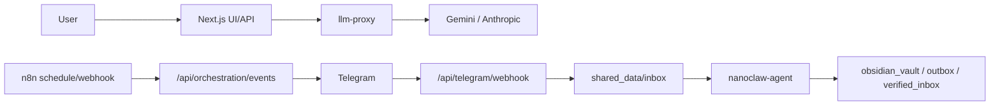

# NanoClaw v2

NanoClaw v2는 `minerva`, `clio`, `hermes` 3개 에이전트를 역할 분리해 운영하는 로컬 우선 오케스트레이션 시스템입니다.

핵심 원칙
- Canonical Agent ID 고정: `minerva`, `clio`, `hermes`
- 모델 호출 단일 게이트: Next.js -> `llm-proxy`
- 외부 수집 결과 Zero-Trust: 명령이 아닌 데이터로만 처리
- 최소 권한 런타임: `read_only`, `cap_drop: [ALL]`, `no-new-privileges`

## 30초 구조


## 바로 실행
```bash
npm run runtime:prepare
docker compose build
docker compose up -d
```

## 문서 읽는 순서

| 문서 | 이 문서가 답하는 질문 | 포함 | 제외 |
|---|---|---|---|
| [docs/ARCHITECTURE.md](docs/ARCHITECTURE.md) | 시스템이 어떻게 연결되는가? | 컴포넌트, 데이터 플로우, 경계 | 장애 대응 절차, 운영 커맨드 |
| [docs/SECURITY_BASELINE.md](docs/SECURITY_BASELINE.md) | 무엇을 어떻게 막는가? | 위협-통제 매핑, 검증 체인 | 서비스 기동 순서 |
| [docs/OPERATIONS_PLAYBOOK.md](docs/OPERATIONS_PLAYBOOK.md) | 오늘 바로 어떻게 운영하는가? | Day-1/Day-2 절차, 트러블슈팅 | 내부 설계 배경 |
| [docs/USE_CASES.md](docs/USE_CASES.md) | 사용자가 어떤 결과를 받는가? | 시나리오별 입력/출력/산출물 | 전체 시스템 상세 구조 |
| [docs/HERMES_SOURCE_PRIORITY.md](docs/HERMES_SOURCE_PRIORITY.md) | Hermes는 무엇을 어떤 우선순위로 수집하는가? | P0/P1/P2 소스·포맷 정책 | 보안 전 범위 |

## 현재 운영 최소 조건

아래 4개가 살아 있어야 실사용이 됩니다.
1. 컨테이너: `nanoclaw-frontend`, `nanoclaw-agent`, `nanoclaw-llm-proxy`, `nanoclaw-n8n`
2. 프론트/API: `http://127.0.0.1:3000` (`next start`, 컨테이너 내부)
3. (외부 Telegram webhook 사용 시) 공개 HTTPS 터널 1개

참고
- 컨테이너는 `docker compose up -d`로 띄우면 터미널 종료 후에도 유지됩니다.
- UI 병렬 개발이 필요하면 별도 포트로 `npm run dev -- --hostname 127.0.0.1 --port 3030`를 사용합니다.

## 최신 반영 포인트
- Telegram 인라인 버튼
  - `Clio, 옵시디언에 저장해`
  - `Hermes, 더 찾아`
  - `Minerva, 인사이트 분석해`
- Hermes 딥다이브 후 Minerva 후속 분석 자동 생성 옵션
  - `HERMES_DEEP_DIVE_AUTO_MINERVA=true`
- DeepL 번역 절감 정책
  - `P0`: summary + 상위 2개 snippet
  - `P1`: summary + 상위 1개 snippet
  - `P2`: 자동 번역 없음

## 기본 검증
```bash
npm run verify:smoke
npm run verify:orchestration
npm run verify:telegram:inline
npm run security:check-orchestration
```
