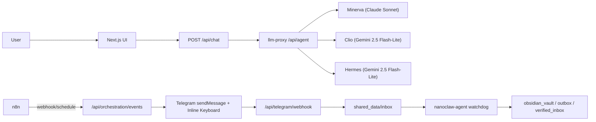
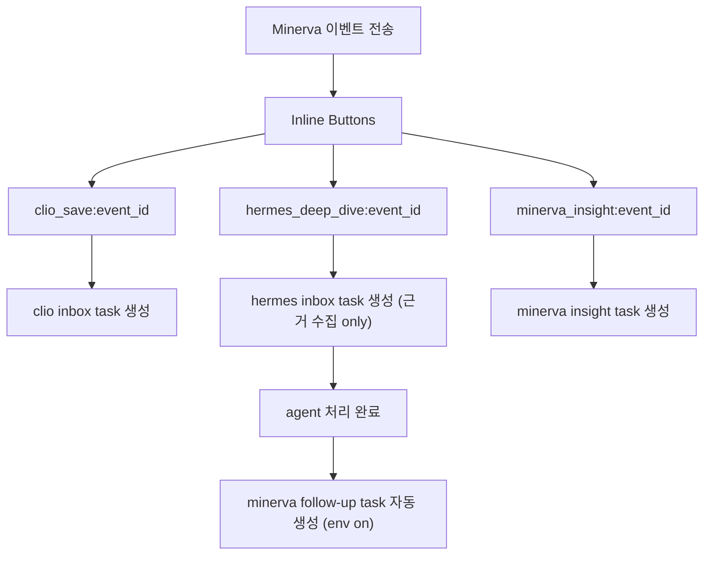

# NanoClaw v2

NanoClaw v2는 `minerva`, `clio`, `hermes` 3개 Canonical Agent ID를 기준으로 역할 경계를 분리하고,  
`llm-proxy` 단일 게이트 + 내부 서명 검증(HMAC) + 최소 권한 컨테이너 운영을 기본값으로 둔 구조입니다.

## Core Principles
- Canonical Agent ID only: `minerva`, `clio`, `hermes`
- Single LLM gateway: Next.js -> `/api/chat` -> `llm-proxy`
- Zero-trust external data: 검색 결과는 실행하지 않고 데이터로만 처리
- Least-privilege runtime: `read_only`, `cap_drop: ALL`, `no-new-privileges`, network split
- Extensible providers: Gemini 기본 + Anthropic(Sonnet) 확장 경로 준비

## Runtime Profile (2026-03-03)
- 모델 라우팅은 환경변수 기반:
  - primary: `MODEL_MINERVA`, `MODEL_CLIO`, `MODEL_HERMES`
  - fallback: `MODEL_FALLBACK_MINERVA/CLIO/HERMES`
  - provider: `LLM_PROVIDER=auto|gemini|anthropic|mock`
- `LLM_PROVIDER=auto`에서는 모델명(`claude*`)을 우선 힌트로 사용해 Gemini/Anthropic 호출 경로를 선택한다.
- 운영 예시(선택 프로필):
  - `minerva`: `claude-sonnet-4-6`
  - `clio`: `gemini-2.5-flash-lite`
  - `hermes`: `gemini-2.5-flash-lite`
- Hermes 자동화 워크플로우:
  - `Hermes Daily Briefing Workflow` (KST 오전/오후 스케줄)
  - `Hermes Web Search Workflow` (Tavily webhook)
- Telegram 인라인 액션:
  - `Clio, 옵시디언에 저장해`
  - `Hermes, 더 찾아` (근거 수집 전용)
  - `Minerva, 인사이트 분석해`
- `Hermes, 더 찾아` 처리 완료 후 `HERMES_DEEP_DIVE_AUTO_MINERVA=true`면 Minerva 후속 분석 task 자동 생성

## Topology (Mermaid)


## Telegram Inline Flow (Mermaid)


## Documentation Index
- Commit baseline (필독): [`docs/COMMIT_BASELINE_V2.md`](docs/COMMIT_BASELINE_V2.md)
- Architecture: [`docs/ARCHITECTURE.md`](docs/ARCHITECTURE.md)
- Security baseline: [`docs/SECURITY_BASELINE.md`](docs/SECURITY_BASELINE.md)
- Operations playbook: [`docs/OPERATIONS_PLAYBOOK.md`](docs/OPERATIONS_PLAYBOOK.md)
- Rebuild plan: [`docs/PLAN_V2.md`](docs/PLAN_V2.md)

## Quick Start
```bash
docker compose build
docker compose up -d
docker compose ps
```

## Verification
```bash
npm run test:proxy
npm run verify:smoke
npm run verify:llm-usage
npm run verify:orchestration
npm run verify:telegram:inline
npm run verify:clio-e2e
npm run security:check-orchestration
```

## Telegram Rehearsal
1. Local inline callback dry-run (no external webhook required):
```bash
npm run verify:telegram:inline
```
2. Public HTTPS endpoint 준비 후 webhook 등록:
```bash
TELEGRAM_WEBHOOK_PUBLIC_BASE=https://<your-public-domain-or-tunnel>
npm run telegram:webhook:set
npm run telegram:webhook:info
```
3. 실제 브리핑 발송 + 인라인 버튼 클릭 리허설:
```bash
npm run telegram:rehearsal:send
```

## Service Endpoints
- Frontend: `http://localhost:3000`
- llm-proxy health: `http://localhost:8001/health`
- n8n: `http://localhost:5678`
- Minerva orchestration event ingest: `POST /api/orchestration/events`
- Telegram callback webhook: `POST /api/telegram/webhook`
- Google Calendar OAuth start: `GET /api/integrations/google-calendar/oauth/start`
- Google Calendar OAuth callback: `GET /api/integrations/google-calendar/oauth/callback`
- Google Calendar today events: `GET /api/integrations/google-calendar/today`
