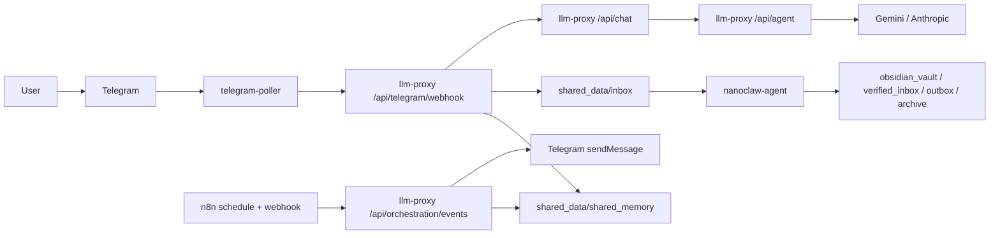

# NanoClaw v2

NanoClaw v2는 `minerva`, `clio`, `hermes` 3개 에이전트를 역할 분리해 운영하는 Telegram 중심 오케스트레이션 시스템입니다.
사용자 경험은 `Minerva` 하나로 노출하고, `Clio`/`Hermes`는 내부 worker로 동작합니다.

핵심 원칙
- Canonical Agent ID 고정: `minerva`, `clio`, `hermes`
- 단일 게이트: Telegram/n8n -> `llm-proxy`
- 외부 수집 결과 Zero-Trust: 명령이 아닌 데이터로만 처리
- 최소 권한 런타임: `read_only`, `cap_drop: [ALL]`, `no-new-privileges`, `tmpfs`

## 한눈에 보는 구조


## 지금 구현된 것
- Telegram 인라인 버튼 3종
  - `Clio, 옵시디언에 저장해`
  - `Hermes, 더 찾아`
  - `Minerva, 인사이트 분석해`
- Minerva Telegram 대화(`/help`, `/reset`, rate-limit, history)
- Clio knowledge review Telegram 명령(`/clio_reviews`)
- Hermes P0/P1/P2 스케줄 수집 + 카테고리 분류 + 안전 필터
- DeepL 번역 절감 정책(P0/P1 선택 번역)
- Google Calendar read-only Telegram 명령
  - `/gcal_connect`, `/gcal_status`, `/gcal_today`
- 승인 큐(2단계 확인), 이벤트 컨트랙트 검증, 런타임 메트릭 API

## 빠른 시작
```bash
bash scripts/runtime/compose.sh build
bash scripts/runtime/compose.sh up -d
```

기본 Telegram 수신 경로는 `telegram-poller`이며, 공개 webhook URL 없이 동작합니다.
컨테이너에는 `.env.local` 전체를 넣지 않고, `docker-compose.yml`에서 서비스별 화이트리스트 키만 주입합니다.
호스트 시크릿은 `.env.local` 평문 대신 macOS Keychain/1Password ref를 사용할 수 있으며, `scripts/runtime/compose-env.sh`가 compose 실행 직전 이를 로드합니다.

## 기본 검증
```bash
npm run verify:daily
npm run verify:smoke
npm run verify:orchestration
npm run verify:telegram:inline
npm run verify:telegram:chat
npm run verify:telegram:gcal
npm run verify:morning:gcal
npm run verify:runtime:drift
npm run verify:clio:format
npm run security:check-orchestration
npm run test:proxy
```

## 문서 읽는 순서

| 문서 | 이 문서가 답하는 질문 |
|---|---|
| [docs/ARCHITECTURE.md](docs/ARCHITECTURE.md) | 컴포넌트가 어떻게 연결되고 데이터가 어디로 흐르는가? |
| [docs/SECURITY_BASELINE.md](docs/SECURITY_BASELINE.md) | 어떤 위협을 어떤 통제로 막는가? |
| [docs/OPERATIONS_PLAYBOOK.md](docs/OPERATIONS_PLAYBOOK.md) | 오늘 바로 어떻게 기동/검증/장애대응할 것인가? |
| [docs/IMPLEMENTATION_COVERAGE.md](docs/IMPLEMENTATION_COVERAGE.md) | 지금 구현 완료/부분완료/미완료는 무엇인가? |
| [docs/AGENT_SHARED_PIPELINE.md](docs/AGENT_SHARED_PIPELINE.md) | Minerva/Clio/Hermes/Aegis는 무엇을 어떤 계약으로 주고받는가? |
| [docs/MINERVA_PERSONA_SPEC.md](docs/MINERVA_PERSONA_SPEC.md) | Minerva는 어떤 톤과 판단 규칙으로 사용자와 대화해야 하는가? |
| [docs/CLIO_V2_SPEC.md](docs/CLIO_V2_SPEC.md) | Clio는 Obsidian 지식 편집 에이전트로 무엇을 입력받고 무엇을 산출해야 하는가? |
| [docs/MEMORY_SPLIT_SPEC.md](docs/MEMORY_SPLIT_SPEC.md) | runtime timeline, working memory, knowledge memory를 어떻게 분리할 것인가? |
| [docs/USE_CASES.md](docs/USE_CASES.md) | 사용자 액션별 입력/처리/산출물은 무엇인가? |
| [docs/HERMES_SOURCE_PRIORITY.md](docs/HERMES_SOURCE_PRIORITY.md) | Hermes 수집 우선순위/카테고리/포맷 정책은 무엇인가? |
| [docs/PRE_VPS_GATES.md](docs/PRE_VPS_GATES.md) | VPS 전환 전에 무엇을 반드시 끝내야 하는가? |
| [docs/AEGIS_PLAN.md](docs/AEGIS_PLAN.md) | Aegis 운영 감시자를 어떻게 설계/도입할 것인가? |

## 현재 운영 최소 조건
1. 컨테이너 Up: `nanoclaw-llm-proxy`, `nanoclaw-telegram-poller`, `nanoclaw-agent`, `nanoclaw-n8n`
2. Telegram bot token/allowlist/bridge secret 설정
3. Google Calendar 사용 시 OAuth callback 경로 유지

참고
- 컨테이너는 `bash scripts/runtime/compose.sh up -d` 후 터미널을 닫아도 유지됩니다.
- poller dead-letter는 `npm run telegram:dead-letter:replay -- all`로 재주입할 수 있습니다.
- inactive duplicate workflow 정리는 `npm run n8n:purge:inactive`로 실행합니다.
