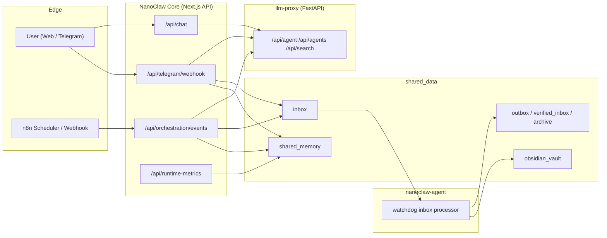

# NanoClaw v2

NanoClaw v2는 `minerva`, `clio`, `hermes` 3개 에이전트를 역할 분리해 운영하는 로컬 우선 오케스트레이션 시스템입니다.
핵심은 "보안 경계는 강화하고, 스파게티 결합은 제거"입니다.

## v1 대비 핵심 개선

| 항목 | 이전(문제) | 현재(v2) | 왜 중요한가 |
|---|---|---|---|
| Agent ID | 곳곳에 중복/드리프트 | Canonical only (`minerva/clio/hermes`) | 역할 혼선/오작동 방지 |
| LLM 호출 경로 | 호출 경로 분산 | Next.js -> llm-proxy 단일 게이트 | 보안/관측/재시도 일원화 |
| 정책 판단 | 라우트별 분산 규칙 | 중앙 Policy Engine | 동작 일관성/디버깅 단순화 |
| 이벤트 계약 | 암묵적 JSON | Event Contract v1 + strict 게이트 | 워크플로 변경 시 런타임 장애 감소 |
| Telegram 고위험 액션 | 단발 실행 위험 | 2단계 승인 + TTL + 프론트 에스컬레이션 | 오발송/오실행 방지 |
| 확장 구조 | 하드코딩 분기 누적 | Capability Registry + Adapter | 기능 추가 시 코어 수정 최소화 |
| 메모리 운영 | 누적 비용 급증 | 2단계 압축(저비용 선처리 -> 고성능 추론) | 비용/지연 안정화 |
| 운영 관측성 | 체감 기반 운영 | runtime-metrics (LLM/오케스트레이션/DeepL) | 장애 탐지/튜닝 속도 향상 |

## 30초 아키텍처



## 문서 읽는 순서

1. [docs/V2_REBUILD_REPORT.md](docs/V2_REBUILD_REPORT.md): 무엇이 왜 바뀌었는지(의사결정 중심)
2. [docs/ARCHITECTURE.md](docs/ARCHITECTURE.md): 컴포넌트/데이터 플로우/책임 경계
3. [docs/SECURITY_BASELINE.md](docs/SECURITY_BASELINE.md): 위협-통제 매핑/검증 체인
4. [docs/OPERATIONS_PLAYBOOK.md](docs/OPERATIONS_PLAYBOOK.md): Day-1/Day-2 운영 절차
5. [docs/USE_CASES.md](docs/USE_CASES.md): 실제 사용자 시나리오/산출물
6. [docs/HERMES_SOURCE_PRIORITY.md](docs/HERMES_SOURCE_PRIORITY.md): Hermes 수집 우선순위 정책

## 빠른 기동

```bash
npm run runtime:prepare
docker compose build
docker compose up -d
docker compose ps
```

## 기본 검증

```bash
npm run verify:event-contract
npm run verify:orchestration
npm run verify:telegram:inline
npm run security:check-orchestration
```
