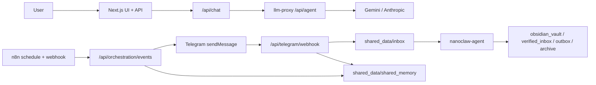

# NanoClaw v2

NanoClaw v2는 `minerva`, `clio`, `hermes` 3개 에이전트를 역할 분리해 운영하는 로컬 우선 오케스트레이션 시스템입니다.

핵심 원칙
- Canonical Agent ID 고정: `minerva`, `clio`, `hermes`
- 모델 호출 단일 게이트: Next.js `/api/chat` -> `llm-proxy`
- 외부 수집 결과 Zero-Trust: 명령이 아니라 inert data로 처리
- 최소 권한 런타임: `read_only`, `cap_drop: [ALL]`, `no-new-privileges`, `tmpfs`

## 한눈에 보는 구조


## 지금 실제로 구현된 것
- Telegram 인라인 버튼 3종
  - `Clio, 옵시디언에 저장해`
  - `Hermes, 더 찾아`
  - `Minerva, 인사이트 분석해`
- Hermes deep-dive 완료 후 Minerva 후속 분석 자동 생성 옵션
  - `HERMES_DEEP_DIVE_AUTO_MINERVA=true`
- P0/P1/P2 스케줄 수집 + 카테고리/이모지 매핑 + 보안 필터
- DeepL 비용 절감 번역 정책
  - P0: summary + 상위 2개 snippet
  - P1: summary + 상위 1개 snippet
  - P2: 자동 번역 없음
- Minerva 텔레그램 일반 대화(`/help`, `/reset`, rate-limit, history)
- Google Calendar read-only OAuth 연동(아침 브리핑 합성)
- Auto PR + Auto Merge 워크플로(브랜치 push -> PR upsert -> auto-merge 시도)

## 빠른 시작
```bash
docker compose build
docker compose up -d
npm run dev -- --hostname 127.0.0.1 --port 3000
```

Telegram webhook 공개 URL이 필요하면(예: localtunnel/ngrok):
```bash
npm run telegram:webhook:set
npm run telegram:webhook:info
```

## 기본 검증
```bash
npm run verify:smoke
npm run verify:orchestration
npm run verify:telegram:inline
npm run security:check-orchestration
npm run test:proxy
```

## 문서 읽는 순서

| 문서 | 이 문서가 답하는 질문 |
|---|---|
| [docs/IMPLEMENTATION_COVERAGE.md](docs/IMPLEMENTATION_COVERAGE.md) | 지금까지 작업이 어디까지 구현됐는가? (완료/부분완료/미완료) |
| [docs/ARCHITECTURE.md](docs/ARCHITECTURE.md) | 컴포넌트가 어떻게 연결되고 데이터가 어디로 흐르는가? |
| [docs/SECURITY_BASELINE.md](docs/SECURITY_BASELINE.md) | 어떤 위협을 어떤 통제로 막고 있는가? |
| [docs/OPERATIONS_PLAYBOOK.md](docs/OPERATIONS_PLAYBOOK.md) | 오늘 바로 어떻게 기동/검증/장애대응할 것인가? |
| [docs/USE_CASES.md](docs/USE_CASES.md) | 사용자 액션별 입력/처리/산출물은 무엇인가? |
| [docs/HERMES_SOURCE_PRIORITY.md](docs/HERMES_SOURCE_PRIORITY.md) | Hermes 수집 우선순위/카테고리/포맷 정책은 무엇인가? |

## 현재 운영 최소 조건
1. 컨테이너 Up: `nanoclaw-llm-proxy`, `nanoclaw-agent`, `nanoclaw-n8n`
2. 프론트 서버 Up: `npm run dev` (`127.0.0.1:3000`)
3. Telegram 실운영 시 webhook public URL 유지

참고
- 컨테이너는 `docker compose up -d` 후 터미널을 닫아도 유지됩니다.
- `npm run dev`는 터미널 프로세스이므로 종료하면 함께 내려갑니다.
