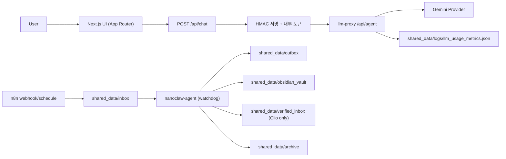
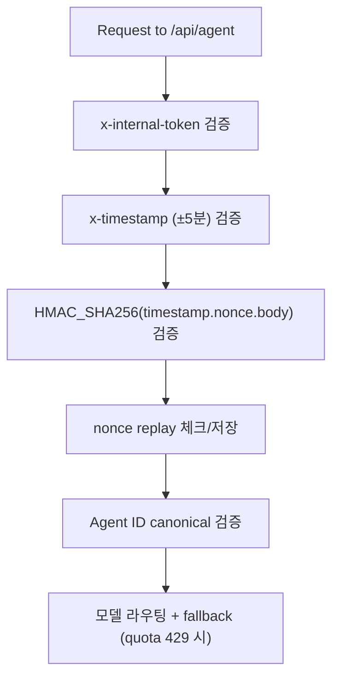
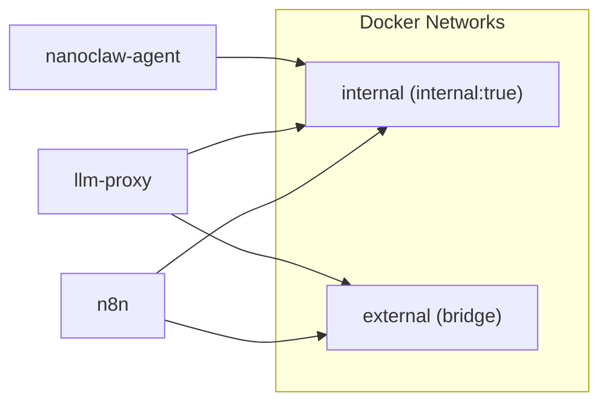
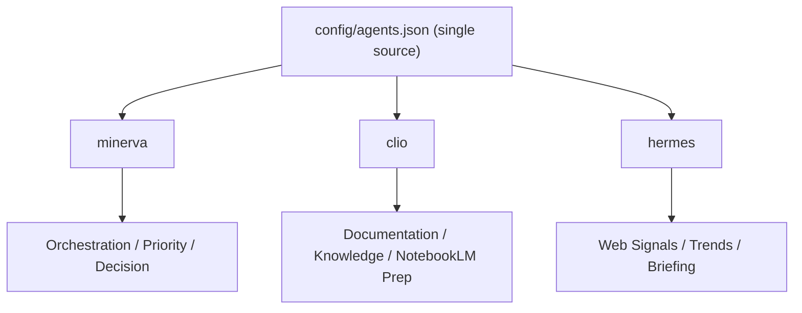
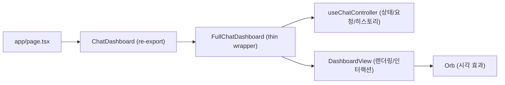

# NanoClaw v2 Commit Baseline (for `Personal-AI-agent-v2`)

대상 원격 저장소: [Personal-AI-agent-v2](https://github.com/Merchantlee99/Personal-AI-agent-v2.git)  
기준 날짜: 2026-03-02  
핵심 원칙: Canonical Agent ID(`minerva`, `clio`, `hermes`)만 허용, 단일 게이트(`llm-proxy`) 강제, 최소 권한 운영.

## 1. 이 문서를 만든 이유
- v1 계열의 가장 큰 문제는 역할/라우팅/보안 검증/운영 스크립트가 얽혀 변경 충돌이 자주 났다는 점이다.
- v2는 기능 추가보다 먼저 경계(Agent boundary, trust boundary, network boundary)를 고정해 스파게티 재발을 막는 것을 우선했다.
- 이 문서는 이후 커밋이 구조를 깨지 않도록 “왜 이 구조인지”와 “어떤 단위로 커밋해야 하는지”를 함께 고정한다.

## 2. 현재 운영 구조 (Mermaid)

## 3. 보안 구조 (Mermaid)

## 4. 에이전트 구조/역할 경계 (Mermaid)

역할 경계 규칙:
- `minerva`: 최종 우선순위/의사결정 담당. 외부 검색 실행 주체가 아님.
- `clio`: 문서화/지식 구조화 담당. 트렌드 최종 판단 주체가 아님.
- `hermes`: 수집/브리핑 담당. 최종 전략 의사결정 주체가 아님.

ID 규칙:
- 허용 ID: `minerva`, `clio`, `hermes` (canonical only)
- 구 ID(`ace`, `owl`, `dolphin`)는 운영 입력으로 허용하지 않음.

## 5. 프론트 구조 (Mermaid)

분해 이유:
- `FullChatDashboard` 단일 컴포넌트 모놀리스를 분리해서 병렬 작업 충돌을 줄였다.
- 상태 로직과 뷰를 분리해 회귀 범위를 좁혔다.
- 스타일은 CSS module 중심으로 이동해 인라인 스타일 드리프트를 줄였다.

## 6. 이전 레포 대비 보안 개선점
- 단일 게이트 강제: 프론트 직접 모델 호출 제거, `llm-proxy` 경유 고정.
- 요청 무결성: token + timestamp + HMAC + nonce replay 보호 기본화.
- nonce 저장 순서 보정: 무효 서명 요청이 replay cache를 오염시키지 않도록 처리 순서 개선.
- 컨테이너 하드닝: `read_only`, `cap_drop: ALL`, `no-new-privileges`, `tmpfs`.
- 네트워크 경계: `internal`/`external` 분리, 에이전트 internal-only.
- Prompt Injection 방어: `/api/search` 결과를 실행하지 않고 데이터로만 전달.
- 운영 가시성: 일별 LLM usage metrics 저장 및 429 알림.

## 7. 아직 남은 보안 과제
- 비밀값 관리: `.env.local` 기반(시크릿 매니저/자동 로테이션 미도입).
- replay 저장소: 인메모리 단일 프로세스(수평 확장 대비 저장소 분리 필요).
- API rate-limit/WAF 계층: 현재 애플리케이션 레벨 제한 미흡.
- egress allowlist: 외부 통신 도메인 제어 정책 미완성.
- n8n 인증/접근통제: 운영환경에서 Basic Auth/IP 제한 정책 강화 필요.

## 8. 커밋 단위 원칙 (중요)
- 한 커밋 = 한 책임.
- 구조 변경(UI 분해)와 정책 변경(보안/ID 룰)을 같은 커밋에 섞지 않는다.
- 테스트/검증이 없는 구조 변경 커밋은 금지한다.
- 문서 커밋은 코드 커밋 직후 같은 주제로 붙여 드리프트를 줄인다.

권장 커밋 예시:
1. `refactor(ui): split dashboard controller and view`
2. `feat(proxy): enforce canonical-only agent ids`
3. `feat(security): harden internal signature verification flow`
4. `chore(ops): add smoke/runtime verification scripts`
5. `docs(architecture): update baseline mermaid diagrams`

## 9. 커밋 전 체크리스트
- [ ] `npm run build`
- [ ] `npm run test:proxy`
- [ ] `npm run verify:smoke` (쿼터 429로 실패 시 원인 분리 기록)
- [ ] `docker compose ps`에서 3서비스 healthy 확인
- [ ] `config/agents.json`의 canonical/role 일치 확인
- [ ] 문서(`ARCHITECTURE`, `SECURITY_BASELINE`, `OPERATIONS_PLAYBOOK`) 동기화 확인

## 10. 새 레포 초기 반영 순서
1. `main` 보호 규칙 설정 (PR 필수 + status check 필수).
2. 본 문서(`COMMIT_BASELINE_V2.md`)와 `docs/*` 3종 먼저 반영.
3. 코드 반영은 “구조 -> 보안 -> 운영 스크립트 -> 문서” 순으로 나눠 커밋.
4. 각 PR에서 Mermaid 다이어그램 diff를 함께 리뷰해 경계 파손을 조기 탐지.
