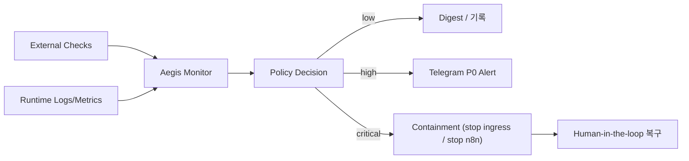

# Aegis Plan (기획 전용, 미배포)

상태: **Planning only**  
중요: Aegis는 Canonical Agent ID 체계(`minerva`, `clio`, `hermes`)에 포함되지 않는 운영 감시자입니다.

## 1) 역할 정의
- 목적: 보안/운영 이상 징후를 상시 감시하고, 위험 시 자동 격리(containment)까지 수행
- 범위:
  - 감시: health, webhook, 스케줄, 인증 실패, 비용 이상치
  - 자동 실행: 제한된 긴급 중지 액션만
  - 금지: 코드 수정/자율 복구/정책 우회

## 2) 입력 신호
- `/health`(frontend/proxy/n8n) 상태
- `/api/runtime-metrics` (telegram success rate, pending approvals, deepl success rate)
- Telegram webhook 상태(`getWebhookInfo`, pending/error)
- 브리핑 도착 SLO(09:05 cut)
- 인증 이벤트(allowlist mismatch, signature/replay/rate-limit)
- LLM usage 이상치(429/fallback/급증)

## 3) 출력/행동
- P0 즉시 알림(텔레그램)
- P1/P2 다이제스트 기록
- 자동 격리 액션(화이트리스트 기반):
  - ingress 차단(예: tunnel 중지)
  - n8n 일시 중지
- 모든 고위험 액션은 감사로그 남김

## 4) 안전장치
- Aegis 액션 allowlist 고정(임의 shell 금지)
- Telegram 승인 2단계 + TTL 300초
- 실행 주체/시각/이유를 `shared_data/shared_memory`에 기록
- Aegis 비활성화 토글 제공(`AEGIS_ENABLED=false`)

## 5) 단계별 도입
### Phase A (권장 즉시)
- 감시 전용(read-only): 알림만 전송, 자동 액션 없음

### Phase B
- 자동 격리 2개만 허용:
  - ingress 중지
  - n8n 중지

### Phase C
- 외부 모니터(별도 런타임) 추가
- 단일 VPS compromise 시 감시 무력화 리스크 완화

## 6) 성공 기준
- 장애 원인 미식별 케이스 제거
- 브리핑 미도착 감지 시간 5분 이내
- 잘못된 자동 조치(오탐 격리) 월 1회 이하
