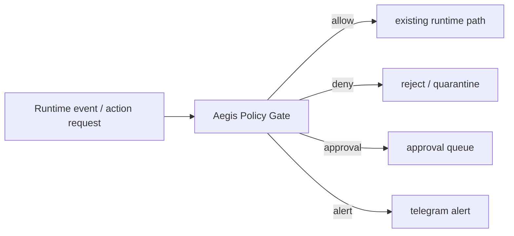
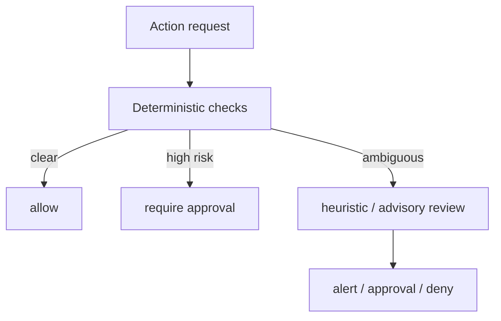

# Aegis Plan (기획 전용, 미배포)

상태: **Planning only**

중요:
- Aegis는 Canonical Agent ID 체계(`minerva`, `clio`, `hermes`)에 포함되지 않습니다.
- Aegis는 "네 번째 업무 에이전트"가 아니라 `guardrail / control plane`입니다.
- Aegis가 자율 복구/자율 수정/자율 정책 변경을 하면 오히려 가장 위험한 고권한 에이전트가 됩니다.

## 1) Aegis의 정확한 역할

목적
- 보안/운영 이상 징후를 감시
- 행동 실행 전에 정책적으로 심사
- 위험도가 높으면 차단 또는 승인 큐로 전환

비목적
- 스스로 목표 설정
- 스스로 코드 수정
- 스스로 정책 rewrite
- 스스로 broad shell 실행

## 2) 왜 RBAC만으로는 부족한가

RBAC가 하는 것
- "누가 어떤 capability를 원칙적으로 가질 수 있는가"

Aegis가 추가로 해야 하는 것
- "지금 이 요청이 현재 맥락에서 안전한가"
- 실행 전 동적 검증
- 이상 징후 감시
- 승인 필요 여부 판정

즉
- RBAC는 `정적 자격`
- Aegis는 `실행 직전 통제`

## 3) 입력 신호

필수 입력
- `/health` (proxy / n8n)
- `/api/runtime-metrics`
- morning briefing observation
- runtime drift 결과
- Telegram delivery failure
- approval backlog
- 인증 실패 이벤트(signature/replay/rate-limit)
- LLM fallback / 429 / 급증

후순위 입력
- 비용 상한 초과
- NotebookLM degraded 상태
- dead-letter 증가

## 4) 출력

허용 가능한 출력
- `allow`
- `deny`
- `require_approval`
- `emit_alert`
- `quarantine_suggest`
- `temporary_rate_limit`

금지 출력
- 코드 수정
- 정책 수정
- broad restart
- shell arbitrary exec
- 시크릿 rotate

## 5) v1 도입 범위

### Phase A. Read-only Monitor
- 감시와 알림만
- 자동 실행 없음

### Phase B. Narrow Gate
- 특정 고위험 액션에 대해 `allow/deny/require_approval`
- 예:
  - 외부 전송
  - 대량 저장
  - 새 capability 사용
  - 위험 호스트 접근

### Phase C. Containment
- 자동 동작은 2개만 허용
  - ingress 일시 중지
  - n8n 일시 중지
- 복구는 human-in-the-loop

## 6) fast path / slow path

fast path
- schema 검증
- allowlist
- cooldown
- rate limit
- approval 필요 여부

slow path
- 이상 패턴 분석
- 위험 점수 보조
- 설명 생성

원칙
- 대부분은 규칙 기반
- LLM은 advisory가 필요할 때만

## 7) 최소 정책 초안

자동 허용
- read-only health check
- observation logging
- known safe internal event

승인 필요
- 외부 전송
- user-facing knowledge claim 확정
- 대량 note update
- future calendar write

자동 차단
- unknown capability
- allowlist 밖 host
- invalid signature / replay
- vault subtree 밖 쓰기 시도

## 8) 성공 기준

- 장애 원인 미식별 케이스 제거
- 브리핑 미도착 감지 시간 5분 이내
- 잘못된 자동 조치 월 1회 이하
- 사람이 Aegis를 쉽게 끌 수 있고, Aegis가 사람을 잠그지 않음
