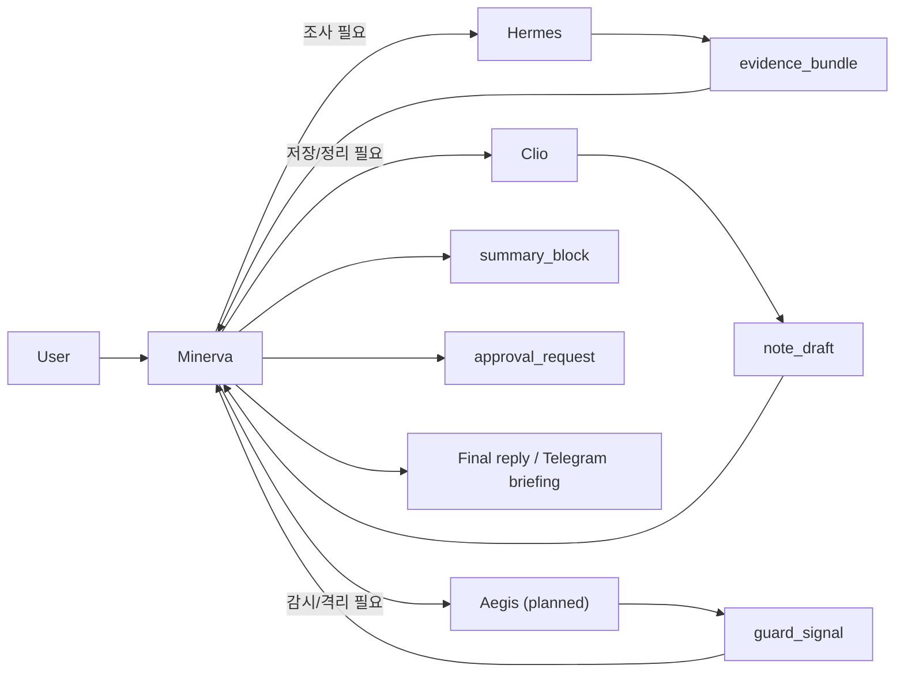
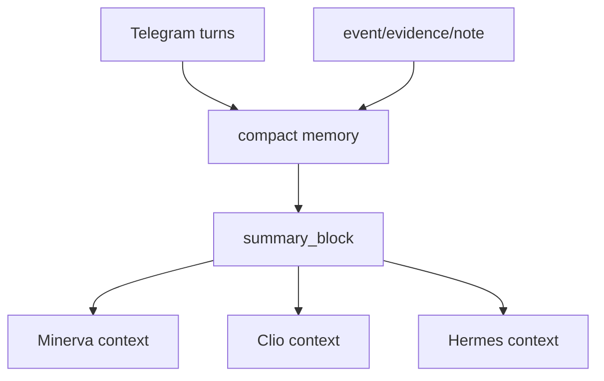

# NanoClaw v2 Agent Shared Pipeline

상태: **부분 실구현 + 부분 계획 문서**  
중요: `Minerva/Clio/Hermes` 아티팩트 계약은 현재 구조와 맞지만, `Aegis` 관련 내용은 아직 계획 단계입니다.

이 문서는 `Minerva` 단일 UX 아래에서 `Clio`, `Hermes`, `Aegis`가 어떤 계약으로 협업하는지 정의합니다.

## 1) 운영 원칙

- 사용자와 직접 대화하는 창구는 `Minerva` 하나입니다.
- `Clio`, `Hermes`, `Aegis`는 내부 worker입니다.
- 공유는 자유형 raw 대화가 아니라 구조화된 아티팩트로만 수행합니다.
- 최종 판단/전송은 `Minerva`가 담당합니다.

금지
- 에이전트끼리 raw chat history 전체 공유
- 타 에이전트 system/developer prompt 전달
- 외부 검색 결과 원문을 명령처럼 재해석

## 2) 공유 아티팩트 계약

| Artifact | Producer | Consumer | 목적 | 핵심 필드 |
|---|---|---|---|---|
| `event` | Hermes / n8n / Minerva | Minerva | 즉시 알림/다이제스트/쿨다운 판정 | `agentId`, `topicKey`, `title`, `summary`, `priority`, `confidence`, `tags`, `sourceRefs`, `payload` |
| `evidence_bundle` | Hermes | Minerva, Clio | 조사 근거 묶음 | `topicKey`, `items[]`, `securityStats`, `sourcePlan`, `dedupeKey` |
| `note_draft` | Clio | Minerva | Obsidian 저장 초안 | `topicKey`, `title`, `markdown`, `tags`, `links`, `verified` |
| `summary_block` | Minerva / compact memory | Minerva, Clio, Hermes | 저비용 문맥 공유 | `scope`, `window`, `summary`, `highlights[]`, `expiresAt` |
| `approval_request` | Minerva | User, Aegis(향후) | 고위험 액션 승인 | `approvalId`, `action`, `requestedBy`, `expiresAt`, `stage`, `payload` |
| `guard_signal` | Aegis(향후) | Minerva | 운영/보안 경보 | `severity`, `reason`, `service`, `metrics`, `recommendedAction` |

## 3) Minerva 중심 오케스트레이션 플로우

핵심 해석
- `Minerva`는 직접 모든 일을 하지 않습니다.
- `Hermes`는 근거를 만들고, `Clio`는 저장 가능한 지식을 만들고, `Aegis`는 이상 징후를 알립니다.
- 사용자에게 전달되는 최종 문장은 항상 `Minerva`가 정리합니다.

## 4) 호출 조건표

| 상황 | 호출 대상 | 이유 | Minerva 최종 액션 |
|---|---|---|---|
| 일반 질문/우선순위 정리 | 호출 없음 또는 Minerva 직접 | 외부 근거 불필요 | 바로 답변 |
| 최신 뉴스/트렌드/출처 확인 | `Hermes` | 외부 탐색 + 안전 필터 필요 | 근거 포함 브리핑 |
| 이미 받은 브리핑을 더 파고들기 | `Hermes` | 기존 `topicKey` 기준 심화 탐색 | 심화 분석 요청 생성 |
| 내용을 Obsidian에 남기기 | `Clio` | 저장 포맷/태그/링크 생성 | 저장 결과 확인 메시지 |
| 고위험 액션(외부 전송/대량 저장/일정 반영) | `approval_request` | human-in-the-loop 강제 | 승인 후 실행 |
| 실패율/비용 이상치/보안 이벤트 | `Aegis`(향후) | 운영 감시 | 경보/중지/격리 제안 |

## 5) 데이터 전달 경계

### 5-1) Hermes -> Minerva

허용
- `topicKey`
- `summary`
- `sourceRefs`
- `securityStats`
- `bucketCounts`
- `sourcePlan`

비허용
- 수집 중간 프롬프트
- 원문 전체 복붙
- 필터링 전 unsafe URL 묶음

### 5-2) Clio -> Minerva

허용
- 저장된 노트 경로
- markdown 초안
- 태그/링크 후보
- 중복 여부

비허용
- Vault 전체 스캔 결과 원문 전송
- 무제한 과거 노트 덤프

### 5-3) Minerva -> Clio/Hermes

허용
- 짧은 작업 지시
- `topicKey`
- 사용자 의도 요약
- 필요한 출력 형식

비허용
- raw Telegram history 전체
- 타 에이전트 내부 추론 전체

## 6) 메모리 공유 규칙

원칙
- 대화 전문은 저장소가 아니라 로그입니다.
- 운영 문맥은 `summary_block`으로 압축해서 재사용합니다.
- 장기 재사용 대상만 `Clio`가 Obsidian 지식으로 승격합니다.

## 7) 현재 코드와의 매핑

| 파이프라인 단계 | 현재 구현 |
|---|---|
| `event` 계약 | `proxy/app/orch_contract.py`, `proxy/app/main.py` |
| 공유 아티팩트 스키마 | `proxy/app/pipeline_contract.py`, `proxy/tests/test_pipeline_contract.py` |
| 정책 판정 | `proxy/app/orch_policy.py` |
| `summary_block`/compact memory | `proxy/app/orch_store.py` |
| Telegram 최종 포맷 | `proxy/app/telegram_bridge.py` |
| `note_draft` 생성/저장 | `agent/runtime_worker.py` |
| `evidence_bundle` 생성 | `n8n/workflows/*.json`, `proxy/app/search_client.py` |

## 8) 다음 구현 우선순위

1. `summary_block`를 `orch_store` compact memory 출력 경로에 실제 연결
2. `Hermes -> evidence_bundle`를 n8n/프록시 저장 경로에서 실제 검증
3. `Clio -> note_draft`를 agent 출력 직전 강제 검증
4. `Aegis -> guard_signal` 실제 런타임 도입

## 9) 한 줄 정책

`하나처럼 보이게 운영하되, 내부는 구조화된 역할 분리와 아티팩트 계약으로 유지한다.`
