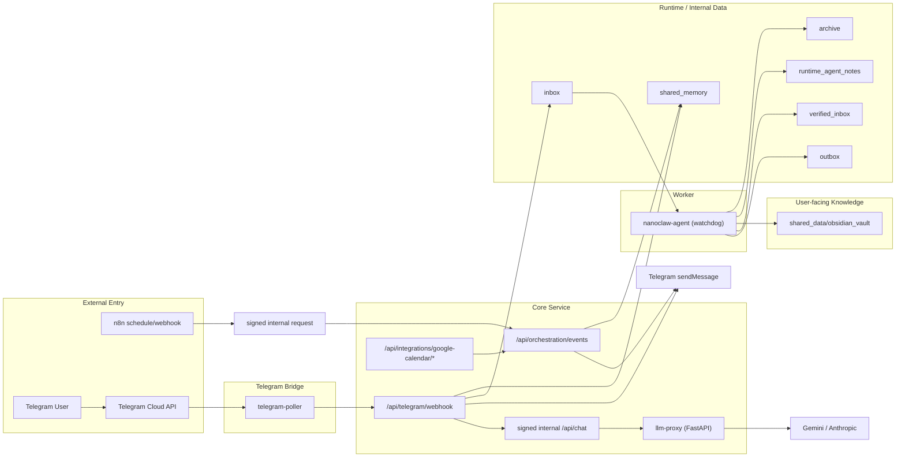
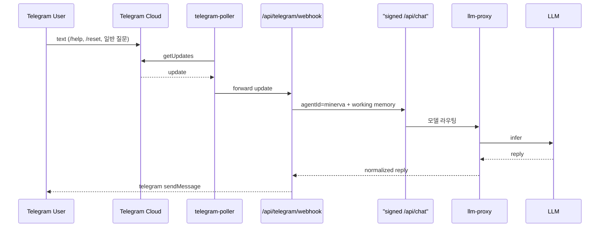
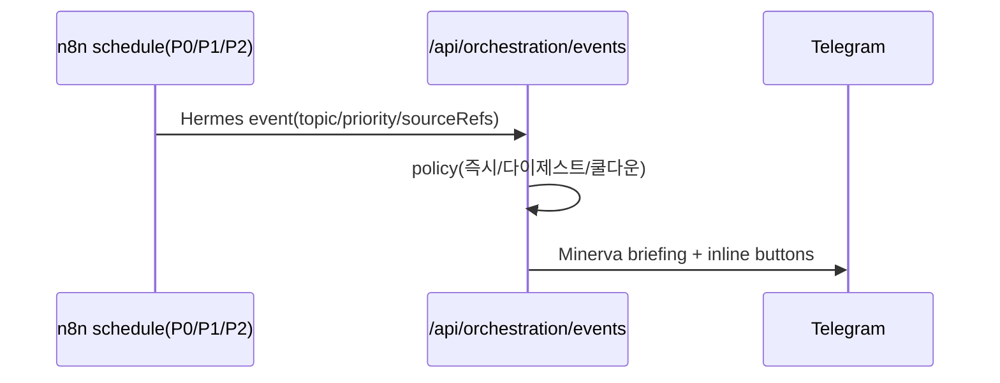
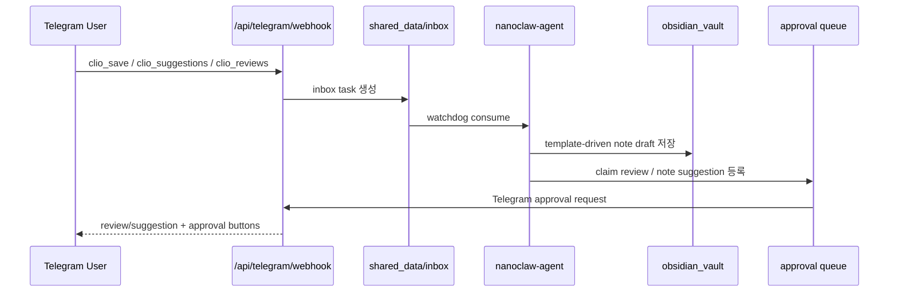
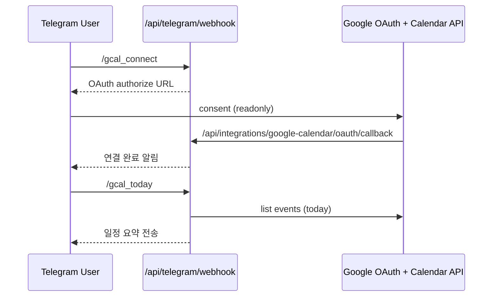

# NanoClaw v2 Architecture

이 문서는 Telegram-first 구조, 역할 경계, 저장 경계를 현재 구현 기준으로 설명합니다.
운영 절차는 [OPERATIONS_PLAYBOOK](OPERATIONS_PLAYBOOK.md), 보안 통제는 [SECURITY_BASELINE](SECURITY_BASELINE.md)를 참고합니다.

## 1) 역할 분리

| Agent | 책임(Do) | 비책임(Do Not) |
|---|---|---|
| `minerva` | 오케스트레이션, 우선순위, 최종 인사이트, 사용자-facing 대화 | 직접 대량 웹수집, 장문 지식 편집 |
| `clio` | Obsidian 표준 노트 초안 생성, 링크/프로젝트/MOC 연결, review/suggestion 관리 | 사용자 claim 자동 확정, evergreen 자동 승격 |
| `hermes` | 외부 수집, 트렌드 브리핑, 근거 확장 | 최종 전략 결론 단독 확정 |

Canonical ID는 `minerva`, `clio`, `hermes`만 허용합니다.

운영 원칙
- 사용자에게 보이는 대화 창구는 `Minerva` 하나입니다.
- `Clio`, `Hermes`, `Aegis`는 내부 worker/계획 대상으로만 다룹니다.
- 에이전트 간 공유는 raw 자유대화가 아니라 `event/evidence/note/summary/approval` 아티팩트로 제한합니다.

## 2) 컴포넌트 구조 (현재 운영형)

내부 이벤트 경계
- `n8n -> /api/orchestration/events`는 내부 인증 헤더를 반드시 거칩니다.
- 필수 헤더:
  - `x-internal-token`
  - `x-timestamp`
  - `x-nonce`
  - `x-signature`
- 시크릿이 없으면 기본값으로 열리지 않고 fail-closed로 거부합니다.

## 3) 저장 경계

### 사용자-facing vault
- [shared_data/obsidian_vault](/Users/isanginn/Workspace/Agent_Workspace/shared_data/obsidian_vault)

여기에는 사람이 다시 읽을 노트만 둡니다.
- `01-Knowledge`
- `02-References`
- `03-Projects`
- `04-Writing`
- `05-Daily`
- `06-MOCs`
- `Home.md`

### runtime/internal data
- `shared_data/inbox`
- `shared_data/outbox`
- `shared_data/verified_inbox`
- `shared_data/shared_memory`
- `shared_data/runtime_agent_notes`
- `shared_data/archive`
- `shared_data/runtime/obsidian_support`

원칙
- Minerva/Hermes runtime markdown는 user-facing vault에 들어가지 않습니다.
- agent support/template/verification artifact는 user-facing vault에 두지 않습니다.
- Clio note만 user-facing vault에 씁니다.

## 4) 핵심 시퀀스

### 4-1) Telegram 일반 대화

### 4-2) Hermes 스케줄 브리핑

### 4-3) Clio 저장/제안/승인

### 4-4) Google Calendar read-only

## 5) 설정 단일 소스

| 대상 | 파일 |
|---|---|
| 에이전트 canonical ID/역할 | `config/agents.json` |
| 에이전트 퍼소나 | `config/personas.json` |
| Minerva 대화 기준 | `docs/MINERVA_PERSONA_SPEC.md` |
| Clio Obsidian 기준 | `docs/CLIO_V2_SPEC.md` |
| 역할별 메모리 분리 기준 | `docs/MEMORY_SPLIT_SPEC.md` |
| 런타임 정책/비밀값 | `.env.local` + Keychain/1Password ref |
| Hermes 소스 분류 규칙 | `proxy/app/source_taxonomy.py` |

## 6) 구현 근거 파일 맵

| 기능 | 구현 파일 |
|---|---|
| Telegram webhook/chat/runtime HTTP 라우트 | `proxy/app/http_routes.py`, `proxy/app/main.py` |
| Telegram polling bridge | `proxy/app/telegram_poller.py` |
| Minerva prompt/톤/모델 라우팅 | `proxy/app/llm_client.py`, `config/personas.json` |
| 정책 엔진(임계값/쿨다운/다이제스트) | `proxy/app/orch_policy.py` |
| 이벤트 컨트랙트 검증 | `proxy/app/orch_contract.py`, `proxy/app/main.py` |
| 내부 인증(HMAC/token/timestamp/nonce) | `proxy/app/security.py`, `scripts/runtime/internal-api-request.sh` |
| 역할/메모리 컨텍스트 조립 | `proxy/app/role_runtime.py`, `proxy/app/main.py` |
| morning briefing 관찰 로그 | `proxy/app/orch_memory.py`, `proxy/app/main.py`, `scripts/verify/report-morning-briefing-observations.sh` |
| n8n execution cleanup | `scripts/n8n/cleanup-execution-data.sh` |

## 7) Hermes Daily Workflow 구조

현재 `Hermes Daily Briefing Workflow`는 아래 단위로 나뉩니다.

1. `Prepare P0/P1/P2 Config`
2. `Collect Tier Signals`
3. `Build Briefing Summary`
4. `Build Briefing Template`
5. `Build Orchestration Payload`
6. `Publish Orchestration Event`
7. `Build API Response`

의도
- 수집/요약/템플릿/서명/전송/응답을 분리해서 drift와 복붙을 줄임
- `Build API Response`와 `Build Briefing Template`에 기능이 과도하게 몰리는 문제를 완화
| 메모리/승인 큐 저장소 | `proxy/app/orch_store.py`, `proxy/app/orch_memory.py`, `proxy/app/orch_approval.py`, `proxy/app/orch_clio_state.py` |
| Google Calendar read-only 통합 | `proxy/app/google_calendar.py`, `proxy/app/main.py` |
| Clio template-driven note 생성 | `agent/clio_pipeline.py`, `agent/clio_core.py`, `agent/clio_render.py`, `agent/clio_notebooklm.py`, `agent/main.py` |
| n8n 부트스트랩 | `scripts/n8n/*.sh`, `n8n/workflows/*.json` |

## 7) 현재 의도적으로 제외된 것
- Telegram 외 채널 추상화(Slack/Email)
- Aegis 자동 격리 런타임
- NotebookLM 실사용 검증 완료

이 항목들은 [IMPLEMENTATION_COVERAGE](IMPLEMENTATION_COVERAGE.md)에서 추적합니다.

## 8) 현재 구조적 리스크
즉시 운영을 막는 수준은 아니지만, 다음 3개는 유지보수 리스크입니다.

1. `proxy/app/orch_store.py`
- facade 자체는 가벼워졌지만 approval / clio state / memory adapter가 여전히 결합된 경계 역할을 한다

2. `agent/clio_pipeline.py`
- Clio 분류, 제목/요약 생성, 태그/링크/재사용 판단이 아직 한 모듈에 남아 있다

3. `agent/main.py`
- watcher / inbox I/O / archive / quarantine / runtime orchestration 책임이 남아 있다

즉, 현재 아키텍처는 ingress, approval/clio-state, Clio render/NotebookLM 경계까지 분리됐고, 다음 리팩터링 과제는 `orch_memory` 세분화와 `Clio inference` 축소입니다.
