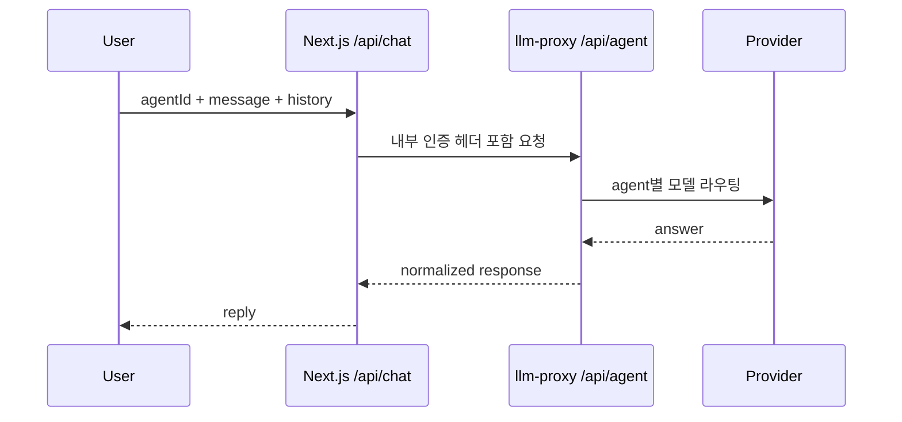
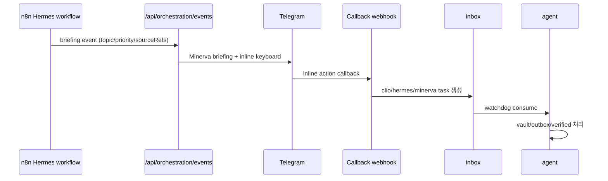

# NanoClaw v2 Architecture

이 문서는 "시스템이 어떻게 구성되어 있는가"만 설명합니다.
운영 절차는 `OPERATIONS_PLAYBOOK.md`, 시나리오는 `USE_CASES.md`를 봅니다.

## 1) 역할 경계

| Agent | 역할 | 하지 않는 일 |
|---|---|---|
| `minerva` | 오케스트레이션, 우선순위, 최종 인사이트 | 웹 크롤링/장문 문서화 전담 |
| `clio` | 문서화, 지식 정리, Obsidian/NotebookLM 준비 | 실시간 트렌드 수집 |
| `hermes` | 웹 수집, 트렌드 브리핑, 근거 확장 | 최종 의사결정 |

Canonical ID는 `minerva`, `clio`, `hermes`만 허용합니다.

## 2) 구성 요소

```mermaid
flowchart LR
  subgraph Client
    UI[Next.js Dashboard]
    TGU[Telegram User]
  end

  subgraph App
    API[Next.js API Routes]
    ORCH[/api/orchestration/events]
    TGCB[/api/telegram/webhook]
  end

  subgraph Core
    PX[llm-proxy]
    AG[nanoclaw-agent]
  end

  subgraph Automation
    N8N[n8n Workflows]
  end

  subgraph Storage
    INBOX[shared_data/inbox]
    OUTBOX[shared_data/outbox]
    VAULT[shared_data/obsidian_vault]
    VERIFIED[shared_data/verified_inbox]
    MEM[shared_data/shared_memory]
  end

  UI --> API
  API --> PX
  PX --> LLM[Gemini / Anthropic]

  N8N --> ORCH
  ORCH --> TG[Telegram SendMessage]
  TGU --> TGCB
  TGCB --> INBOX

  INBOX --> AG
  AG --> OUTBOX
  AG --> VAULT
  AG --> VERIFIED
  ORCH --> MEM
  TGCB --> MEM
```

## 3) 핵심 데이터 플로우

### 3-1. Chat 플로우



### 3-2. Hermes 스케줄 브리핑 플로우



## 4) 설정 단일 소스

- 에이전트 식별/역할 정의: `config/agents.json`
- 에이전트 퍼소나: `config/personas.json`
- 런타임 정책/비밀값: `.env.local`

## 5) 저장소 구조(운영 관점)

```text
shared_data/
  inbox/           # 들어오는 task
  outbox/          # 처리 결과 JSON
  archive/         # 처리 완료 inbox 원본
  obsidian_vault/  # Clio 산출 Markdown
  verified_inbox/  # Clio 정제 payload
  shared_memory/   # events, cooldown, digest, memory.md, oauth state
```

## 6) 확장 포인트

- LLM Provider 확장: `llm-proxy` 내부 provider 라우팅 추가
- Search Provider 확장: Hermes 수집 workflow + proxy search client 확장
- Calendar/NotebookLM 연동: Next.js integrations + Clio pipeline 확장
