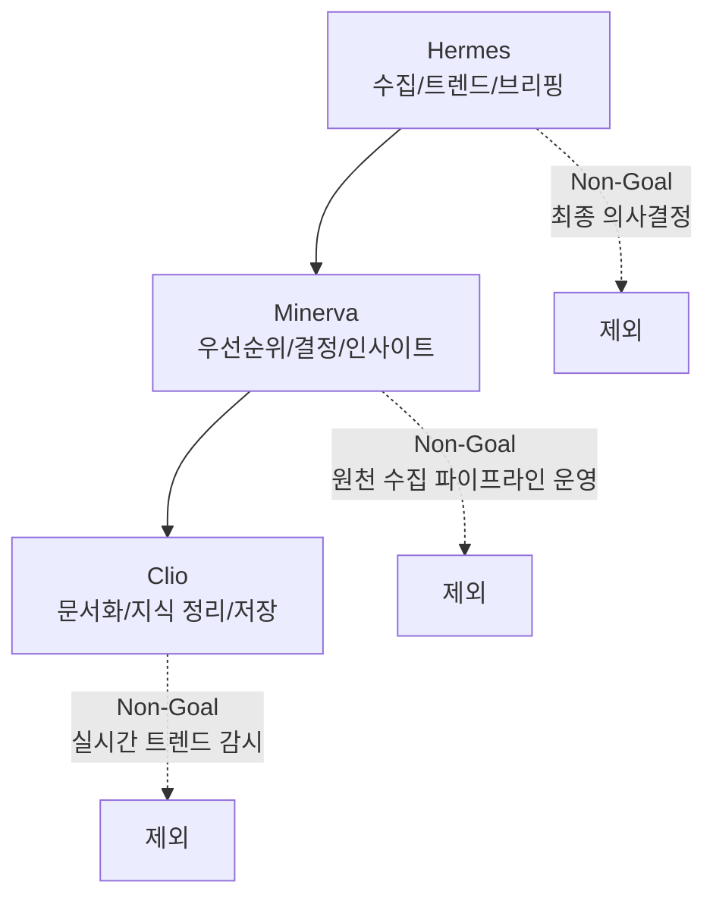
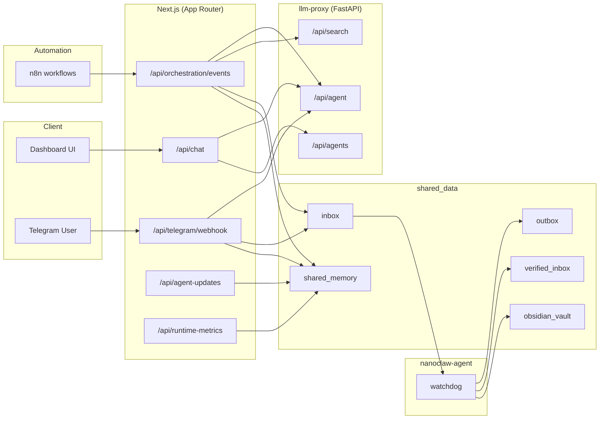
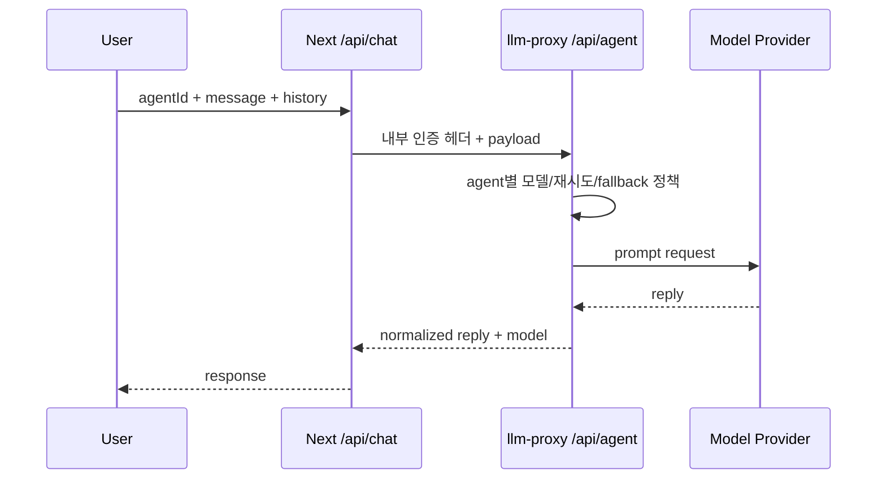
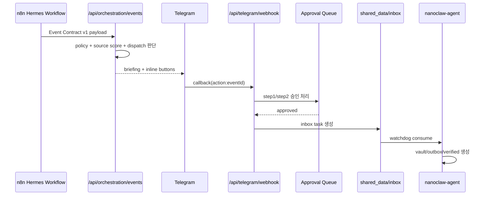
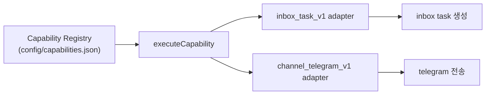

# NanoClaw v2 Architecture

이 문서는 "시스템이 어떻게 연결되고, 어떤 책임 경계로 동작하는가"를 설명합니다.
운영 절차는 [OPERATIONS_PLAYBOOK](OPERATIONS_PLAYBOOK.md), 보안 통제는 [SECURITY_BASELINE](SECURITY_BASELINE.md)를 참고합니다.

## 1) 아키텍처 목표

1. 보안 경계 유지: 외부 입력은 항상 데이터로만 처리
2. 역할 분리 강화: Minerva/Clio/Hermes 책임 고정
3. 확장성 확보: 기능 추가 시 코어 수정 최소화
4. 운영성 강화: 정책/메트릭/검증을 구조에 내장

## 2) v1 -> v2 구조 변경 요약

| 변경 축 | v1 성격 | v2 성격 | 기대 효과 |
|---|---|---|---|
| 책임 분리 | UI/정책/라우팅 결합 | 역할 경계 + 정책 엔진 분리 | 병렬 개발 충돌 감소 |
| 기능 확장 | 하드코딩 분기 추가 | Capability Registry + Adapter | 외부 도구 확장 용이 |
| 이벤트 처리 | 암묵적 payload | Event Contract v1 + strict 모드 | 배포/워크플로 안정성 향상 |
| 승인 흐름 | 단순 액션 실행 | 2단계 승인 + TTL + 에스컬레이션 | 고위험 액션 안전성 확보 |
| 관측성 | 로그 위주 | runtime-metrics API | 비용/SLO/오류율 상시 확인 |

## 3) 책임 경계 (Agent Boundary)



Canonical Agent ID는 `minerva`, `clio`, `hermes`만 허용합니다.

## 4) 컴포넌트 구조



## 5) 핵심 런타임 플로우

### 5-1) Chat 플로우 (사용자 대화)



### 5-2) Hermes 이벤트 -> Telegram -> 승인 -> Inbox



## 6) 확장 구조 (Capability + Adapter)



핵심 의도
- 새 기능(예: Jira/Notion/Slack)을 capability 등록으로 확장
- 비즈니스 로직과 채널/도구 구현체 결합 최소화

## 7) 정책 구조 (Policy Engine)

정책은 `src/lib/orchestration/policy.ts`를 기준으로 중앙화했습니다.

- Dispatch Policy: 즉시 발송/다이제스트/쿨다운
- Auto Clio Policy: Hermes 고영향 이벤트 자동 저장 조건
- Approval Policy: TTL, 프론트 에스컬레이션 비율
- Translation Tier Policy: P0/P1/P2 번역량 제어

효과
- 라우트별 산개 규칙 제거
- 운영 파라미터(.env)로 제어 가능

## 8) 이벤트 계약 (Event Contract v1)

- 스키마: `docs/schemas/orchestration-event.v1.schema.json`
- 파서: `src/lib/orchestration/event-contract.ts`
- strict 모드: `ORCH_REQUIRE_SCHEMA_V1=true`

v1 envelope 필수 필드
- `schemaVersion`, `eventType`, `producer`, `occurredAt`, `payload`

## 9) 데이터 저장 구조

```text
shared_data/
  inbox/                 # 승인/액션으로 생성되는 task 입력
  outbox/                # 에이전트 처리 결과
  verified_inbox/        # Clio 검증 payload
  obsidian_vault/        # 최종 문서 산출물
  archive/               # 처리 완료 원본
  shared_memory/
    agent_events.json
    digest_queue.json
    topic_cooldowns.json
    telegram_pending_approvals.json
    telegram_chat_history.json
    memory.md
```

## 10) 운영 관측 포인트

`/api/runtime-metrics`에서 주요 지표를 제공합니다.

- LLM: 호출량/성공률/429/fallback/latency(avg,p95,max)
- Orchestration: 이벤트 수, decision 분포, telegram 전송 성공률, 승인 상태
- DeepL: 시도/성공/실패/문자량

## 11) 핵심 파일 맵

- API 진입: `src/app/api/*`
- 정책 엔진: `src/lib/orchestration/policy.ts`
- 이벤트 계약: `src/lib/orchestration/event-contract.ts`
- 승인 큐: `src/lib/orchestration/approvals.ts`
- 확장 레이어: `src/lib/orchestration/capability-*.ts`
- 프록시 라우팅/메트릭: `proxy/app/main.py`
