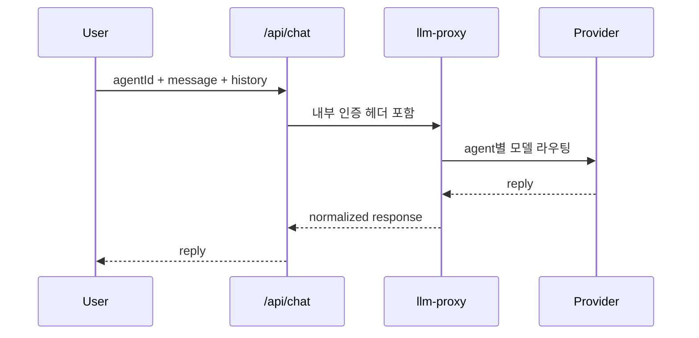
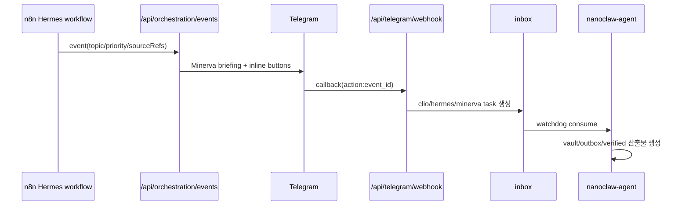

# NanoClaw v2 Architecture

이 문서는 "시스템이 어떻게 구성되는가"만 설명합니다.
운영 절차는 `OPERATIONS_PLAYBOOK.md`, 사용자 흐름은 `USE_CASES.md`를 봅니다.

## 1) 역할 경계

| Agent | 책임 | Non-Goal |
|---|---|---|
| `minerva` | 오케스트레이션, 우선순위, 최종 인사이트 | 직접 웹수집 파이프라인 운영 |
| `clio` | 문서화, 지식 정리, Obsidian/NotebookLM 준비 | 실시간 트렌드 감시 |
| `hermes` | 웹 수집, 트렌드 브리핑, 근거 확장 | 최종 의사결정 |

Canonical ID는 `minerva`, `clio`, `hermes`만 허용합니다.

## 2) 컴포넌트 맵

```mermaid
flowchart LR
  subgraph Client
    UI[Next.js Dashboard]
    TGUSER[Telegram User]
  end

  subgraph App
    API[Next.js API Routes]
    ORCH[/api/orchestration/events]
    TGCB[/api/telegram/webhook]
  end

  subgraph Core
    PX[llm-proxy]
    AG[nanoclaw-agent]
  end

  subgraph Automation
    N8N[n8n workflows]
  end

  subgraph Storage
    INBOX[shared_data/inbox]
    OUTBOX[shared_data/outbox]
    VAULT[shared_data/obsidian_vault]
    VERIFIED[shared_data/verified_inbox]
    MEM[shared_data/shared_memory]
  end

  UI --> API
  API --> PX
  PX --> LLM[Gemini / Anthropic]

  N8N --> ORCH
  ORCH --> TG[Telegram sendMessage]
  TGUSER --> TGCB
  TGCB --> INBOX

  INBOX --> AG
  AG --> OUTBOX
  AG --> VAULT
  AG --> VERIFIED
  ORCH --> MEM
  TGCB --> MEM
```

## 3) 핵심 플로우

### 3-1) Chat 플로우



### 3-2) Hermes 브리핑 -> Telegram 액션 플로우



## 4) 인터페이스 계약(요약)

| 경로 | 입력 | 출력 |
|---|---|---|
| `/api/chat` | `agentId`, `message`, `history?` | `agentId`, `model`, `reply` |
| `/api/orchestration/events` | Hermes/Clio 이벤트 payload | dispatch decision + telegram 전송 결과 |
| `/api/telegram/webhook` | Telegram update/callback | callback ack + inbox side-effect |
| `llm-proxy /api/agent` | 내부 인증 헤더 + agent payload | 모델 응답 + 메타 |

## 5) 설정 단일 소스

- 에이전트 식별/역할: `config/agents.json`
- 에이전트 퍼소나: `config/personas.json`
- 런타임 정책/비밀값: `.env.local`

## 6) 저장소(운영 관점)

```text
shared_data/
  inbox/           # 들어오는 task
  outbox/          # 처리 결과 JSON
  archive/         # 처리 완료 원본
  obsidian_vault/  # Clio markdown 산출물
  verified_inbox/  # Clio 정제 payload
  shared_memory/   # events, digest, cooldown, memory, oauth state
```

## 7) 이 문서에서 다루지 않는 것

- 장애 대응 명령과 런북 절차 (`OPERATIONS_PLAYBOOK.md`)
- 위협 모델/보안 통제의 근거 (`SECURITY_BASELINE.md`)
- 사용자 관점 시나리오 (`USE_CASES.md`)
