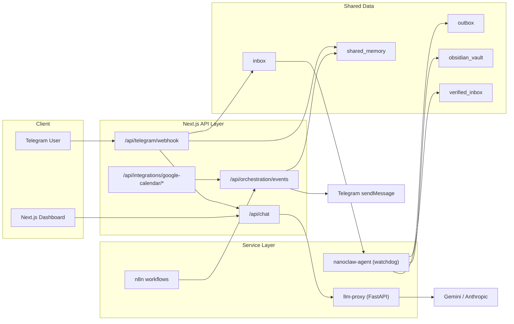
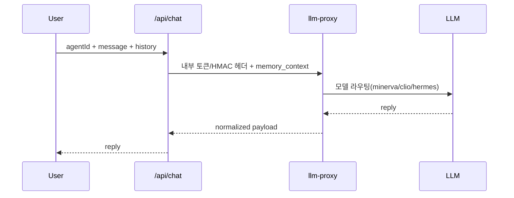
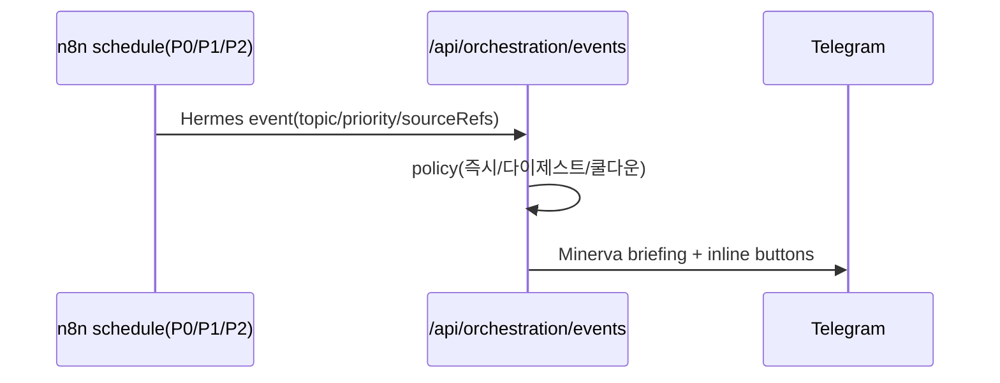
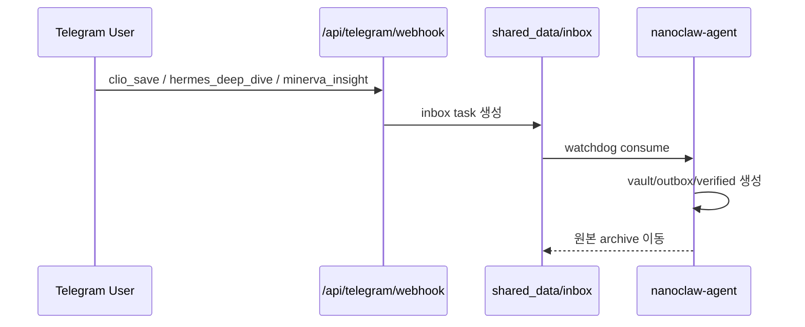

# NanoClaw v2 Architecture

이 문서는 "시스템이 어떻게 연결되고, 어떤 책임으로 분리되어 있는지"를 설명합니다.
운영 절차는 [OPERATIONS_PLAYBOOK](OPERATIONS_PLAYBOOK.md), 보안 통제는 [SECURITY_BASELINE](SECURITY_BASELINE.md)를 참고합니다.

## 1) 역할 분리(고정 규칙)

| Agent | 책임(Do) | 비책임(Do Not) |
|---|---|---|
| `minerva` | 오케스트레이션, 우선순위, 최종 인사이트 | 직접 대량 웹수집 파이프라인 운영 |
| `clio` | 지식 구조화, 문서화, Obsidian/NotebookLM 준비 | 실시간 트렌드 감시 의사결정 |
| `hermes` | 외부 수집, 트렌드 브리핑, 근거 확장 | 최종 전략 결론 단독 확정 |

Canonical ID는 `minerva`, `clio`, `hermes`만 허용합니다.

## 2) 컴포넌트 구조



## 3) 핵심 시퀀스

### 3-1) 사용자 채팅



### 3-2) Hermes 스케줄 브리핑



### 3-3) Telegram 인라인 버튼 후속 처리



## 4) 설정 단일 소스

| 대상 | 파일 |
|---|---|
| 에이전트 canonical ID/역할 | `config/agents.json` |
| 에이전트 퍼소나 | `config/personas.json` |
| 런타임 정책/비밀값 | `.env.local` |
| Hermes 소스 분류 규칙 | `src/lib/orchestration/source-taxonomy.ts` |

## 5) 저장소 산출물 구조

```text
shared_data/
  inbox/               # webhook/callback 기반 task 입력
  outbox/              # agent 처리 결과(JSON)
  archive/             # 처리 완료 원본
  obsidian_vault/      # Clio markdown 산출물
  verified_inbox/      # Clio 정제 payload
  shared_memory/       # events, cooldown, digest, telegram history, compact memory
```

## 6) 구현 근거 파일 맵

| 기능 | 구현 파일 |
|---|---|
| 정책 엔진(임계값/쿨다운/다이제스트) | `src/lib/orchestration/policy.ts` |
| 오케스트레이션 엔드포인트 | `src/app/api/orchestration/events/route.ts` |
| Telegram 포맷/인라인 버튼/번역 정책 | `src/lib/orchestration/telegram.ts` |
| Telegram webhook 처리 | `src/app/api/telegram/webhook/route.ts` |
| 메모리 압축/컨텍스트 주입 | `src/lib/orchestration/compact-memory.ts`, `src/lib/orchestration/memory-context.ts` |
| LLM 라우팅/모델 fallback | `proxy/app/main.py`, `proxy/app/llm_client.py` |
| agent 파일 파이프라인 | `agent/main.py` |
| n8n 부트스트랩 | `scripts/n8n/*.sh`, `n8n/workflows/*.json` |

## 7) 현재 아키텍처에서 의도적으로 제외된 것
- Telegram 외 채널 추상화(Slack/Email 드라이버)
- 승인 큐 기반 2단계 Human-in-the-loop 액션
- 엄격한 이벤트 JSON Schema 버전 강제(`schema_version` 계약)

이 항목들은 [IMPLEMENTATION_COVERAGE](IMPLEMENTATION_COVERAGE.md)에 "부분완료/미구현"으로 추적합니다.
