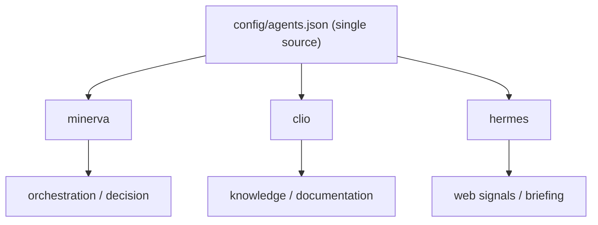
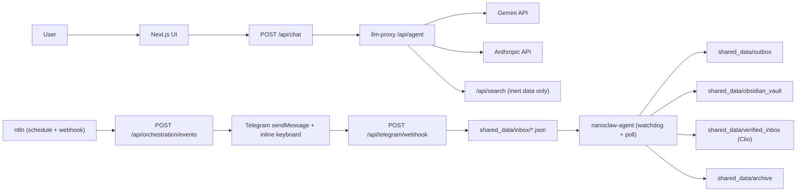
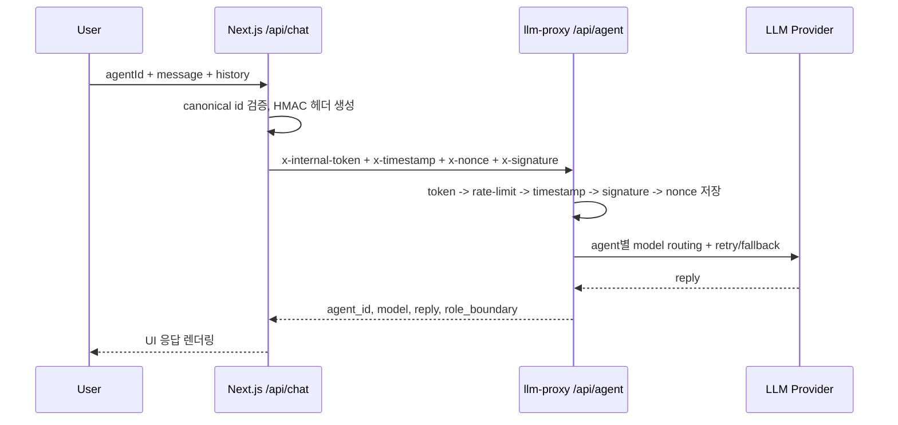
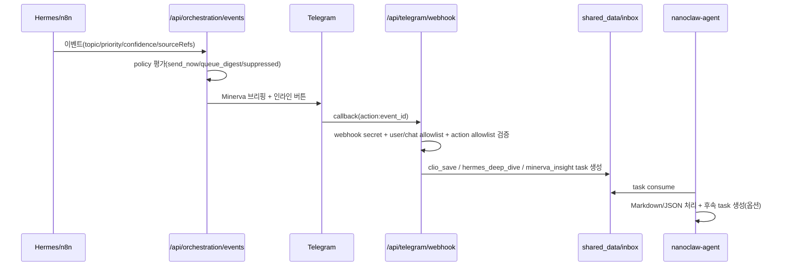
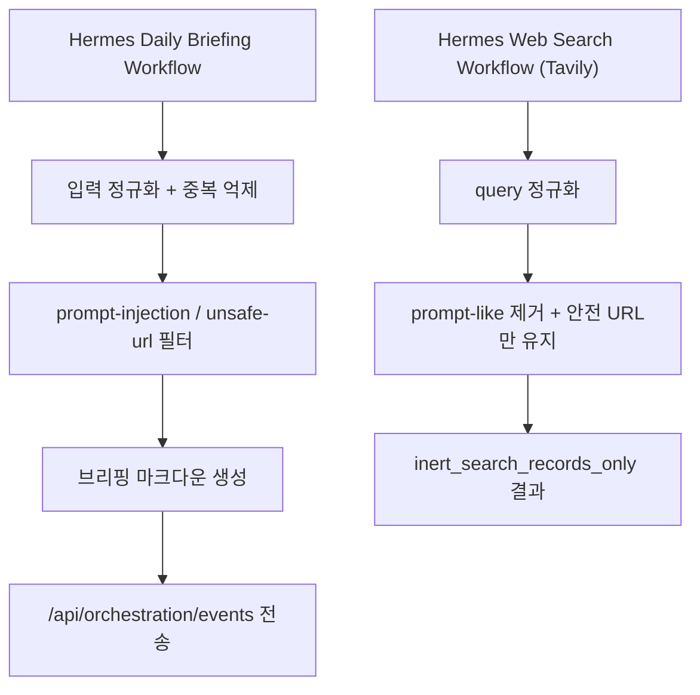
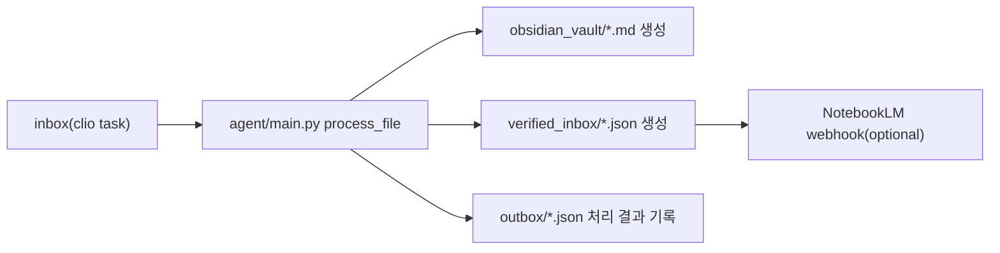
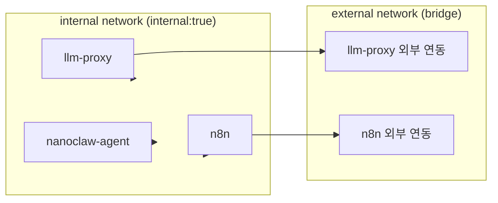

# NanoClaw v2 Architecture

기준 시점: 2026-03-03  
핵심: `minerva` / `clio` / `hermes` 3개 canonical ID, `llm-proxy` 단일 게이트, 내부 검증(HMAC), 최소 권한 컨테이너.

## 1. 역할 경계
- `minerva`: 오케스트레이션, 우선순위 판단, 최종 인사이트 정리
- `clio`: 문서화, 지식 정리, Obsidian/NotebookLM 준비
- `hermes`: 웹 수집, 트렌드 브리핑, 근거 확장 수집



## 2. 전체 시스템 토폴로지



## 3. Chat 경로 (Frontend -> llm-proxy)



## 4. Orchestration + Telegram 인라인 액션



현재 인라인 버튼 UX:
- `Clio, 옵시디언에 저장해`
- `Hermes, 더 찾아`
- `Minerva, 인사이트 분석해`

`Hermes, 더 찾아`는 근거 수집 전용으로 제한되며, `HERMES_DEEP_DIVE_AUTO_MINERVA=true`일 때 처리 완료 후 Minerva 후속 인사이트 태스크를 자동 생성한다.

## 5. n8n 워크플로우 구조



보안 원칙:
- 검색/수집 결과는 실행하지 않고 구조화 데이터로만 하위 단계로 전달
- `localhost`, 사설 IP, 스크립트/명령 유도 텍스트는 필터링

## 6. Clio 파이프라인 구조



Clio 처리 시 포함 정보:
- 태그 자동화(`#clio`, `#knowledge-pipeline` + 동적 태그)
- 관련 링크/출처 URL
- DeepL 번역 적용 여부
- NotebookLM sync 준비 메타

## 7. 데이터 경로

```text
shared_data/
  inbox/                 # telegram/orchestration/n8n/수동 태스크 유입
  outbox/                # 처리 결과 JSON
  archive/               # 처리 완료 원본 inbox 보관
  obsidian_vault/        # Markdown 지식 산출물
  verified_inbox/        # Clio 정제 payload
  shared_memory/         # 이벤트, digest, cooldown, oauth/token 상태
  logs/                  # llm usage metrics
```

## 8. Docker/네트워크 경계



기본 하드닝:
- `read_only: true`
- `cap_drop: [ALL]`
- `security_opt: [no-new-privileges:true]`
- `tmpfs` 사용

## 9. 이전 레포 대비 핵심 변화
- alias 입력(`ace`, `owl`, `dolphin`) 제거, canonical only 고정
- 역할별 책임 경계 명시 + Telegram 액션도 경계에 맞춰 분리
- `llm-proxy`를 유일한 모델 호출 게이트로 고정
- n8n 2개 워크플로우(스케줄 브리핑/웹검색)를 운영 스크립트와 검증 스크립트로 표준화
- Clio 검증 파이프라인(`verified_inbox`)과 NotebookLM 준비 경로 추가
