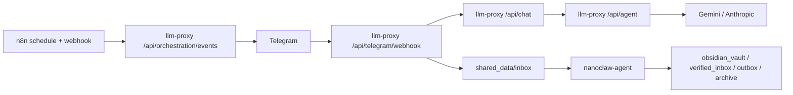

# NanoClaw v2 Commit Baseline

대상 원격 저장소: [Personal-AI-agent-v2](https://github.com/Merchantlee99/Personal-AI-agent-v2.git)  
기준 날짜: 2026-03-06  
원칙: Canonical ID only, 단일 LLM 게이트, 역할 경계 고정, Telegram-only 운영.

## 1) 목적
- 문서/코드 드리프트를 줄이고 구조 변경 시 리뷰 기준을 고정
- 커밋이 기능 추가보다 경계 보존을 먼저 만족하도록 강제
- 병렬 작업 충돌 최소화

## 2) 현재 기준 구조

## 3) Canonical Agent 정책
- 고정 ID: `minerva`, `clio`, `hermes`
- alias: 입력 허용하지 않음
- source of truth: `config/agents.json`

## 4) 보안 기준
- 내부 API는 `x-internal-token + timestamp + nonce + signature` 필수
- nonce 저장은 signature 검증 이후
- 검색 결과는 명령이 아니라 inert 데이터 레코드
- Docker 최소권한(`read_only`, `cap_drop=ALL`, `no-new-privileges`, `tmpfs`)
- internal/external 네트워크 분리

## 5) Telegram UX 기준
버튼 라벨:
- `Clio, 옵시디언에 저장해`
- `Hermes, 더 찾아`
- `Minerva, 인사이트 분석해`

행동 규칙:
- Hermes deep-dive는 근거 수집 전용
- 최종 판단은 Minerva 수행
- `HERMES_DEEP_DIVE_AUTO_MINERVA=true`면 Hermes 완료 후 Minerva follow-up 자동 생성

## 6) n8n 운영 기준
필수 워크플로우
1. `Hermes Daily Briefing Workflow`
2. `Hermes Web Search Workflow`

검증 포인트
- prompt-injection/unsafe URL 필터 코드 노드 존재
- duplicate briefing 억제 동작
- orchestration 연동 strict 검증(`HERMES_EXPECT_ORCHESTRATION=true`)

## 7) 커밋 단위 원칙
- 한 커밋 = 한 책임
- 구조 변경과 정책 변경 분리
- 문서는 코드 변경과 같은 주제로 동기 커밋
- 검증 스크립트 없는 구조 변경 커밋 금지

## 8) PR 리뷰 체크리스트
- [ ] `config/agents.json`과 코드의 에이전트 ID 일치
- [ ] Telegram -> llm-proxy 단일 게이트 유지
- [ ] 텔레그램 액션 allowlist/allowlist source 유지
- [ ] n8n 필터 노드(`INJECTION_PATTERNS`, `isSafeUrl`) 유지
- [ ] `npm run test:proxy`
- [ ] `npm run verify:smoke`
- [ ] `npm run security:check-orchestration`

## 9) 문서 동기화 대상
아래 문서는 구조 변경 시 반드시 함께 갱신
- `README.md`
- `docs/ARCHITECTURE.md`
- `docs/SECURITY_BASELINE.md`
- `docs/OPERATIONS_PLAYBOOK.md`
