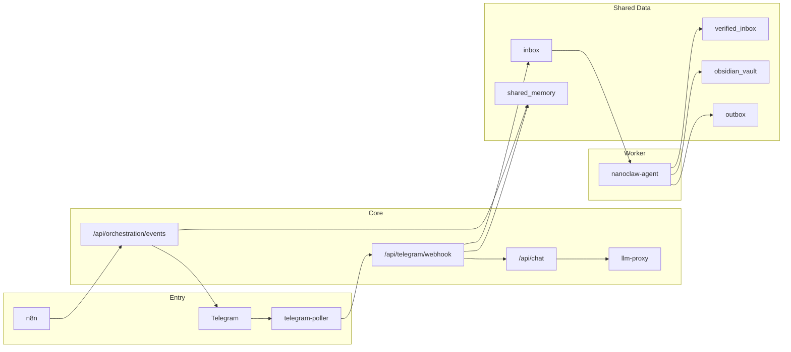

# NanoClaw v2 Implementation Coverage

이 문서는 현재 구현 상태를 Telegram-only 운영 기준으로 정리합니다.

## 1) 핵심 결론
- Next.js 프론트 경로를 제거하고 `llm-proxy` 단일 진입 구조로 정리 완료
- 보안 경계(내부 HMAC 체인, Telegram allowlist, n8n 안전 필터, 최소권한 컨테이너) 정착
- 운영 핵심(승인 큐, 이벤트 컨트랙트 검증, 런타임 메트릭 API) 구현 완료
- 남은 확장 과제는 채널 추상화, Aegis 실배포, NotebookLM 실연동 검증

## 2) 구현도 매트릭스

| 항목 | 상태 | 구현 근거 |
|---|---|---|
| Canonical Agent ID 단일화 | 완료 | `config/agents.json`, `proxy/app/agents.py`, `agent/main.py` |
| 역할 경계(미네르바/클리오/헤르메스) | 완료 | `proxy/app/main.py` `ROLE_BOUNDARY`, `config/personas.json` |
| LLM 단일 게이트 + 내부 인증 체인 | 완료 | `proxy/app/main.py`, `proxy/app/security.py` |
| 모델 라우팅 + 429 fallback + 사용량 기록 | 완료 | `proxy/app/main.py`, `proxy/app/llm_client.py`, `shared_data/logs/llm_usage_metrics.json` |
| Hermes P0/P1/P2 스케줄 수집 | 완료 | `n8n/workflows/hermes-daily-briefing.json` |
| Tavily 웹검색 워크플로 + 안전필터 | 완료 | `n8n/workflows/hermes-web-search-tavily.json`, `proxy/app/search_client.py` |
| Telegram polling bridge + 인라인 3버튼 + 일반대화 | 완료 | `proxy/app/telegram_poller.py`, `proxy/app/telegram_bridge.py`, `proxy/app/main.py` |
| 승인 큐(2단계 확인 + TTL) | 완료 | `proxy/app/orch_store.py`, `proxy/app/main.py` |
| Event Contract(JSON Schema + 버전 검증) | 완료(옵션 강제형) | `proxy/app/orch_contract.py`, `proxy/app/main.py` |
| 메모리 2단계 압축(저비용 컨텍스트) | 완료 | `proxy/app/orch_store.py`(compact memory), `agent/main.py` |
| Minerva 정책 엔진(임계/쿨다운/다이제스트) | 완료 | `proxy/app/orch_policy.py`, `proxy/app/main.py` |
| Google Calendar read-only 연동(Telegram-only) | 완료 | `proxy/app/google_calendar.py`, `proxy/app/main.py` |
| DeepL 선택 번역 최적화 | 완료 | `proxy/app/telegram_bridge.py`, `agent/main.py` |
| Clio Obsidian/verified_inbox 파이프라인 | 완료 | `agent/main.py`, `shared_data/obsidian_vault`, `shared_data/verified_inbox` |
| 통합 운영 메트릭 API | 완료 | `proxy/app/main.py` (`/api/runtime-metrics`) |
| GitHub Auto PR + Auto Merge | 완료(리포 설정 의존) | `.github/workflows/auto-pr-automerge.yml`, `scripts/github/enable-auto-pr-automerge-settings.sh` |
| Next.js UI/오브 렌더러 | 제거 완료 | `src/` 제거, 프론트 런타임 제거 |
| 채널 추상화(Telegram 외) | 미구현 | Telegram 전용 경로 |
| NotebookLM 실운영 연동 | 부분완료 | `agent/main.py` dispatch 구현, 운영 endpoint 검증 미완료 |
| Aegis 운영 감시자 | 기획 | `docs/AEGIS_PLAN.md` |
| 에이전트 공유 파이프라인 설계 | 완료(설계 문서) | `docs/AGENT_SHARED_PIPELINE.md` |

## 3) 현재 아키텍처 레벨

## 4) 가장 시급한 남은 보완
1. NotebookLM 실연동 검증(`NOTEBOOKLM_SYNC_ENABLED=true` 운영 테스트)
2. 채널 추상화(향후 Slack/Email 확장 대비)
3. Aegis 도입(감시/격리 정책 확정 후 단계 적용)
4. Pre-VPS 게이트 최종 통과(`docs/PRE_VPS_GATES.md`)
