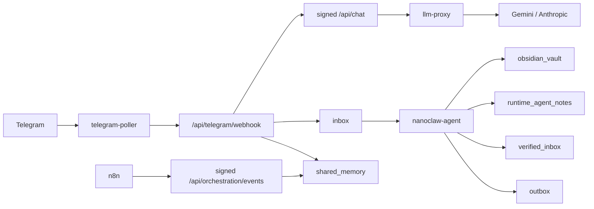

# NanoClaw v2 Implementation Coverage

이 문서는 현재 구현 상태를 Telegram-only 운영 기준으로 정리합니다.

## 1) 핵심 결론
- Next.js 프론트 경로를 제거하고 `llm-proxy` 단일 진입 구조로 정리 완료
- Telegram polling, internal HMAC chain, 최소권한 컨테이너, Tavily allowlist 적용 완료
- `/api/chat`, `/api/runtime-metrics`, `/api/orchestration/events` internal auth 강제, fail-closed secret 로드, Clio vault write boundary 고정 완료
- worker unknown `agent_id` quarantine, smoke/Clio verification self-cleanup 적용 완료
- morning preflight를 read-only 점검으로 분리 완료
- Hermes daily workflow code node 분리(`summary/template/payload/publish/response`) 완료
- morning briefing observation log/report 경로 추가 완료
- n8n execution cleanup script 추가 완료
- Minerva working memory, Clio/Hermes role memory, 승인 큐, runtime drift audit 구현 완료
- Clio v2는 template-driven Obsidian note 생성, review/suggestion/approval까지 구현 완료
- 남은 과제는 NotebookLM 실연동 검증, Aegis 실배포, 실제 7일 연속 morning briefing 운영 데이터 확보

## 2) 구현도 매트릭스

| 항목 | 상태 | 구현 근거 |
|---|---|---|
| Canonical Agent ID 단일화 | 완료 | `config/agents.json`, `proxy/app/agents.py`, `agent/runtime_worker.py`, `agent/main.py` |
| 역할 경계(미네르바/클리오/헤르메스) | 완료 | `proxy/app/main.py`, `proxy/app/role_runtime.py`, `config/personas.json` |
| LLM 단일 게이트 + 내부 인증 체인 | 완료 | `proxy/app/http_routes.py`, `proxy/app/security.py` |
| `/api/orchestration/events` signed internal gate | 완료 | `proxy/app/main.py`, `proxy/app/security.py`, `scripts/runtime/internal-api-request.sh` |
| `/api/chat`, `/api/runtime-metrics` signed internal gate | 완료 | `proxy/app/http_routes.py`, `proxy/app/security.py`, `scripts/runtime/internal-api-request.sh` |
| 모델 라우팅 + 429 fallback + 사용량 기록 | 완료 | `proxy/app/role_runtime.py`, `proxy/app/llm_client.py` |
| Hermes P0/P1/P2 스케줄 수집 | 완료 | `n8n/workflows/hermes-daily-briefing.json` |
| Hermes daily workflow node 분리 | 완료 | `n8n/workflows/hermes-daily-briefing.json` |
| Tavily 웹검색 + 안전필터 | 완료 | `n8n/workflows/hermes-web-search-tavily.json`, `proxy/app/search_client.py` |
| Telegram polling bridge + 인라인 3버튼 + 일반대화 | 완료 | `proxy/app/telegram_poller.py`, `proxy/app/telegram_bridge.py`, `proxy/app/main.py`, `proxy/app/role_runtime.py` |
| 승인 큐(2단계 확인 + TTL) | 완료 | `proxy/app/orch_store.py`, `proxy/app/orch_approval.py`, `proxy/app/main.py` |
| Event Contract(JSON Schema + 버전 검증) | 완료 | `proxy/app/orch_contract.py`, `proxy/app/main.py` |
| Minerva working memory 주입 | 완료 | `proxy/app/orch_minerva_memory.py`, `proxy/app/role_runtime.py`, `proxy/app/main.py` |
| Clio knowledge memory / Hermes evidence memory | 완료(경량 summary 기준) | `proxy/app/orch_role_memories.py`, `proxy/app/orch_clio_state.py` |
| Minerva 정책 엔진(임계/쿨다운/다이제스트) | 완료 | `proxy/app/orch_policy.py`, `proxy/app/main.py` |
| Google Calendar read-only 연동(Telegram-only) | 완료 | `proxy/app/google_calendar.py`, `proxy/app/main.py` |
| DeepL 선택 번역 최적화 | 완료 | `proxy/app/telegram_bridge.py`, `agent/clio_notebooklm.py`, `agent/clio_pipeline.py`, `agent/runtime_worker.py` |
| Clio template-driven Obsidian/verified_inbox 파이프라인 | 완료 | `agent/clio_core.py`, `agent/clio_render.py`, `agent/clio_pipeline.py`, `agent/runtime_worker.py`, `shared_data/verified_inbox` |
| Clio review/suggestion/approval | 완료 | `proxy/app/main.py`, `proxy/app/orch_store.py`, `proxy/app/orch_clio_state.py`, `scripts/verify/check-clio-*.sh` |
| user-facing vault / runtime note 분리 | 완료 | `agent/runtime_worker.py`, `agent/clio_pipeline.py`, `agent/clio_render.py`, `shared_data/obsidian_vault`, `shared_data/runtime_agent_notes` |
| Clio approval write boundary를 vault subtree로 제한 | 완료 | `proxy/app/orch_clio_state.py` |
| worker unknown `agent_id` quarantine | 완료 | `agent/runtime_worker.py` |
| smoke/Clio verification artifact self-cleanup | 완료 | `scripts/verify/smoke-runtime.sh`, `scripts/verify/check-clio-format-contract.sh`, `scripts/verify/check-clio-pipeline-e2e.sh` |
| 통합 운영 메트릭 API | 완료 | `proxy/app/http_routes.py` (`/api/runtime-metrics`) |
| morning briefing observation report | 완료 | `proxy/app/orch_runtime_state.py`, `scripts/verify/report-morning-briefing-observations.sh` |
| n8n execution cleanup / retention | 완료 | `scripts/n8n/cleanup-execution-data.sh` |
| GitHub Auto PR + Auto Merge | 완료(리포 설정 의존) | `.github/workflows/auto-pr-automerge.yml` |
| NotebookLM 실운영 검증 | 부분완료 | `agent/runtime_worker.py` dispatch 구현, 운영 endpoint 검증 미완료 |
| Aegis 운영 감시자 | 기획 | `docs/AEGIS_PLAN.md` |
| 채널 추상화(Telegram 외) | 미구현 | Telegram 전용 경로 |

## 3) 현재 아키텍처 레벨

## 4) 현재 남은 핵심 리스크
1. 실제 `7일 연속` morning briefing 성공 데이터는 아직 확보되지 않음
2. Clio가 만든 `article/paper`의 실사용 품질은 real input 기준 추가 검증 필요
3. polling dead-letter는 완화됐지만 운영상 메시지 유실을 100% 제거한 것은 아님
4. NotebookLM은 여전히 비활성 운영 상태
5. `proxy/app/orch_store.py`, `agent/clio_pipeline.py`, `agent/runtime_worker.py`는 여전히 대형 모듈이라 리팩터링 여지 큼

## 5) 지금 당장 더 필요한 것보다 뒤로 미룬 것
- Aegis runtime 도입
- VPS/외부 노출 구조
- Slack/Email 채널 추상화

현재 병목은 보안 추가보다 `실운영 신뢰성`과 `Clio/Minerva 실사용 품질`입니다.
