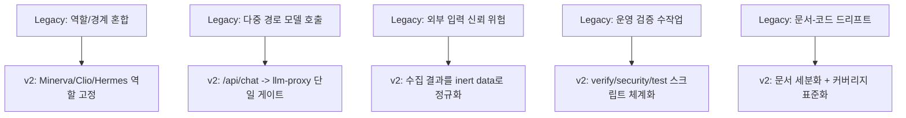
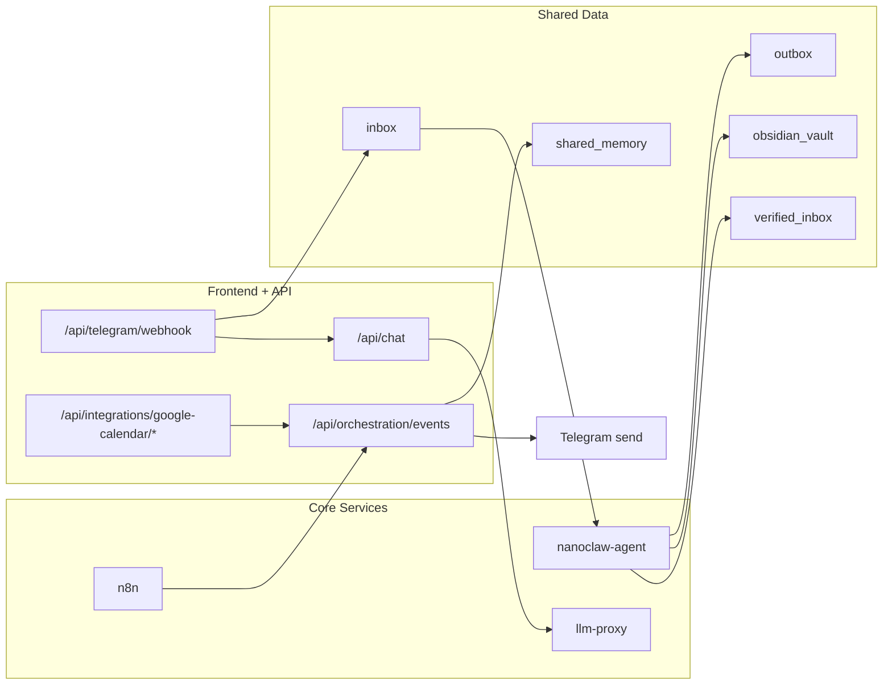

# NanoClaw v2 Implementation Coverage

이 문서는 "초기 재구축 목표 대비 현재 구현도"를 발표용으로 정리한 상태표입니다.

## 1) 핵심 결론
- 구조적 복잡도(스파게티)는 **이전 레거시 대비 크게 감소**했습니다.
- 보안 경계(내부 HMAC 체인, Telegram allowlist, n8n 안전 필터, 컨테이너 최소권한)는 **기본선 이상**으로 정착됐습니다.
- 운영 핵심(승인 큐, 이벤트 컨트랙트 검증, 런타임 메트릭 API)은 **구현 완료** 상태입니다.
- 다만 Pre-VPS 게이트 관점에서 `NotebookLM 실연동`, `운영 UI 가시성`, `채널 추상화`, `Aegis 도입`은 **미완료**입니다.

## 2) 레거시 대비 개선 축

## 3) 구현도 매트릭스

| 항목 | 상태 | 구현 근거 |
|---|---|---|
| Canonical Agent ID 단일화 | 완료 | `config/agents.json`, `src/lib/agents.ts`, `proxy/app/agents.py`, `agent/main.py` |
| 역할 경계(미네르바/클리오/헤르메스) | 완료 | `proxy/app/main.py` `ROLE_BOUNDARY`, `config/personas.json` |
| LLM 단일 게이트 + 내부 인증 체인 | 완료 | `src/app/api/chat/route.ts`, `proxy/app/security.py` |
| 모델 라우팅 + 429 fallback + 사용량 기록 | 완료 | `proxy/app/main.py`, `proxy/app/llm_client.py`, `shared_data/logs/llm_usage_metrics.json` |
| Hermes P0/P1/P2 스케줄 수집 | 완료 | `n8n/workflows/hermes-daily-briefing.json` |
| Tavily 웹검색 워크플로 + 안전필터 | 완료 | `n8n/workflows/hermes-web-search-tavily.json`, `proxy/app/search_client.py` |
| Telegram 인라인 3버튼 + 일반대화 | 완료 | `src/lib/orchestration/telegram.ts`, `src/app/api/telegram/webhook/route.ts` |
| Clio Obsidian/verified_inbox 파이프라인 | 완료 | `agent/main.py`, `shared_data/obsidian_vault`, `shared_data/verified_inbox` |
| Memory 2단계 압축(저비용 컨텍스트) | 완료 | `src/lib/orchestration/compact-memory.ts`, `src/lib/orchestration/memory-context.ts` |
| Minerva 정책 엔진(임계/쿨다운/다이제스트) | 완료(기본형) | `src/lib/orchestration/policy.ts`, `src/app/api/orchestration/events/route.ts` |
| Google Calendar read-only 연동 | 완료 | `src/lib/integrations/google-calendar.ts`, 관련 API routes |
| DeepL 선택 번역 최적화 | 완료 | `src/lib/integrations/deepl.ts`, `src/lib/orchestration/telegram.ts` |
| GitHub Auto PR + Auto Merge | 완료(체크 통과 전 대기형) | `.github/workflows/auto-pr-automerge.yml`, `scripts/github/enable-auto-pr-automerge-settings.sh` |
| Event Contract(JSON Schema + 버전 검증) | 완료(정책 옵션형) | `src/lib/orchestration/event-contract.ts`, `src/app/api/orchestration/events/route.ts` |
| Human-in-the-loop 승인 큐(2단계 확인) | 완료 | `src/lib/orchestration/storage.ts`, `src/app/api/telegram/webhook/route.ts` |
| 채널 추상화(Telegram 외) | 미구현 | Telegram 전용 경로로 구현 |
| 통합 운영 메트릭 API | 완료(백엔드) | `src/app/api/runtime-metrics/route.ts` |
| Clio 포맷 계약 버전 고정 | 완료 | `agent/main.py`, `scripts/verify/check-clio-format-contract.sh` |
| NotebookLM 실운영 연동 | 부분완료 | `agent/main.py`(dispatch 구현), 실제 endpoint 운영 검증은 미완료 |
| Aegis 운영 감시자 | 기획 | `docs/AEGIS_PLAN.md` |

## 4) 지금 기준 아키텍처 레벨

## 5) 가장 시급한 남은 보완
1. Frontend 운영 가시성(메트릭/웹훅/브리핑 SLO 상태 카드)
2. NotebookLM 실연동 검증(`NOTEBOOKLM_SYNC_ENABLED=true` 운영 테스트)
3. 채널 추상화(향후 Slack/Email 확장 대비)
4. Aegis 도입(감시/격리 정책 확정 후 단계적 적용)
5. Pre-VPS 게이트 문서 기준 최종 통과 (`docs/PRE_VPS_GATES.md`)

## 6) 운영 판단 가이드
- "오늘 바로 실운영 가능?" -> **가능** (Telegram + n8n + agent + proxy 기준)
- "VPS 이전 준비 완료?" -> **아직 아님** (`docs/PRE_VPS_GATES.md` Gate 1~4 선통과 필요)
