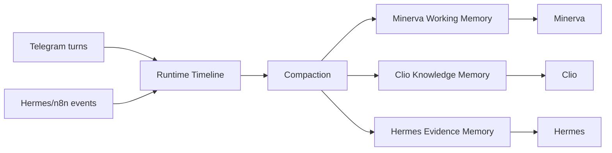

# Memory Split Spec

이 문서는 현재 하나의 `memory.md`에 섞여 있는 운영 타임라인, 사용자 맥락, 지식 메모리를 분리하는 기준을 정의합니다.

## 1) 왜 분리해야 하는가

현재 `shared_data/shared_memory/memory.md`는 다음이 섞여 있습니다.

- Hermes 이벤트
- Telegram 대화
- 검증/리허설 흔적
- 운영 메모

이 구조는 추적용 타임라인으로는 쓸 수 있지만, `Minerva`의 조언 품질과 `Clio`의 지식 구조화에는 적합하지 않습니다.

문제
- 잡음이 많다
- 사용자 목표/프로젝트 중심이 아니다
- 역할별 문맥이 분리되지 않는다
- 장기 재사용보다 운영 로그에 가깝다

## 2) 목표

메모리를 아래 4층으로 분리한다.

1. runtime timeline
2. Minerva working memory
3. Clio knowledge memory
4. Hermes evidence memory

중요:
- raw 대화 전문은 로그로 남기되, 작업 메모리에는 요약만 올린다.

## 3) 메모리 계층

### 3-1) Runtime Timeline

목적
- 운영 추적
- 장애 분석
- 이벤트 흐름 확인

포함
- orchestration event
- approval event
- telegram turn log
- system warning

비포함
- 장기 사용자 선호
- 지식 claim
- 프로젝트별 정제 맥락

현재 파일
- `shared_data/shared_memory/memory.md`
- `shared_data/shared_memory/agent_events.json`

권장 방향
- `memory.md`는 timeline 용도로만 유지

### 3-2) Minerva Working Memory

목적
- 사용자-facing 판단 품질 향상
- 최근 의사결정 맥락 유지

포함
- 장기 목표
- 현재 집중 프로젝트
- 최근 주요 결정
- 최근 미해결 이슈
- 사용자 선호하는 답변 스타일
- 다음 행동 후보

비포함
- raw Telegram 전체 대화
- Hermes 원문 수집 결과 전체
- Clio markdown 전문

예시 필드

```json
{
  "userGoals": [],
  "activeProjects": [],
  "decisionPreferences": [],
  "recentDecisions": [],
  "openLoops": [],
  "updatedAt": "ISO-8601"
}
```

### 3-3) Clio Knowledge Memory

목적
- Obsidian 저장 일관성 유지
- 템플릿/태그/프로젝트/MOC 판단 재사용

포함
- tag taxonomy
- project registry
- MOC registry
- 최근 생성 노트 요약
- 중복 후보
- link 후보

비포함
- 사용자 감정/잡담
- 운영 health log
- Hermes 수집 원문 전체

예시 필드

```json
{
  "tagTaxonomyVersion": "v1",
  "projects": [],
  "mocs": [],
  "recentNotes": [],
  "dedupeCandidates": [],
  "pendingClaimReviews": []
}
```

### 3-4) Hermes Evidence Memory

목적
- 같은 주제 반복 수집 방지
- 근거 중복 제거
- 브리핑 품질 유지

포함
- topicKey
- source refs
- trust score
- dedupe key
- last seen time
- briefing inclusion history

비포함
- Minerva 결론문 전체
- Clio note draft 전문
- 사용자 대화 전문

예시 필드

```json
{
  "topicKey": "string",
  "dedupeKey": "string",
  "sourceRefs": [],
  "trustScore": 0.0,
  "lastSeenAt": "ISO-8601",
  "usedInBriefing": true
}
```

## 4) 데이터 흐름



## 5) 요약/압축 규칙

### raw -> summary 원칙

- raw log는 저장 가능
- worker에게 전달되는 것은 summary만 허용

### compaction 시 남길 것

- 행동에 영향을 주는 결정
- 반복 주제
- 사용자의 장기 목표
- 다음 액션에 영향을 주는 사실

### compaction 시 버릴 것

- smoke/rehearsal/verification noise
- 중복 브리핑 샘플
- 형식 검증 로그
- low-value small talk

## 6) 각 에이전트가 읽을 수 있는 메모리

| Agent | 읽기 가능 | 금지 |
|---|---|---|
| `Minerva` | Runtime summary, Minerva working memory, 필요 시 Hermes/Clio summary | raw vault dump, raw evidence bulk |
| `Clio` | Clio knowledge memory, note-related summary, project/MOC registry | raw Telegram history full dump |
| `Hermes` | Hermes evidence memory, topic cooldown/dedupe state | 사용자 장기 메모 전체 |

## 7) Telegram-only 운영에서의 적용 원칙

- Telegram chat history는 원본 로그로만 유지
- Minerva inference에는 compacted working memory만 넣는다
- Clio 저장 시에는 note-related summary만 넣는다
- Hermes 재탐색에는 dedupe/trust summary만 넣는다

## 8) 현재 구현과의 차이

현재
- `memory.md` 중심
- compact memory 일부 존재
- Telegram Minerva 대화에 compact memory가 충분히 안 붙음

목표
- timeline과 working memory를 분리
- role-specific memory 사용
- raw 대화 전문 공유 금지

## 9) 권장 파일 구조

```text
shared_data/shared_memory/
  memory.md                     # runtime timeline
  compact_memory.json           # 기존 summary_block 출력
  minerva_working_memory.json   # 신규
  clio_knowledge_memory.json    # 신규
  clio_claim_review_queue.json  # knowledge claim review 대기열
  hermes_evidence_memory.json   # 신규
  telegram_chat_history.json    # raw log
  agent_events.json             # raw event log
```

## 10) 업데이트 규칙

### Runtime Timeline

- 이벤트 발생 시 append

### Minerva Working Memory

- Telegram 대화 종료 후 compacted summary 반영
- 승인/결정/프로젝트 변경 시 갱신

### Clio Knowledge Memory

- note draft 생성 후 갱신
- taxonomy/registry 변경 시 갱신

### Hermes Evidence Memory

- 브리핑 생성 후 갱신
- 동일 topic 재수집 시 dedupe/recency 갱신

## 11) 구현 우선순위

1. `memory.md`를 runtime timeline으로 역할 고정
2. `minerva_working_memory.json` 추가
3. `clio_knowledge_memory.json` 추가
4. `hermes_evidence_memory.json` 추가
5. Telegram Minerva 대화에 working memory 실제 주입

## 12) 성공 기준

1. `memory.md`에 테스트/샘플 잡음이 대폭 줄어든다
2. Minerva가 최근 사용자 목표/프로젝트를 일관되게 반영한다
3. Clio가 기존 프로젝트/태그/MOC를 안정적으로 재사용한다
4. Hermes가 중복 링크와 중복 주제를 덜 올린다

## 13) 한 줄 정책

`메모리는 하나의 거대한 로그가 아니라, 역할별로 다른 결정을 돕는 작업 기억으로 분리되어야 한다.`
