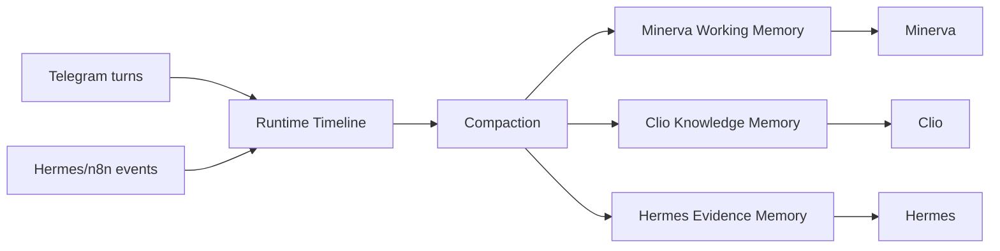

# Memory Split Spec

이 문서는 `memory.md`에 섞여 있던 운영 타임라인, 사용자 맥락, 지식 메모리를 현재 구현 기준으로 분리해 설명합니다.

## 1) 왜 분리했는가
기존 `shared_data/shared_memory/memory.md`는 아래가 섞여 있었습니다.
- Hermes 이벤트
- Telegram 대화
- 검증/리허설 흔적
- 운영 메모

이 구조는 timeline으로는 쓸 수 있지만, `Minerva`의 조언 품질과 `Clio`의 지식 구조화에는 적합하지 않았습니다.

## 2) 현재 분리된 계층
1. runtime timeline
2. Minerva working memory
3. Clio knowledge memory
4. Hermes evidence memory

원칙
- raw 대화 전문은 로그로 남기되, inference에는 summary만 올립니다.
- role별로 필요한 메모리만 읽습니다.

## 3) 계층별 정의

### Runtime Timeline
목적
- 운영 추적
- 장애 분석
- 이벤트 흐름 확인

파일
- `shared_data/shared_memory/memory.md`
- `shared_data/shared_memory/agent_events.json`
- `shared_data/shared_memory/telegram_chat_history.json`

### Minerva Working Memory
목적
- 사용자-facing 판단 품질 향상
- 최근 의사결정 맥락 유지

파일
- `shared_data/shared_memory/minerva_working_memory.json`

포함
- 장기 목표
- 현재 집중 프로젝트
- 최근 주요 결정
- 최근 미해결 이슈
- 답변 선호
- 다음 행동 후보

### Clio Knowledge Memory
목적
- Obsidian 저장 일관성 유지
- review/suggestion/중복 판단 재사용

파일
- `shared_data/shared_memory/clio_knowledge_memory.json`
- `shared_data/shared_memory/clio_claim_review_queue.json`

포함
- taxonomy/registry snapshot
- 최근 note 요약
- pending review
- pending suggestion
- dedupe 후보

### Hermes Evidence Memory
목적
- 같은 주제 반복 수집 방지
- 근거 중복 제거
- 브리핑 품질 유지

파일
- `shared_data/shared_memory/hermes_evidence_memory.json`

포함
- topicKey
- source refs
- trust score
- dedupe key
- last seen time
- briefing inclusion history

## 4) 데이터 흐름

## 5) 현재 구현 상태
- `Minerva working memory`: 실제 주입 중
- `Clio knowledge memory`: 실제 review/suggestion 흐름에서 사용 중
- `Hermes evidence memory`: dedupe/trust 요약 기준으로 사용 중
- `memory.md`: timeline 용도로 유지

## 6) compaction 원칙
남길 것
- 행동에 영향을 주는 결정
- 반복 주제
- 사용자의 장기 목표
- 다음 액션에 영향을 주는 사실

버릴 것
- smoke/rehearsal/verification noise
- 중복 브리핑 샘플
- 형식 검증 로그
- low-value small talk

## 7) 각 에이전트가 읽는 메모리

| Agent | 읽기 가능 | 금지 |
|---|---|---|
| `Minerva` | Minerva working memory + 필요한 summary | raw vault dump, raw evidence bulk |
| `Clio` | Clio knowledge memory + taxonomy/project/MOC summary | raw Telegram history full dump |
| `Hermes` | Hermes evidence memory + topic cooldown/dedupe state | 사용자 장기 메모 전체 |

## 8) 구현 파일
- `proxy/app/orch_store.py`
- `proxy/app/main.py`
- `shared_data/shared_memory/*`
