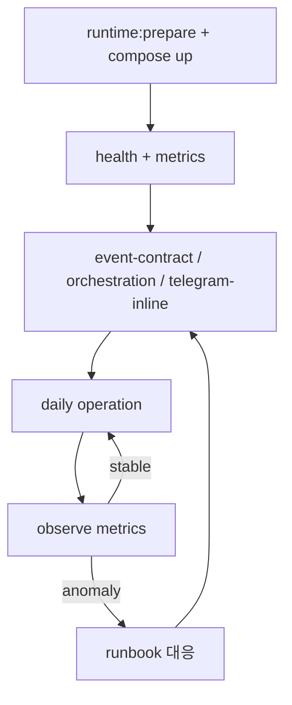

# NanoClaw v2 Operations Playbook

이 문서는 "실운영에서 무엇을, 어떤 순서로, 어떤 기준으로 확인할지"를 다룹니다.

## 1) 운영 전제

필수 실행 상태
1. `nanoclaw-frontend` Up(healthy)
2. `nanoclaw-llm-proxy` Up(healthy)
3. `nanoclaw-agent` Up
4. `nanoclaw-n8n` Up(healthy)

필수 원칙
- 설정 변경 후 `npm run runtime:prepare`로 frontend 런타임 env 재생성
- 검증 없이 운영 정책 변경 금지

## 2) Day-1 기동 순서

```bash
npm run runtime:prepare
docker compose build
docker compose up -d
docker compose ps
curl -sS http://127.0.0.1:8001/health
curl -sS http://127.0.0.1:3000/api/runtime-metrics | jq '.ok'
```

성공 기준
- 4개 서비스 모두 Up
- `llm-proxy /health` = ok
- `runtime-metrics.ok` = true

## 3) Day-1 워크플로 부트스트랩

```bash
npm run n8n:bootstrap
npm run n8n:bootstrap:hermes
npm run n8n:bootstrap:hermes-search
```

검증
```bash
npm run verify:hermes:schedule
npm run n8n:test:hermes-search
```

## 4) Day-2 운영 루틴

일일 점검
```bash
npm run verify:event-contract
npm run verify:orchestration
npm run verify:telegram:inline
npm run security:check-orchestration
npm run verify:llm-usage
```

주간 점검
```bash
npm run test:proxy
npm run verify:clio-e2e
npm run verify:daily
```

## 5) 운영 대시보드 해석 기준

`/api/runtime-metrics`

핵심 지표
- `llm.successRate`: LLM 성공률
- `llm.latencyMs.p95`: LLM 지연 상위 95%
- `llm.quota429`: 쿼터 압박 신호
- `orchestration.byDecision`: 즉시/다이제스트/억제 분포
- `orchestration.telegram.successRate`: 브리핑 전송 품질
- `orchestration.pendingApprovals`: 승인 병목 여부
- `deepl.translated`, `deepl.failed`: 번역 비용/오류 신호

## 6) 장애 대응 런북

### 6-1) 아침 브리핑 미수신

1. 컨테이너 상태 확인
```bash
docker compose ps
```
2. n8n 워크플로 상태/로그 확인
```bash
docker compose logs n8n --tail=200
```
3. 오케스트레이션 E2E 확인
```bash
FRONTEND_PORT=3000 npm run verify:orchestration
```
4. Telegram 경로 확인
```bash
npm run telegram:webhook:info
FRONTEND_PORT=3000 npm run verify:telegram:inline
```

### 6-2) Telegram 일반 대화 무응답

1. webhook secret/allowlist 확인
2. `/api/chat` 경로 확인
3. `llm-proxy /health` 확인

### 6-3) Clio 저장 누락

1. 승인 큐 상태 확인 (`pending/expired`)
2. `shared_data/inbox` 생성 여부 확인
3. `nanoclaw-agent` 로그 확인
4. `obsidian_vault`/`verified_inbox` 산출물 확인

## 7) 배포/변경 운영 규칙

1. 정책 변경 전: 영향 범위 문서화
2. 정책 변경 후: `runtime:prepare` + 컨테이너 재기동
3. 재기동 후: `verify:event-contract`, `verify:orchestration`, `security:check-orchestration` 필수
4. 운영 중대 변경은 PR로 리뷰 후 반영

## 8) 자동 PR + Auto-Merge 운영

워크플로
- `.github/workflows/auto-pr-automerge.yml`
- 동작: `main`이 아닌 브랜치로 push되면 PR을 생성(또는 재사용)하고 auto-merge를 활성화 시도

필수 선행조건(1회)
1. GitHub Repository Settings -> General -> Pull Requests -> `Allow auto-merge` 활성화
2. `main` 보호 규칙에서 Required checks 유지(예: `runtime-verification`)
3. 1인 운영이면 `required approvals = 0`(solo 프로필), 2인 이상이면 strict 프로필

주의
- required check가 통과되기 전에는 머지되지 않음(정상 동작)
- repo 설정에서 auto-merge가 비활성화되어 있으면 워크플로는 PR 생성까지만 수행
- 이미 열린 PR이 있으면 새 PR을 만들지 않고 기존 PR에 auto-merge를 재설정

## 9) 운영 시퀀스 시각화



## 10) 체크리스트 (운영자용)

- [ ] strict schema(`ORCH_REQUIRE_SCHEMA_V1`)가 frontend runtime env에 반영됨
- [ ] Telegram 액션 3종이 2단계 승인으로 동작함
- [ ] `security:check-orchestration` PASS
- [ ] runtime-metrics 주요 필드 정상 노출
- [ ] n8n timezone이 `Asia/Seoul`로 고정됨
