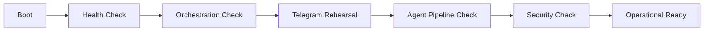

# NanoClaw v2 Operations Playbook

이 문서는 "어떻게 띄우고, 어떻게 검증하고, 장애 시 어떻게 복구하는가"를 설명합니다.

## 1) Day-1 기동

### 1-1. 필수 환경
- `.env.local` 준비 (`.env.local.example` 기반)
- 핵심 비밀값 설정
  - `INTERNAL_API_TOKEN`, `INTERNAL_SIGNING_SECRET`, `N8N_ENCRYPTION_KEY`
  - `TELEGRAM_BOT_TOKEN`, `TELEGRAM_CHAT_ID`, `TELEGRAM_WEBHOOK_SECRET`

### 1-2. 기동
```bash
docker compose build
docker compose up -d
docker compose ps
npm run dev -- --hostname 127.0.0.1 --port 3000
```

### 1-3. 즉시 확인
```bash
curl -sS http://127.0.0.1:8001/health
```

성공 기준
- `nanoclaw-agent`, `nanoclaw-llm-proxy`, `nanoclaw-n8n`가 `Up`
- `llm-proxy` health 응답 정상
- 프론트 `127.0.0.1:3000` 접속 가능

## 2) Day-1 워크플로 부트스트랩

### 2-1. n8n 기본
```bash
npm run n8n:bootstrap
```

### 2-2. Hermes 워크플로
```bash
npm run n8n:bootstrap:hermes
npm run n8n:bootstrap:hermes-search
```

### 2-3. 워크플로 검증
```bash
npm run verify:hermes:schedule
npm run n8n:test:hermes-search
```

## 3) Day-2 운영 점검 루틴

### 3-1. 권장 일일 점검
```bash
npm run verify:smoke
npm run verify:orchestration
npm run verify:telegram:inline
npm run security:check-orchestration
```

### 3-2. 주간 점검
```bash
npm run test:proxy
npm run verify:llm-usage
npm run verify:clio-e2e
```

### 3-3. 텔레그램 실운영 리허설
```bash
npm run telegram:webhook:info
npm run telegram:rehearsal:send
```

## 4) 운영 시나리오별 필수 프로세스

### 4-1. Telegram 브리핑이 안 올 때
1. `docker compose ps`로 `nanoclaw-n8n`, `nanoclaw-llm-proxy` 확인
2. `npm run telegram:webhook:info`로 webhook 설정 확인
3. `npm run verify:orchestration`로 이벤트->디스패치 경로 점검
4. `docker compose logs n8n --tail=100` 확인

### 4-2. 텔레그램 일반 대화 응답이 없을 때
1. Next 서버(`3000`) 실행 여부 확인
2. `TELEGRAM_ALLOWED_USER_IDS/CHAT_IDS` 값 확인
3. `/api/telegram/webhook` 로그에서 rate-limit/allowlist 차단 여부 확인

### 4-3. Clio 저장이 누락될 때
1. `shared_data/inbox`에 `clio` task 생성 여부 확인
2. `nanoclaw-agent` 로그에서 watchdog 처리 확인
3. `shared_data/verified_inbox`와 `shared_data/obsidian_vault` 생성 여부 확인

## 5) 번역(DeepL) 운영 정책

- 브리핑 기본 언어: 한국어 우선
- 비용 절감 정책
  - `P0`: summary + 상위 2개 snippet 번역
  - `P1`: summary + 상위 1개 snippet 번역
  - `P2`: 자동 번역 없음
- 필수 환경값
  - `DEEPL_API_KEY`
  - `DEEPL_TARGET_LANG=KO`

검증
- DeepL key 유효성: 단건 번역 API 호출이 `HTTP 200`
- E2E: `/api/orchestration/events` 영어 payload -> 텔레그램 `핵심 요약` 한글 출력

## 6) 브랜치 보호 운영

### 6-1. 수동 적용
```bash
GITHUB_TOKEN=*** \
GITHUB_REPO=Merchantlee99/Personal-AI-agent-v2 \
GITHUB_BRANCH=main \
npm run security:branch-protect
```

### 6-2. 운영 프로필
- `strict`: 승인 1개 + 필수 상태체크
- `solo`: 승인 0개 + 필수 상태체크(1인 운영)
- `auto`: 운영자 수 기준 자동 선택

## 7) 운영 상태 다이어그램


