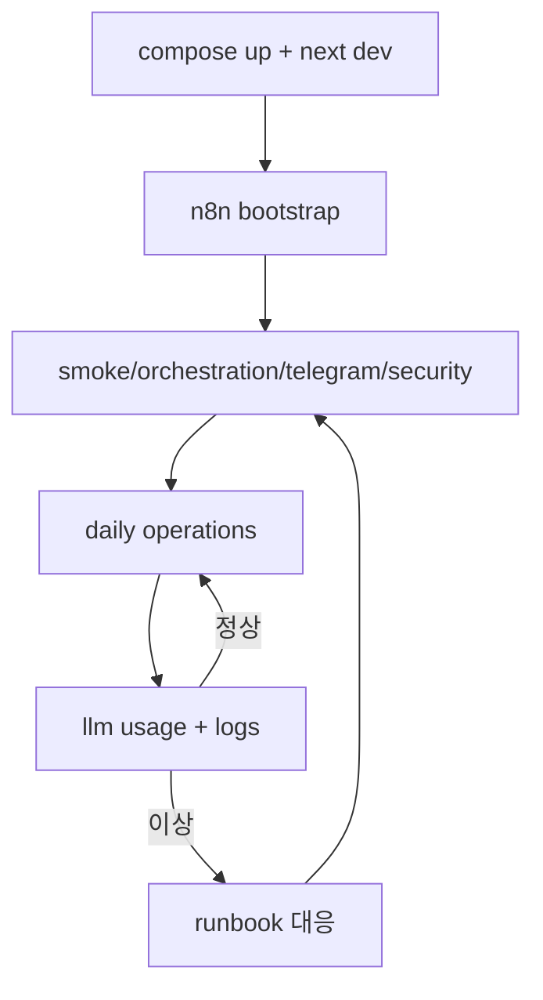

# NanoClaw v2 Operations Playbook

이 문서는 "실운영에서 무엇을, 어떤 순서로, 어떤 기준으로" 실행하는 문서입니다.

## 1) 운영 전제

필수 실행 상태
1. `nanoclaw-llm-proxy` Up(healthy)
2. `nanoclaw-agent` Up
3. `nanoclaw-n8n` Up(healthy)
4. `nanoclaw-frontend` Up(healthy)

중요 사실
- 현재 frontend는 docker compose 서비스로 포함됩니다.
- 기본 운영은 compose 기반(`frontend` 컨테이너), 로컬 `npm run dev`는 개발 모드 선택사항입니다.

## 2) Day-1 기동 순서

```bash
docker compose build
docker compose up -d
docker compose ps
curl -sS http://127.0.0.1:8001/health
curl -sS http://127.0.0.1:3000/api/runtime-metrics | jq '{ok,generatedAt}'
```

성공 기준
- 4개 컨테이너(frontend/proxy/agent/n8n) 모두 Up
- `llm-proxy /health`가 `ok`
- `http://127.0.0.1:3000` 접속 가능

## 3) n8n 워크플로 부트스트랩

```bash
npm run n8n:bootstrap
npm run n8n:bootstrap:hermes
npm run n8n:bootstrap:hermes-search
```

검증
```bash
npm run verify:hermes:schedule
npm run n8n:test:hermes-search
```

## 4) Day-2 운영 루틴

일일 점검
```bash
npm run verify:smoke
npm run verify:orchestration
npm run verify:telegram:inline
npm run verify:telegram:chat
npm run verify:clio:format
npm run security:check-orchestration
npm run verify:llm-usage
```

주간 점검
```bash
npm run test:proxy
npm run verify:clio-e2e
npm run verify:clio:format
npm run verify:memory
npm run verify:llm-runtime
```

## 5) 장애 대응 런북

### 5-1) 아침 브리핑 미수신
1. 서비스 상태 확인
```bash
docker compose ps
```
2. n8n 로그 확인
```bash
docker compose logs n8n --tail=200
```
3. 오케스트레이션 경로 검증
```bash
FRONTEND_PORT=3000 npm run verify:orchestration
```
4. Telegram webhook 상태 확인
```bash
npm run telegram:webhook:info
```

### 5-2) Telegram 일반 대화 무응답
1. `.env.local`의 `TELEGRAM_WEBHOOK_SECRET`, `TELEGRAM_ALLOWED_*` 확인
2. Next.js 서버 살아있는지 확인
   - compose 운영 기준: `docker compose ps`에서 `nanoclaw-frontend` 상태 확인
   - 개발 모드 기준: `npm run dev` 프로세스 확인
3. `llm-proxy /health` 확인
4. 대화 경로 검증
```bash
npm run verify:telegram:chat
```

### 5-3) Clio 산출물 누락
1. inbox 파일 생성 여부 확인: `shared_data/inbox`
2. agent 로그 확인
```bash
docker compose logs nanoclaw-agent --tail=200
```
3. 산출물 확인
- `shared_data/obsidian_vault`
- `shared_data/verified_inbox`
- `shared_data/outbox`
4. 포맷 계약 검증
```bash
npm run verify:clio:format
```

## 6) 변경 반영 운영 규칙
1. `.env.local` 수정 후 컨테이너 재기동
```bash
docker compose up -d --build
```
2. 재기동 후 핵심 검증
```bash
npm run verify:smoke
npm run verify:orchestration
npm run security:check-orchestration
```
3. 운영 중대 변경은 PR 경유(직접 main 반영 지양)

## 7) GitHub Auto PR + Auto-Merge 운영

관련 파일
- `.github/workflows/auto-pr-automerge.yml`
- `scripts/github/enable-auto-pr-automerge-settings.sh`

동작
- `main`이 아닌 브랜치 push 시 PR 생성/재사용
- auto-merge 활성화 시도(필수 체크 green 이후 merge)

1회 선행 설정
1. Repository Settings -> General -> Pull Requests -> `Allow auto-merge`
2. Repository Settings -> Actions -> General
   - Workflow permissions: `Read and write`
   - `Allow GitHub Actions to create and approve pull requests`
3. 브랜치 보호 규칙(required checks) 정리

부트스트랩
```bash
GITHUB_TOKEN=*** GITHUB_REPO=Merchantlee99/Personal-AI-agent-v2 npm run github:auto-merge:bootstrap
```

## 8) 운영 시퀀스



## 9) 운영 체크리스트
- [ ] Telegram action allowlist 3종 설정됨
- [ ] `security:check-orchestration` PASS
- [ ] `verify:hermes:schedule` PASS
- [ ] `verify:telegram:inline` PASS
- [ ] `test:proxy` PASS
- [ ] Auto PR workflow 성공(run failed 없음)

## 10) 오브 렌더 튜닝 루프(개발)

레퍼런스 매칭 작업은 감으로 튜닝하지 않고 프레임 비교 루프로 수행합니다.

```bash
# 최신 Desktop 녹화 2개 자동 비교
npm run render:analyze:latest

# 수동 지정 비교
REFERENCE_VIDEO="/abs/path/reference.mov" CURRENT_VIDEO="/abs/path/current.mov" npm run render:analyze

# 단일 영상 프레임 추출
INPUT_VIDEO="/abs/path/current.mov" npm run render:extract
```

산출물:
- `shared_data/render_review/<run_id>/report.md`
- `side_by_side.mp4`, `diff.mp4`, `worst_frames/*.png`

## 11) 16GB 로컬 안정성 가드

커널 패닉/메모리 압박 가능성을 줄이기 위한 최소 규칙:
1. `next dev`는 반드시 1개만 실행
2. `npm run dev`와 `frontend` 컨테이너를 동시에 장시간 중복 사용하지 않기
3. WebGL 탭(오브 화면) 다중 오픈 금지
4. 메모리 압박 시 우선 조치: 불필요 브라우저 탭 종료 -> dev 재기동 -> compose 재확인

권장 점검:
```bash
docker stats --no-stream
docker compose ps
vm_stat
```
