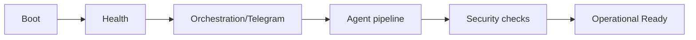

# NanoClaw v2 Operations Playbook

이 문서는 "지금 바로 어떻게 운영하는가"를 설명합니다.
아키텍처/보안/시나리오는 [ARCHITECTURE](ARCHITECTURE.md), [SECURITY_BASELINE](SECURITY_BASELINE.md), [USE_CASES](USE_CASES.md)를 봅니다.

## 1) 운영 최소 조건 (반드시 유지)

실사용 상태를 유지하려면 아래 3가지를 동시에 만족해야 합니다.

1. 컨테이너 3개가 `Up`
- `nanoclaw-agent`
- `nanoclaw-llm-proxy`
- `nanoclaw-n8n`

2. 프론트 서버 실행 중
- `npm run dev -- --hostname 127.0.0.1 --port 3000`

3. (외부 Telegram webhook 사용 시) 공개 HTTPS 터널 1개

중요
- 컨테이너는 `docker compose up -d`로 띄우면 터미널 종료 후에도 유지됩니다.
- `npm run dev`는 터미널 프로세스라 종료 시 함께 중단됩니다.

## 2) Day-1 기동

```bash
docker compose build
docker compose up -d
docker compose ps
npm run dev -- --hostname 127.0.0.1 --port 3000
curl -sS http://127.0.0.1:8001/health
```

성공 기준
- `docker compose ps`에서 핵심 3서비스 `Up`
- `llm-proxy /health` 응답 정상
- `127.0.0.1:3000` 접속 정상

## 3) Day-1 워크플로 부트스트랩

타임존 사전 확인
```bash
grep -E '^(GENERIC_TIMEZONE|N8N_DEFAULT_TIMEZONE|TZ)=' .env.local
```
- 기대값: 모두 `Asia/Seoul`

```bash
npm run n8n:bootstrap
npm run n8n:bootstrap:hermes
npm run n8n:bootstrap:hermes-search
```

검증
```bash
npm run verify:hermes:schedule
npm run n8n:test:hermes-search
```

## 4) Day-2 운영 루틴

일일
```bash
npm run verify:smoke
npm run verify:orchestration
npm run verify:telegram:inline
npm run security:check-orchestration
```

주간
```bash
npm run test:proxy
npm run verify:llm-usage
npm run verify:clio-e2e
```

## 5) 즉시 트러블슈팅

### 5-1) Telegram 브리핑이 안 올 때
1. `docker compose ps`
2. `npm run telegram:webhook:info`
3. `npm run verify:orchestration`
4. `docker compose logs n8n --tail=100`

### 5-2) Telegram 일반 대화 응답이 없을 때
1. `3000` 포트 Next 서버 실행 확인
2. `TELEGRAM_ALLOWED_USER_IDS/CHAT_IDS` 확인
3. webhook 로그에서 allowlist/rate-limit 차단 확인

### 5-3) Clio 저장 누락 시
1. `shared_data/inbox`에 clio task 생성 여부 확인
2. `nanoclaw-agent` 로그 확인
3. `shared_data/verified_inbox`, `shared_data/obsidian_vault` 산출물 확인

## 6) 번역(DeepL) 운영

정책
- `P0`: summary + 상위 2개 snippet 번역
- `P1`: summary + 상위 1개 snippet 번역
- `P2`: 자동 번역 없음

필수 값
- `DEEPL_API_KEY`
- `DEEPL_TARGET_LANG=KO`

검증
- 단건 API `HTTP 200`
- 영어 이벤트 E2E 전송 시 텔레그램 `핵심 요약` 한글 출력

## 7) 브랜치 보호 운영

수동 적용
```bash
GITHUB_TOKEN=*** \
GITHUB_REPO=Merchantlee99/Personal-AI-agent-v2 \
GITHUB_BRANCH=main \
npm run security:branch-protect
```

프로필
- `strict`: 승인 1개 + 필수 상태체크
- `solo`: 승인 0개 + 필수 상태체크
- `auto`: 운영자 수 기준 자동 선택

## 8) 운영 상태 플로우


