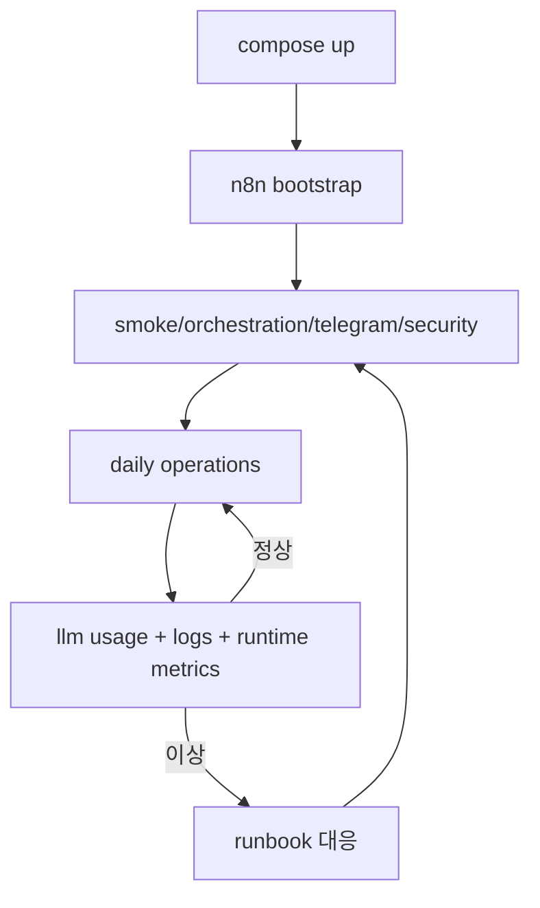

# NanoClaw v2 Operations Playbook

이 문서는 실운영에서 무엇을 어떤 순서로 실행하는지 정리합니다.

## 1) 운영 전제

필수 실행 상태
1. `nanoclaw-llm-proxy` Up(healthy)
2. `nanoclaw-telegram-poller` Up
3. `nanoclaw-agent` Up
4. `nanoclaw-n8n` Up(healthy)

중요 사실
- 현재 운영은 Telegram-only입니다. Next.js 프론트는 제거되었습니다.
- API 진입점은 `llm-proxy:8000`(호스트 `127.0.0.1:8001`)입니다.

## 2) Day-1 기동 순서

```bash
bash scripts/runtime/compose.sh build
bash scripts/runtime/compose.sh up -d
bash scripts/runtime/compose.sh ps
curl -sS http://127.0.0.1:8001/health
curl -sS http://127.0.0.1:8001/api/runtime-metrics | jq '{ok,generatedAt}'
```

성공 기준
- 4개 컨테이너(proxy/poller/agent/n8n) 모두 Up
- `llm-proxy /health`가 `ok`

## 3) n8n 워크플로 부트스트랩

```bash
npm run n8n:bootstrap
npm run n8n:bootstrap:hermes
npm run n8n:bootstrap:hermes-search
```

검증
```bash
npm run verify:hermes:schedule
npm run n8n:test:hermes-search
```

## 4) Day-2 운영 루틴

일일 점검
```bash
npm run verify:daily
```

수동 개별 점검
```bash
npm run verify:smoke
npm run verify:orchestration
npm run verify:telegram:inline
npm run verify:telegram:chat
npm run verify:telegram:gcal
npm run verify:morning:gcal
npm run verify:runtime:drift
npm run verify:clio:format
npm run verify:clio:suggestion
npm run verify:clio:merge
npm run verify:clio:approval
npm run verify:morning:preflight
npm run security:check-orchestration
npm run verify:llm-usage
```

주간 점검
```bash
npm run test:proxy
npm run verify:clio-e2e
npm run verify:memory
npm run verify:llm-runtime
npm run verify:clio:approval
```

## 5) 장애 대응 런북

### 5-1) 아침 브리핑 미수신
1. 서비스 상태 확인
```bash
bash scripts/runtime/compose.sh ps
```
2. n8n 로그 확인
```bash
bash scripts/runtime/compose.sh logs n8n --tail=200
```
3. 오케스트레이션 경로 검증
```bash
npm run verify:orchestration
```
4. Telegram poller 로그 확인
```bash
bash scripts/runtime/compose.sh logs telegram-poller --tail=200
```
5. dead-letter 확인 및 필요 시 replay
```bash
tail -n 20 shared_data/logs/telegram_poller_dead_letter.jsonl
npm run telegram:dead-letter:replay -- all
```
6. inactive duplicate workflow 정리
```bash
npm run n8n:purge:inactive
```

### 5-2) Telegram 일반 대화 무응답
1. `.env.local`의 `TELEGRAM_BOT_TOKEN`, `TELEGRAM_WEBHOOK_SECRET`, `TELEGRAM_ALLOWED_*` 확인
2. `llm-proxy /health` 확인
3. `telegram-poller` 로그 확인
```bash
bash scripts/runtime/compose.sh logs telegram-poller --tail=200
```
4. 대화 경로 검증
```bash
npm run verify:telegram:chat
```

### 5-3) Clio 산출물 누락
1. inbox 파일 생성 여부 확인: `shared_data/inbox`
2. agent 로그 확인
```bash
bash scripts/runtime/compose.sh logs nanoclaw-agent --tail=200
```
3. 산출물 확인
- `shared_data/obsidian_vault`
- `shared_data/verified_inbox`
- `shared_data/outbox`
4. 포맷 계약 검증
```bash
npm run verify:clio:format
```
5. knowledge claim 승인 대기 확인
```bash
npm run verify:clio:approval
```
6. Telegram에서 검토 목록 확인
```text
/clio_reviews
/clio_suggestions
```

### 5-4) Google Calendar 명령 실패
1. 상태 확인
```bash
curl -sS http://127.0.0.1:8001/api/integrations/google-calendar/status \
  -H "x-internal-token: $INTERNAL_API_TOKEN" \
  -H "x-timestamp: <ts>" \
  -H "x-nonce: <nonce>" \
  -H "x-signature: <sig>"
```
2. Telegram에서 `/gcal_status`, `/gcal_today` 확인
3. 필요 시 `/gcal_connect`로 OAuth 재연결

## 6) 변경 반영 운영 규칙
1. `.env.local` 수정 후 컨테이너 재기동
```bash
bash scripts/runtime/compose.sh up -d --build
```
2. 재기동 후 핵심 검증
```bash
npm run verify:daily
npm run verify:morning:preflight
npm run verify:smoke
npm run verify:orchestration
npm run verify:runtime:drift
npm run security:check-orchestration
```
3. 운영 중대 변경은 PR 경유(직접 main 반영 지양)

## 7) GitHub Auto PR + Auto-Merge 운영

관련 파일
- `.github/workflows/auto-pr-automerge.yml`
- `scripts/github/enable-auto-pr-automerge-settings.sh`

동작
- `main`이 아닌 브랜치 push 시 PR 생성/재사용
- auto-merge 활성화 시도(필수 체크 green 이후 merge)

1회 선행 설정
1. Repository Settings -> General -> Pull Requests -> `Allow auto-merge`
2. Repository Settings -> Actions -> General
   - Workflow permissions: `Read and write`
   - `Allow GitHub Actions to create and approve pull requests`
3. 브랜치 보호 규칙(required checks) 정리

부트스트랩
```bash
GITHUB_TOKEN=*** GITHUB_REPO=Merchantlee99/Personal-AI-agent-v2 npm run github:auto-merge:bootstrap
```

## 8) 운영 시퀀스



## 9) 운영 체크리스트
- [ ] Telegram action allowlist 3종 설정됨
- [ ] `security:check-orchestration` PASS
- [ ] `verify:hermes:schedule` PASS
- [ ] `verify:runtime:drift` PASS
- [ ] `verify:telegram:inline` PASS
- [ ] `test:proxy` PASS
- [ ] Auto PR workflow 성공(run failed 없음)

## 10) 16GB 로컬 안정성 가드
1. Docker 컨테이너 4개 외 불필요 프로세스 상시 정리
2. 장시간 미사용 시 `bash scripts/runtime/compose.sh stop`으로 메모리 회수
3. 점검 명령
```bash
docker stats --no-stream
bash scripts/runtime/compose.sh ps
vm_stat
```

## 11) Host Secret 운영

권장 원칙
1. `.env.local`에는 시크릿 값 대신 ref만 둡니다.
2. 실제 값은 macOS Keychain 또는 1Password에 저장합니다.
3. compose 실행은 `bash scripts/runtime/compose.sh ...`로 고정합니다. 직접 `docker compose --env-file .env.local ...`를 호출하면 Keychain/1Password ref가 빈 값으로 해석될 수 있습니다.

macOS Keychain 예시
```bash
security add-generic-password -U -s nanoclaw -a TELEGRAM_BOT_TOKEN -w '...'
security add-generic-password -U -s nanoclaw -a INTERNAL_API_TOKEN -w '...'
security add-generic-password -U -s nanoclaw -a INTERNAL_SIGNING_SECRET -w '...'
```

`.env.local` ref 예시
```bash
TELEGRAM_BOT_TOKEN=
TELEGRAM_BOT_TOKEN_KEYCHAIN_SERVICE=nanoclaw
TELEGRAM_BOT_TOKEN_KEYCHAIN_ACCOUNT=TELEGRAM_BOT_TOKEN
```

## 12) Clio 승인/제안 운영

Clio knowledge claim
1. 새 knowledge draft는 자동으로 Telegram 검토 알림이 갈 수 있습니다.
2. `/clio_reviews`로 pending claim을 조회할 수 있습니다.
3. 승인 시 `draft -> confirmed`, note frontmatter도 같이 갱신됩니다.

Clio note suggestion
1. `/clio_suggestions`로 pending update/merge 제안을 조회합니다.
2. 제안 메시지에는 점수, 근거 2~3줄, 변경 요약이 포함됩니다.
3. `이 제안 보류`를 누르면 cooldown 동안 같은 fingerprint 제안은 재등장하지 않습니다.
4. note 내용/대상/fingerprint가 바뀌면 다시 제안될 수 있습니다.

## 13) Morning Preflight 해석

`npm run verify:morning:preflight`는 09:00 KST 브리핑 전에 아래를 확인합니다.
1. runtime up
2. `llm-proxy /health`
3. Hermes schedule/dispatch
4. morning calendar attach
5. Telegram Minerva text path
6. runtime drift

실패 시 출력 형식
```text
[morning-preflight] FAIL step=...
[morning-preflight] cause=...
[morning-preflight] next_action=...
```

1Password 예시
```bash
ANTHROPIC_API_KEY=
ANTHROPIC_API_KEY_OP_REF=op://Private/NanoClaw/ANTHROPIC_API_KEY
```
