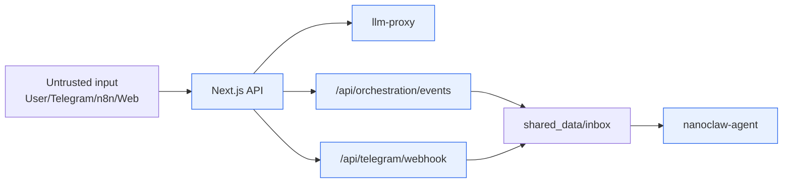
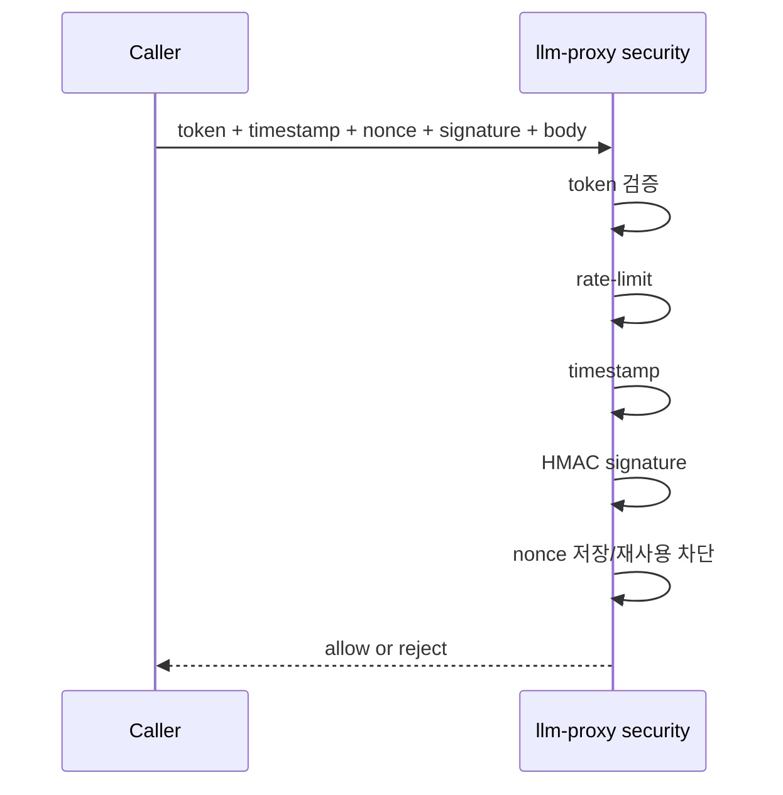

# NanoClaw v2 Security Baseline

이 문서는 "무엇을 막고, 어떤 통제로 막는가"를 설명합니다.
실행 절차는 [OPERATIONS_PLAYBOOK](OPERATIONS_PLAYBOOK.md)를 봅니다.

## 1) 보호 목표

- 내부 API 위변조/재전송 방지
- 외부 수집 데이터의 prompt injection 무해화
- Telegram callback 오용/권한 우회 방지
- 컨테이너/네트워크 최소 권한 유지

## 2) Trust Boundary



원칙
- 외부 입력은 항상 "실행 불가 데이터"로만 처리합니다.

## 3) 내부 인증/무결성 체인

적용 대상: `llm-proxy` (`/api/agent`, `/api/agents`, `/api/search`)

필수 헤더
- `x-internal-token`
- `x-timestamp`
- `x-nonce`
- `x-signature`

검증 순서
1. token 검증
2. rate-limit 검증
3. timestamp 검증
4. HMAC signature 검증
5. nonce 저장/재사용 차단



왜 이 순서인가?
- signature 검증 전에 nonce를 저장하면, 무효 서명 요청으로 nonce cache를 오염시켜 DoS 표면이 커집니다.

## 4) 통제 매트릭스

| 위협 | 통제 | 확인 지점 |
|---|---|---|
| 내부 요청 위조 | token + HMAC + timestamp + nonce | proxy security 검증 로그/테스트 |
| replay 공격 | nonce TTL + 재사용 차단 | nonce store hit |
| callback 오용 | webhook secret + allowlist + action allowlist | `/api/telegram/webhook` 응답/로그 |
| prompt injection | 패턴 제거 + inert data contract | n8n `security_stats` |
| 과권한 컨테이너 | read_only/cap_drop/no-new-privileges | `docker compose`/검증 스크립트 |

## 5) Telegram 보안 기준

- webhook secret: `TELEGRAM_WEBHOOK_SECRET`
- 허용 사용자/채팅: `TELEGRAM_ALLOWED_USER_IDS`, `TELEGRAM_ALLOWED_CHAT_IDS`
- 허용 액션: `TELEGRAM_ALLOWED_CALLBACK_ACTIONS`
- 텍스트 대화 rate-limit 적용

허용 액션
- `clio_save`
- `hermes_deep_dive`
- `minerva_insight`

## 6) Hermes 수집 보안 기준

- prompt-like 텍스트 제거
- unsafe URL 차단(`localhost`, 사설 IP, 비정상 스킴)
- downstream 전달 계약: `inert_search_records_only`
- 필터 통계 `security_stats` 유지

## 7) 런타임 하드닝

핵심 서비스 공통
- `read_only: true`
- `cap_drop: [ALL]`
- `security_opt: ["no-new-privileges:true"]`
- `tmpfs` 사용

네트워크
- internal network: 내부 서비스 통신
- external network: 외부 API 필요한 서비스만 연결
- published port는 localhost 바인딩만 허용 (`127.0.0.1`)
  - frontend `127.0.0.1:3000`
  - llm-proxy `127.0.0.1:8001`
  - n8n `127.0.0.1:5678`

Orchestration 경로
- n8n -> frontend는 내부 DNS 고정: `http://frontend:3000/api/orchestration/events`
- `host.docker.internal` 경로는 기본 운영 경로로 사용하지 않음

## 8) 비밀값 운영

- 실제 비밀값은 `.env.local`만 사용(커밋 금지)
- 우선 로테이션
  - `INTERNAL_API_TOKEN`
  - `INTERNAL_SIGNING_SECRET`
  - `N8N_ENCRYPTION_KEY`
  - `TELEGRAM_WEBHOOK_SECRET`
  - `GOOGLE_CALENDAR_OAUTH_CLIENT_SECRET`
  - `DEEPL_API_KEY`

## 9) 최소 보안 검증

```bash
npm run security:check-orchestration
npm run verify:smoke
npm run verify:telegram:inline
npm run verify:clio-e2e
```
