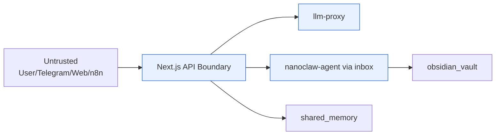
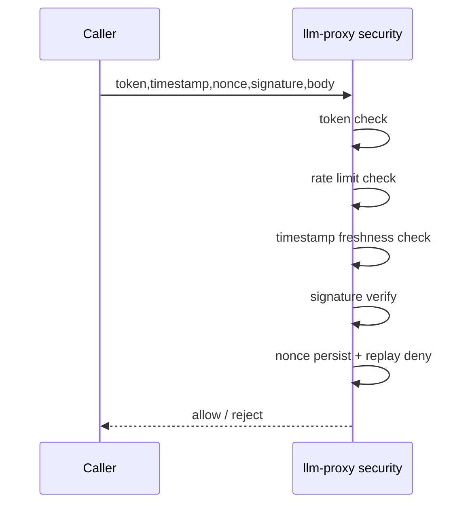
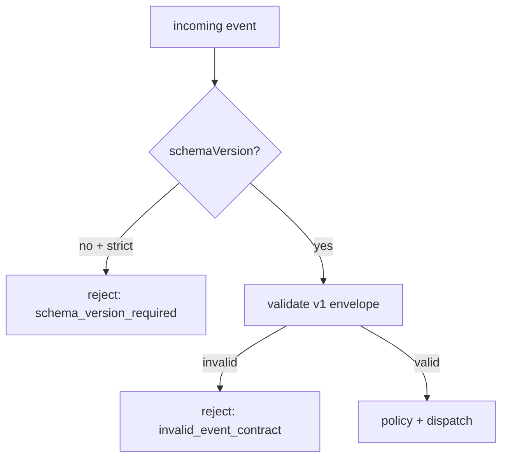
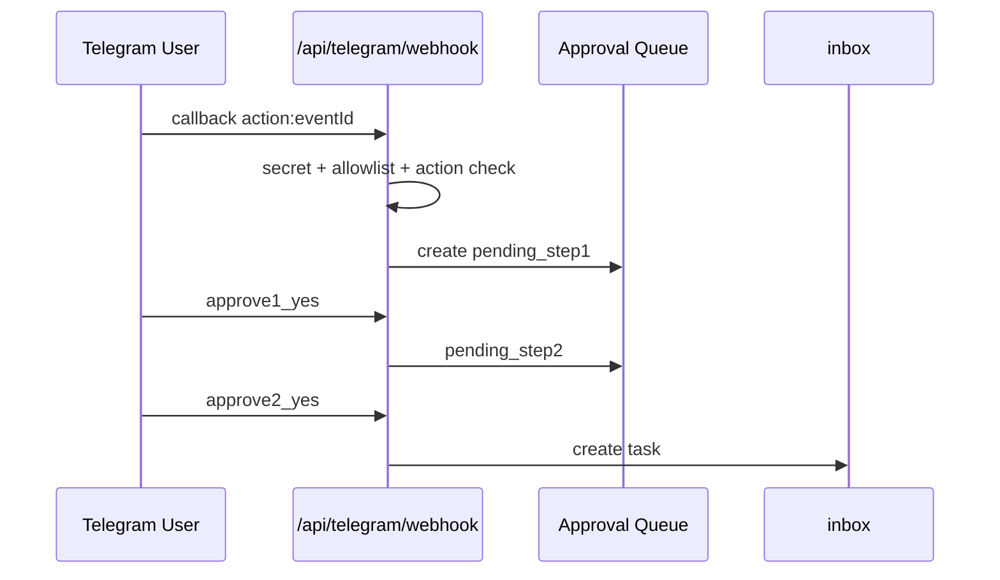

# NanoClaw v2 Security Baseline

이 문서는 "무엇을 위협으로 보고, 어떤 통제로 차단하는가"를 설명합니다.

## 1) 보호 목표

1. 내부 API 위조/재전송(replay) 차단
2. 외부 수집 데이터 기반 prompt injection 차단
3. Telegram callback 권한 오용 차단
4. 컨테이너 런타임 최소 권한 유지
5. 운영 중 설정 드리프트 조기 탐지

## 2) v1 -> v2 보안 구조 개선

| 영역 | 이전 위험 | v2 통제 | 효과 |
|---|---|---|---|
| 내부 인증 | 단일 토큰 의존 가능성 | token + timestamp + nonce + HMAC | 위조/재전송 방어 강화 |
| nonce 처리 | 검증 순서 취약 가능성 | signature 검증 후 nonce 저장 | 무효 요청 nonce 오염/DoS 표면 축소 |
| 이벤트 입력 | 암묵 payload 수용 | Event Contract v1 + strict 게이트 | 구조 깨짐/예상치 못한 필드 유입 감소 |
| Telegram 액션 | 단발 승인 리스크 | 2단계 승인 + TTL + allowlist | 오실행/권한 우회 완화 |
| 수집 파이프라인 | 외부 텍스트 신뢰 위험 | injection 패턴/unsafe URL 필터 | 프롬프트 오염 완화 |
| 런타임 권한 | 기본 권한 과다 가능성 | read_only + cap_drop + no-new-privileges + tmpfs | 컨테이너 탈주/피해 범위 축소 |

## 3) Trust Boundary



원칙
- 외부 입력은 절대 "명령"으로 해석하지 않고, 항상 "데이터 레코드"로만 처리합니다.

## 4) 내부 요청 인증/무결성 체인

대상: `llm-proxy` 보호 라우트 (`/api/agent`, `/api/agents`, `/api/search`)

필수 헤더
- `x-internal-token`
- `x-timestamp`
- `x-nonce`
- `x-signature`

검증 순서
1. token 검증
2. rate limit 검증
3. timestamp 검증
4. HMAC signature 검증
5. nonce 저장 + 재사용 차단



검증 순서의 이유
- signature 검증 전에 nonce를 저장하면 무효 서명 요청이 nonce 저장소를 오염시켜 DoS 표면이 커집니다.

## 5) Event Contract 보안 게이트

- 스키마 파일: `docs/schemas/orchestration-event.v1.schema.json`
- strict 모드: `ORCH_REQUIRE_SCHEMA_V1=true`

차단 규칙
- envelope 미존재: `schema_version_required`
- 필수 필드 누락/타입 불일치: `invalid_event_contract + validationErrors`



## 6) Telegram 보안 통제

필수 통제
- webhook secret: `TELEGRAM_WEBHOOK_SECRET`
- 사용자/채팅 allowlist: `TELEGRAM_ALLOWED_USER_IDS`, `TELEGRAM_ALLOWED_CHAT_IDS`
- 허용 액션 allowlist: `TELEGRAM_ALLOWED_CALLBACK_ACTIONS`
- 텍스트 질의 rate limit

고위험 액션 보호
- 2단계 승인(yes/no -> 재확인 yes/no)
- 승인 TTL: 기본 300초
- TTL 절반 경과 시 프론트 승인 카드 에스컬레이션



## 7) Hermes 수집 보안 통제

n8n 워크플로 기준
- injection 패턴 제거
- unsafe URL 차단(`localhost`, private IP, 비정상 scheme)
- `security_stats` 산출
- downstream에는 정제된 레코드만 전달

## 8) 런타임/네트워크 하드닝

공통 컨테이너 통제
- `read_only: true`
- `cap_drop: [ALL]`
- `security_opt: [no-new-privileges:true]`
- `tmpfs` 사용

네트워크 통제
- internal network와 external network 분리
- 외부 노출 포트는 localhost 바인딩만 허용
  - `127.0.0.1:3000` (frontend)
  - `127.0.0.1:8001` (llm-proxy)
  - `127.0.0.1:5678` (n8n)

## 9) 비밀값/설정 운영

- 실비밀은 `.env.local`만 보관 (커밋 금지)
- frontend에는 최소키만 `shared_data/runtime/frontend.env`로 렌더
- strict 게이트 반영을 위해 `runtime:prepare`가 최신 env를 반영해야 함

## 10) 최소 보안 검증 절차

```bash
npm run runtime:prepare
npm run verify:event-contract
npm run verify:orchestration
npm run verify:telegram:inline
npm run security:check-orchestration
```

## 11) 남은 리스크(현재 시점)

1. 운영자 토큰/비밀값 유출 시 2차 피해 가능성
2. 단일 운영자 환경에서 사람 승인 분리(4-eyes) 부재
3. 외부 소스 신뢰도는 점수화되어도 100% 진실 보장 불가

권장 보완
- 정기 키 로테이션 + 비밀 스캔 자동화
- 2인 운영 시 branch/protection strict 프로필 즉시 복귀
- 고영향 액션은 승인 큐 기본 적용 범위 확대
