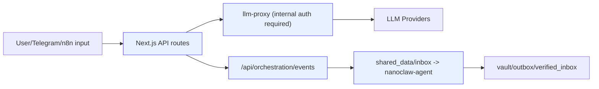
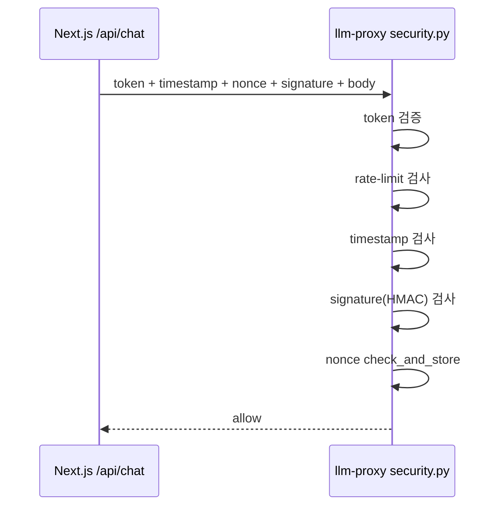
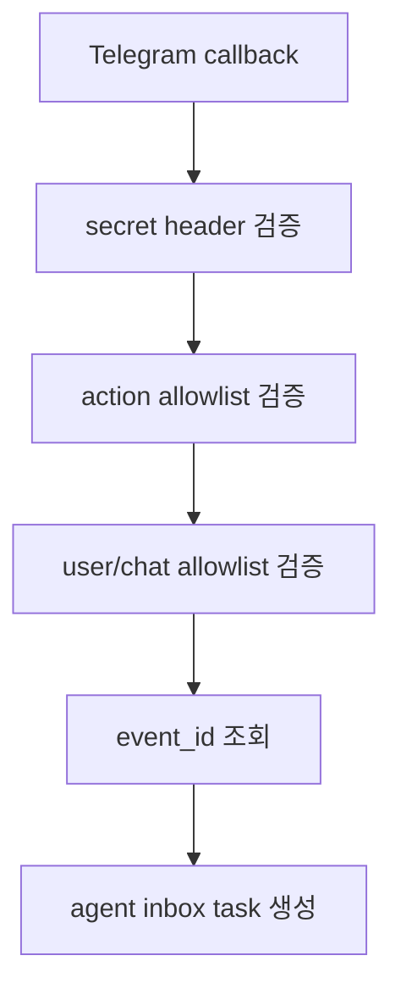

# NanoClaw v2 Security Baseline

기준 시점: 2026-03-03

## 1. 보안 원칙
1. `llm-proxy` 단일 게이트
2. 내부 요청 무결성 검증(token + timestamp + HMAC + replay 방지)
3. 외부 입력 Zero-Trust(검색/웹 수집 결과는 데이터)
4. 최소 권한 컨테이너 기본값
5. Canonical ID only(`minerva`, `clio`, `hermes`)

## 2. Trust Boundary



- 신뢰 경계 안: Next.js API, llm-proxy, nanoclaw-agent, shared_data
- 신뢰 경계 밖: 사용자 입력, 웹 검색 원문, Telegram callback payload, 외부 API 응답

## 3. 내부 인증/무결성 (`/api/agent`, `/api/agents`, `/api/search`)

필수 헤더:
- `x-internal-token`
- `x-timestamp`
- `x-nonce`
- `x-signature`

검증 순서(중요):
1. internal token 상수시간 비교
2. fixed-window rate limit
3. timestamp(±5분) 검증
4. HMAC(`timestamp.nonce.body`) 검증
5. nonce replay 저장/차단



참고:
- nonce는 **signature 검증 이후** 저장한다.  
  무효 서명 요청이 replay cache를 오염시키는 DoS 표면을 줄이기 위한 순서다.
- 관련 환경변수:
  - `INTERNAL_RATE_LIMIT_PER_MINUTE`
  - `INTERNAL_RATE_LIMIT_WINDOW_SEC`
  - `INTERNAL_NONCE_TTL_SEC`
  - `INTERNAL_NONCE_MAX_ENTRIES`

## 4. Telegram Callback 보안
- 경로: `POST /api/telegram/webhook`
- 필수 정책:
  - `x-telegram-bot-api-secret-token` 일치(`TELEGRAM_WEBHOOK_SECRET`)
  - callback source allowlist (`TELEGRAM_ALLOWED_USER_IDS`, `TELEGRAM_ALLOWED_CHAT_IDS`)
  - callback action allowlist (`TELEGRAM_ALLOWED_CALLBACK_ACTIONS`)
  - `action:event_id` 규격만 허용

허용 액션:
- `clio_save`
- `hermes_deep_dive`
- `minerva_insight`



## 5. Google Calendar 연동 보안
- read-only 스코프만 허용:
  - `GOOGLE_CALENDAR_OAUTH_SCOPES=https://www.googleapis.com/auth/calendar.readonly`
- OAuth state TTL(10분) 사용
- 토큰/상태 파일은 `shared_data/shared_memory` 하위 저장

## 6. Hermes 수집 파이프라인 보안
대상 워크플로우:
- `hermes-daily-briefing`
- `hermes-web-search-tavily`

보호 정책:
- prompt-injection 패턴 제거(`ignore previous`, `system prompt`, 코드블록/스크립트 등)
- unsafe URL 차단(`localhost`, 사설 IP, non-http(s))
- 정제된 결과만 downstream 전달(`inert_search_records_only`)
- 필터 통계(`security_stats`)를 출력에 포함

## 7. Docker 하드닝 기본값
모든 핵심 서비스(`nanoclaw-agent`, `llm-proxy`, `n8n`)에 적용:
- `read_only: true`
- `cap_drop: [ALL]`
- `security_opt: ["no-new-privileges:true"]`
- `tmpfs` 사용

## 8. 네트워크 경계
- `internal` 네트워크: `internal: true`
- `external` 네트워크: 외부 통신이 필요한 서비스만 연결
- `nanoclaw-agent`: internal only
- `llm-proxy`, `n8n`: internal + external
- `n8n` 포트는 기본 `127.0.0.1:5678` 로컬 바인딩

## 9. 비밀값 운영
- `.env.local.example`: 템플릿만
- `.env.local`: 실제 비밀값(버전관리 제외)
- 우선 로테이션 대상:
  - `INTERNAL_API_TOKEN`
  - `INTERNAL_SIGNING_SECRET`
  - `N8N_ENCRYPTION_KEY`
  - `TELEGRAM_WEBHOOK_SECRET`
  - `GOOGLE_CALENDAR_OAUTH_CLIENT_SECRET`

## 10. 운영 점검 명령
```bash
npm run security:check-orchestration
npm run verify:smoke
npm run verify:telegram:inline
npm run verify:clio-e2e
```
