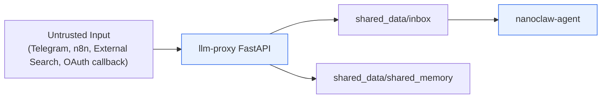
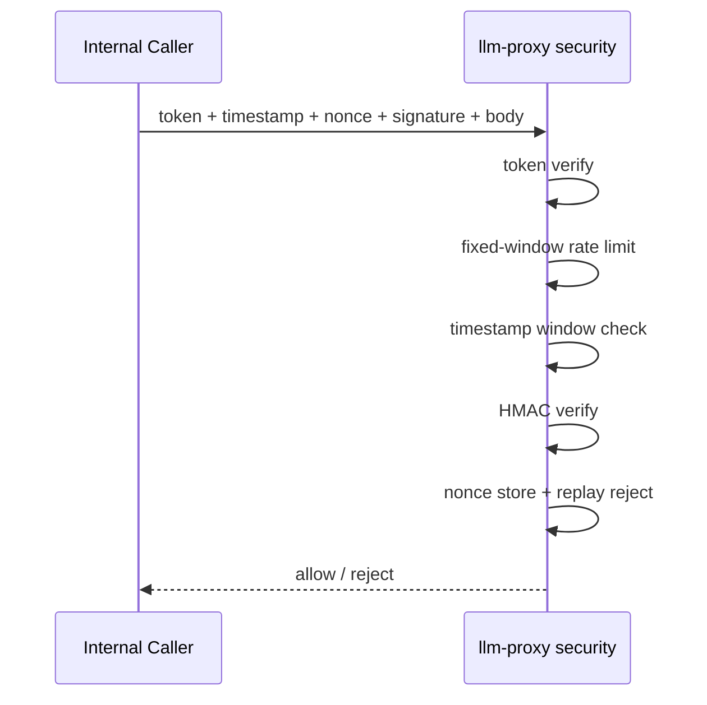

# NanoClaw v2 Security Baseline

이 문서는 어떤 위협을 어떤 통제로 막는지 정리합니다.

## 1) 보호 목표
- 내부 API 위조/변조/재전송(replay) 방지
- Telegram polling bridge/callback 오용 차단
- Hermes 수집 경로의 prompt injection/unsafe URL 차단
- 컨테이너 과권한 축소 및 네트워크 경계 유지

## 2) Trust Boundary



원칙
- 외부 입력은 실행 지시가 아닌 데이터로만 취급합니다.

## 3) 내부 요청 인증/무결성 체인

적용 대상
- `llm-proxy`: `/api/agent`, `/api/agents`, `/api/search`, Google Calendar 내부 조회 엔드포인트

필수 헤더
- `x-internal-token`
- `x-timestamp`
- `x-nonce`
- `x-signature`

검증 순서
1. token 검증
2. rate-limit 검증
3. timestamp 검증
4. HMAC signature 검증
5. nonce 저장/재사용 차단



이 순서의 이유
- 서명 검증 전에 nonce를 저장하면 무효 요청으로 nonce cache를 오염시켜 DoS 표면이 커집니다.

## 4) Telegram 보안 통제

통제 항목
- bridge secret: `TELEGRAM_WEBHOOK_SECRET`
- 호출자 allowlist
  - `TELEGRAM_ALLOWED_USER_IDS`
  - `TELEGRAM_ALLOWED_CHAT_IDS`
- callback action allowlist
  - `TELEGRAM_ALLOWED_CALLBACK_ACTIONS`
- 일반 텍스트 대화 rate-limit
  - `TELEGRAM_TEXT_RATE_LIMIT_WINDOW_SEC`
  - `TELEGRAM_TEXT_RATE_LIMIT_MAX`
- 승인 큐 2단계 확인 + TTL
  - `TELEGRAM_APPROVAL_QUEUE_ENABLED`
  - `TELEGRAM_APPROVAL_REQUIRED_STEPS`
  - `TELEGRAM_APPROVAL_TTL_SEC`

허용 액션 표준
- `clio_save`
- `hermes_deep_dive`
- `minerva_insight`

추가 경계
- 기본 수신 방식은 `telegram-poller`의 outbound polling입니다.
- 공개 Telegram webhook URL은 기본 운영 경로가 아닙니다.
- poller는 `429/일시적 오류`를 재시도하고, 영구 `4xx`만 dead-letter로 남깁니다.
- dead-letter는 운영자가 replay해서 복구할 수 있습니다.

## 5) Hermes 수집 보안 통제

n8n/프록시 공통 원칙
- prompt-like 패턴 제거(`INJECTION_PATTERNS`)
- unsafe URL 차단(`localhost`, private/loopback/link-local)
- 계약: `inert_search_records_only`
- 통계: `security_stats` 유지

적용 파일
- `n8n/workflows/hermes-daily-briefing.json`
- `n8n/workflows/hermes-web-search-tavily.json`
- `proxy/app/search_client.py`

## 6) Google Calendar read-only 통제
- OAuth scope 고정: `https://www.googleapis.com/auth/calendar.readonly`
- 연결/토큰 저장 경로는 shared_memory 고정
- Telegram 명령(`/gcal_connect`, `/gcal_status`, `/gcal_today`)만 운영 플로우로 사용
- 브리핑 자동 첨부는 `GOOGLE_CALENDAR_ATTACH_TO_MORNING_BRIEFING`로 제어

## 7) 런타임 하드닝

공통 하드닝(`docker-compose.yml`)
- `read_only: true`
- `cap_drop: [ALL]`
- `security_opt: ["no-new-privileges:true"]`
- `tmpfs` 사용

네트워크
- `internal`: 내부 통신 전용
- `external`: 외부 API 필요한 서비스만 연결

## 8) 위협-통제 매트릭스

| 위협 | 통제 | 구현 근거 |
|---|---|---|
| 내부 요청 위조 | token + HMAC + timestamp + nonce | `proxy/app/security.py` |
| replay 공격 | nonce TTL + 재사용 차단 | `ReplayWindow` (`proxy/app/security.py`) |
| Telegram 오용 | secret + allowlist + action allowlist + approval queue | `proxy/app/main.py`, `proxy/app/telegram_bridge.py` |
| poller 유실 은닉 | dead-letter 기록 + offset 분리 | `proxy/app/telegram_poller.py` |
| prompt injection | 패턴 제거 + inert data contract | `n8n/workflows/*.json`, `proxy/app/search_client.py` |
| unsafe URL/내부망 유도 | public URL 검증 | n8n code nodes + `search_client.py` |
| Tavily API base 오염 | https + allowlisted host 강제 | `proxy/app/search_client.py`, `n8n/workflows/*.json` |
| 과권한 컨테이너 | read_only/cap_drop/no-new-privileges | `docker-compose.yml` |

## 9) 비밀값 운영 규칙
- 실제 비밀은 `.env.local`에만 저장(커밋 금지)
- `docker-compose.yml`은 `.env.local` 전체를 컨테이너에 주입하지 않고, 서비스별 화이트리스트 키만 전달합니다.
- 우선 로테이션 대상
  - `INTERNAL_API_TOKEN`
  - `INTERNAL_SIGNING_SECRET`
  - `N8N_ENCRYPTION_KEY`
  - `TELEGRAM_WEBHOOK_SECRET`
  - `GOOGLE_CALENDAR_OAUTH_CLIENT_SECRET`
  - `DEEPL_API_KEY`

## 10) 최소 보안 검증 명령

```bash
npm run security:check-orchestration
npm run verify:smoke
npm run verify:runtime:drift
npm run verify:telegram:inline
npm run verify:clio-e2e
npm run test:proxy
```
