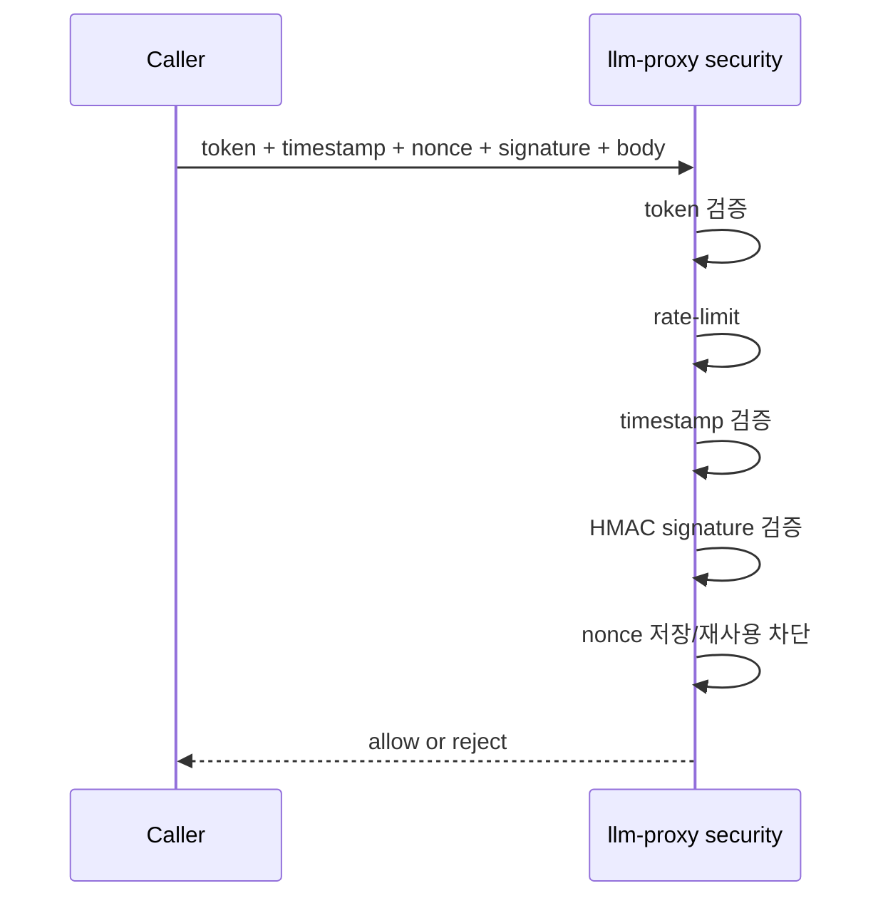

# NanoClaw v2 Security Baseline

이 문서는 "무엇을 막고, 어떤 통제로 막는가"를 설명합니다.
운영 절차는 `OPERATIONS_PLAYBOOK.md`를 봅니다.

## 1) 보안 목표

- 내부 API 위변조/재전송 방지
- 외부 수집 데이터의 프롬프트 인젝션 무해화
- 권한 최소화(컨테이너/네트워크)
- Telegram callback 오용 차단

## 2) Trust Boundary

```mermaid
flowchart LR
  EXT[Untrusted Input\nUser/Telegram/n8n/Web] --> API[Next.js API]
  API --> PX[llm-proxy]
  API --> ORCH[/api/orchestration/events]
  API --> TGCB[/api/telegram/webhook]
  ORCH --> INBOX[shared_data/inbox]
  TGCB --> INBOX
  INBOX --> AG[nanoclaw-agent]

  classDef trusted fill:#e8f1ff,stroke:#3b82f6,stroke-width:1px;
  class API,PX,ORCH,TGCB,AG trusted;
```

원칙: 외부 입력은 항상 "실행 불가 데이터"로 취급합니다.

## 3) 내부 요청 검증 체인

적용 대상: `llm-proxy` (`/api/agent`, `/api/agents`, `/api/search`)

필수 헤더
- `x-internal-token`
- `x-timestamp`
- `x-nonce`
- `x-signature`

검증 순서
1. token 검증
2. rate-limit 검증
3. timestamp 허용 범위 검증
4. HMAC signature 검증
5. nonce 저장 및 재사용 차단



순서 이유
- signature 이전 nonce 저장을 금지해야, 무효 서명 요청으로 replay cache를 오염시키는 DoS를 줄일 수 있습니다.

## 4) Telegram 보안

- webhook secret 검증: `TELEGRAM_WEBHOOK_SECRET`
- 허용 사용자/채팅만 통과: `TELEGRAM_ALLOWED_USER_IDS`, `TELEGRAM_ALLOWED_CHAT_IDS`
- 허용 액션만 통과: `TELEGRAM_ALLOWED_CALLBACK_ACTIONS`
- 텍스트 대화 rate-limit 적용

허용 인라인 액션
- `clio_save`
- `hermes_deep_dive`
- `minerva_insight`

## 5) Hermes 수집 보안

- prompt-like 패턴 제거
- unsafe URL 제거(`localhost`, 사설 IP, 비정상 스킴)
- downstream에는 정제된 레코드만 전달 (`inert_search_records_only`)
- 필터 통계를 결과에 포함 (`security_stats`)

## 6) 런타임 하드닝

모든 핵심 서비스 기본값
- `read_only: true`
- `cap_drop: [ALL]`
- `security_opt: ["no-new-privileges:true"]`
- `tmpfs` 사용

네트워크 분리
- `internal` 네트워크: 핵심 서비스 통신
- `external` 네트워크: 외부 API 호출이 필요한 서비스만 연결

## 7) 비밀값 관리

- 실제 비밀값은 `.env.local`만 사용(커밋 금지)
- 우선 로테이션 대상
  - `INTERNAL_API_TOKEN`
  - `INTERNAL_SIGNING_SECRET`
  - `N8N_ENCRYPTION_KEY`
  - `TELEGRAM_WEBHOOK_SECRET`
  - `GOOGLE_CALENDAR_OAUTH_CLIENT_SECRET`
  - `DEEPL_API_KEY`

## 8) 최소 보안 점검 명령

```bash
npm run security:check-orchestration
npm run verify:smoke
npm run verify:telegram:inline
npm run verify:clio-e2e
```
