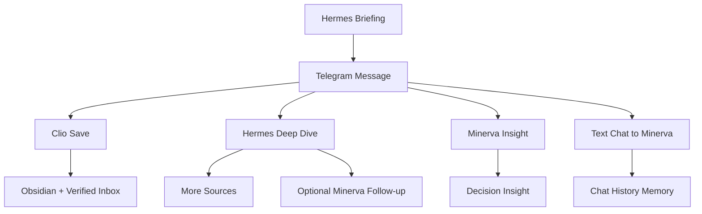

# NanoClaw v2 Use Cases

이 문서는 "실제 사용자가 어떤 흐름으로 결과를 받는가"를 설명합니다.
구조는 `ARCHITECTURE.md`, 운영은 `OPERATIONS_PLAYBOOK.md`를 참고합니다.

## 1) 아침 브리핑 수신 (Hermes -> Minerva -> Telegram)

목표
- 스케줄 기반으로 수집된 신호를 Minerva 브리핑으로 수신

흐름
1. n8n 스케줄 트리거(P0/P1/P2)
2. Hermes 워크플로가 소스 정제/중복 억제
3. `/api/orchestration/events`로 이벤트 전달
4. Minerva 포맷으로 Telegram 브리핑 전송

결과물
- Telegram 메시지(주제/핵심 요약/출처/인사이트)
- `shared_data/shared_memory/agent_events.json` 기록

## 2) 브리핑에서 즉시 저장 (Clio 버튼)

목표
- 브리핑 내용을 즉시 지식 자산으로 저장

흐름
1. Telegram 인라인 `Clio, 옵시디언에 저장해`
2. `/api/telegram/webhook` 검증 후 clio task 생성
3. `nanoclaw-agent`가 inbox 처리
4. Obsidian markdown + verified payload 생성

결과물
- `shared_data/obsidian_vault/*.md`
- `shared_data/verified_inbox/*.json`

## 3) 추가 근거 수집 (Hermes 버튼)

목표
- 기존 주제의 근거를 더 수집

흐름
1. Telegram 인라인 `Hermes, 더 찾아`
2. hermes deep-dive task 생성
3. Hermes가 연관 소스 재수집/정리
4. 옵션: `HERMES_DEEP_DIVE_AUTO_MINERVA=true`면 Minerva 후속 분석 자동 생성

결과물
- hermes outbox 결과
- (옵션) minerva follow-up task

## 4) 2차 사고 분석 요청 (Minerva 버튼)

목표
- 수집된 신호를 의사결정 관점으로 재해석

흐름
1. Telegram 인라인 `Minerva, 인사이트 분석해`
2. minerva insight task 생성
3. Minerva가 우선순위/리스크/액션 중심 응답

결과물
- Telegram 후속 인사이트 메시지
- memory timeline 기록

## 5) 일반 대화형 질의 (Telegram Text -> Minerva)

목표
- 텔레그램에서 자연어로 Minerva와 대화

흐름
1. 텍스트 메시지 수신
2. allowlist + rate-limit + webhook secret 검증
3. `/api/chat(agent=minerva)` 브리지
4. 응답 송신 + chat history 저장

결과물
- Telegram 대화 응답
- `shared_data/shared_memory/telegram_chat_history.json`

## 6) 전체 유스케이스 맵

