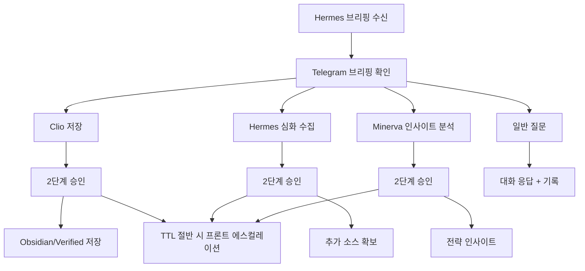

# NanoClaw v2 Use Cases

이 문서는 실제 사용 시나리오를 기준으로 입력, 처리, 결과물을 정리합니다.

## 1) 핵심 시나리오 한눈에 보기

| 시나리오 | 트리거 | 시스템 처리 | 사용자 결과 |
|---|---|---|---|
| 아침 브리핑 | n8n schedule(P0/P1/P2) | Hermes 수집 -> Minerva 포맷 -> Telegram 전송 | 카테고리별 요약 브리핑 수신 |
| Clio 저장 | 인라인 `Clio, 옵시디언에 저장해` | 2단계 승인 -> inbox task -> agent 처리 | Obsidian 노트/verified payload 생성 |
| Hermes 심화 수집 | 인라인 `Hermes, 더 찾아` | 2단계 승인 -> 심화 수집 task | 추가 근거 소스 확보 |
| Minerva 인사이트 | 인라인 `Minerva, 인사이트 분석해` | 2단계 승인 -> Minerva 분석 task | 2차 사고 기반 분석 결과 수신 |
| 일반 대화 | Telegram 텍스트 | `/api/chat` 브리지 + 메모리 컨텍스트 | 자연어 질의응답 |
| 승인 에스컬레이션 | 승인 대기 TTL 절반 도달 | 프론트 승인 카드 발행 | 승인 누락 방지 |

## 2) 시나리오 상세

### 2-1) 아침 브리핑

입력
- n8n 스케줄 트리거

처리
1. Hermes가 수집/필터/중복 억제
2. Event Contract v1로 오케스트레이션 전달
3. Minerva 형식으로 Telegram 브리핑 생성

산출물
- Telegram 브리핑 메시지
- `shared_memory/agent_events.json` 기록

### 2-2) Clio 저장

입력
- Telegram 인라인 버튼 클릭

처리
1. callback 인증(비밀/allowlist/action)
2. 2단계 승인 완료
3. `shared_data/inbox`에 clio task 생성
4. nanoclaw-agent가 vault/verified 결과 생성

산출물
- `shared_data/obsidian_vault/*.md`
- `shared_data/verified_inbox/*.json`

### 2-3) Hermes 심화 수집

입력
- Telegram 인라인 버튼 클릭

처리
1. 2단계 승인
2. hermes deep-dive task 생성
3. 관련 소스 확장 수집
4. 옵션: 후속 Minerva 분석 task 자동 생성

산출물
- deep-dive 결과(outbox)
- 옵션 Minerva follow-up

### 2-4) Minerva 인사이트 분석

입력
- Telegram 인라인 버튼 클릭

처리
1. 2단계 승인
2. Minerva 분석 task 생성
3. 우선순위/영향/액션 중심 분석

산출물
- 인사이트 메시지
- 메모리 타임라인 누적

### 2-5) Telegram 일반 대화

입력
- 일반 텍스트 메시지

처리
1. webhook 인증/허용 검사
2. `/api/chat(agent=minerva)` 호출
3. chat history + compact memory 반영

산출물
- 대화 응답
- `telegram_chat_history.json`

## 3) 사용자 여정 다이어그램

## 4) Telegram 브리핑 포맷 의도

고정 섹션
- `주제`
- `핵심 요약`
- `출처`
- `Minerva 인사이트`

의도
- 읽기 우선: 불필요한 마크다운 기호 제거
- 실행 우선: 버튼 액션과 연결되는 구조 유지
- 확장성: 멀티 주제(n개)에도 동일 포맷 유지

## 5) 성공 기준

- 사용자는 브리핑을 받고, 버튼 1회 진입으로 고위험 액션을 안전하게 실행한다.
- 승인 만료/누락은 프론트 에스컬레이션으로 보완된다.
- 결과물은 `inbox -> agent -> vault/outbox/verified` 경로에서 추적 가능하다.
