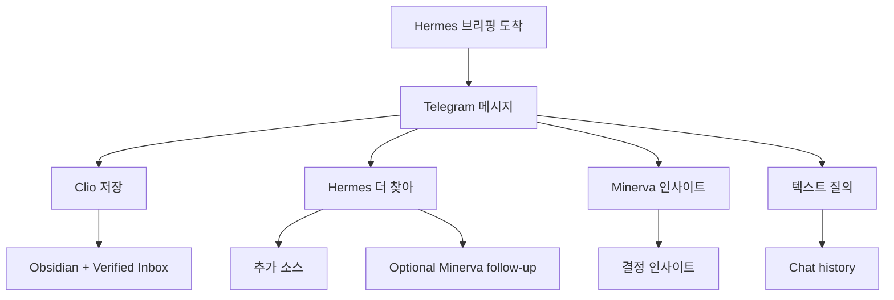

# NanoClaw v2 Use Cases

이 문서는 "사용자가 무엇을 입력하고 어떤 결과물을 받는가"를 설명합니다.
구조는 `ARCHITECTURE.md`, 운영은 `OPERATIONS_PLAYBOOK.md`를 참고합니다.

## 1) 시나리오 요약표

| 시나리오 | 시작점 | 핵심 액션 | 산출물 |
|---|---|---|---|
| 아침 브리핑 수신 | n8n schedule | Hermes 수집 -> Minerva 브리핑 전송 | Telegram 브리핑 + event 기록 |
| Clio 저장 | Telegram 인라인 버튼 | `clio_save` callback | Obsidian md + verified payload |
| Hermes 추가 수집 | Telegram 인라인 버튼 | `hermes_deep_dive` callback | 추가 소스 결과 + (옵션) Minerva 후속 분석 |
| Minerva 인사이트 분석 | Telegram 인라인 버튼 | `minerva_insight` callback | 우선순위/리스크 중심 분석 메시지 |
| Telegram 텍스트 대화 | Telegram 일반 메시지 | `/api/chat(agent=minerva)` 브리지 | 대화 응답 + chat history |

## 2) 아침 브리핑 수신 (Hermes -> Minerva -> Telegram)

입력
- n8n 스케줄 트리거(P0/P1/P2)

처리
1. Hermes 워크플로가 소스 정제/중복 억제
2. `/api/orchestration/events`로 이벤트 전달
3. Minerva 포맷으로 Telegram 브리핑 발송

결과물
- Telegram 브리핑(주제/핵심 요약/출처/인사이트)
- `shared_data/shared_memory/agent_events.json`

## 3) 브리핑 즉시 저장 (Clio 버튼)

입력
- Telegram 인라인 `Clio, 옵시디언에 저장해`

처리
1. `/api/telegram/webhook` 검증 통과
2. clio task 생성 -> `shared_data/inbox`
3. `nanoclaw-agent`가 task 처리

결과물
- `shared_data/obsidian_vault/*.md`
- `shared_data/verified_inbox/*.json`

## 4) 추가 근거 수집 (Hermes 버튼)

입력
- Telegram 인라인 `Hermes, 더 찾아`

처리
1. hermes deep-dive task 생성
2. Hermes가 연관 소스 재수집/정리
3. 옵션: `HERMES_DEEP_DIVE_AUTO_MINERVA=true`면 Minerva 후속 분석 자동 생성

결과물
- hermes outbox 결과
- (옵션) minerva follow-up task

## 5) Minerva 2차 사고 분석

입력
- Telegram 인라인 `Minerva, 인사이트 분석해`

처리
1. minerva insight task 생성
2. Minerva가 우선순위/영향/다음 액션 관점으로 분석

결과물
- Telegram 후속 인사이트 메시지
- memory timeline 누적

## 6) Telegram 일반 대화

입력
- Telegram 일반 텍스트 메시지

처리
1. allowlist + rate-limit + webhook secret 검증
2. `/api/chat(agent=minerva)` 브리지
3. 응답 송신 + history 저장

결과물
- Telegram 대화 응답
- `shared_data/shared_memory/telegram_chat_history.json`

## 7) 전체 사용자 여정

