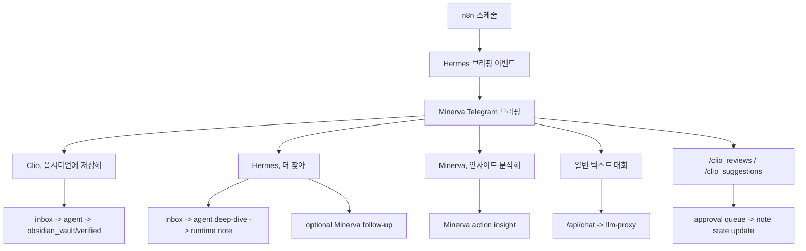

# NanoClaw v2 Use Cases

이 문서는 사용자가 어떤 입력을 주고, 시스템이 어떤 산출물을 내는지 현재 운영 흐름 기준으로 설명합니다.

## 1) 시나리오 요약

| 시나리오 | 시작점 | 핵심 처리 | 산출물 |
|---|---|---|---|
| 아침 브리핑 수신 | n8n schedule(P0/P1/P2) | Hermes 수집 -> Minerva 브리핑 | Telegram 브리핑 + event log |
| Clio 저장 | Telegram 인라인 버튼 | callback -> inbox task -> agent 처리 | Obsidian note + verified payload |
| Hermes 추가 수집 | Telegram 인라인 버튼 | callback -> hermes task | 추가 근거 + outbox + optional follow-up |
| Minerva 인사이트 | Telegram 인라인 버튼 | callback -> minerva task | 우선순위 액션 인사이트 |
| Telegram 일반 대화 | Telegram 일반 텍스트 | `/api/chat(agent=minerva)` 호출 | 대화 응답 + chat history |
| Clio review/suggestion 승인 | Telegram 명령 | pending review/suggestion -> 2단계 승인 | note 상태 업데이트 |

## 2) 브리핑 수신 시나리오

입력
- `Hermes Daily Briefing Workflow` 스케줄 트리거

처리
1. P0/P1/P2 소스 수집
2. injection/unsafe URL 필터링
3. dedup guard
4. `/api/orchestration/events`로 이벤트 발행
5. 정책 엔진(즉시/다이제스트/쿨다운)
6. Telegram 브리핑 발송

결과물
- Telegram 메시지(주제/핵심 요약/출처/Minerva 인사이트)
- `shared_data/shared_memory/agent_events.json`
- `shared_data/shared_memory/memory.md`

## 3) Clio 저장 시나리오

입력
- Telegram 인라인: `Clio, 옵시디언에 저장해`

처리
1. secret + allowlist + action allowlist 검증
2. `shared_data/inbox/*.json` task 생성
3. agent가 파일 감시 후 처리
4. Clio가 type 분류, 템플릿 선택, tag/project/MOC 연결 생성
5. knowledge면 review queue 생성 가능

결과물
- user-facing note: `shared_data/obsidian_vault/<folder>/*.md`
- verified payload: `shared_data/verified_inbox/*.json`
- outbox metadata: `shared_data/outbox/*.json`

## 4) Hermes 추가 수집 시나리오

입력
- Telegram 인라인: `Hermes, 더 찾아`

처리
1. hermes deep-dive task 생성
2. agent가 deep-dive 결과를 runtime note/outbox로 반영
3. `HERMES_DEEP_DIVE_AUTO_MINERVA=true`면 Minerva follow-up task 자동 생성

결과물
- Hermes deep-dive 산출물
- optional Minerva 후속 인사이트 태스크

## 5) Minerva 인사이트 시나리오

입력
- Telegram 인라인: `Minerva, 인사이트 분석해`

처리
1. minerva task 생성
2. Minerva가 2차 사고(인과/파급/우선순위) 중심으로 분석

결과물
- Minerva 분석 메시지
- 관련 이벤트/메모리 누적

## 6) Telegram 일반 대화 시나리오

입력
- Telegram 텍스트 (`/help`, `/reset`, 일반 질의)

처리
1. allowlist 검증
2. rate-limit 적용
3. chat history 로드
4. Minerva working memory 주입
5. `/api/chat(agent=minerva)` 호출
6. 응답 전송 + history/timeline 저장

결과물
- Telegram 응답
- `shared_data/shared_memory/telegram_chat_history.json`
- `shared_data/shared_memory/minerva_working_memory.json`
- `shared_data/shared_memory/memory.md`

## 7) Clio review / suggestion 승인 시나리오

입력
- Telegram 명령: `/clio_reviews`, `/clio_suggestions`
- Telegram 인라인: approve/dismiss callback

처리
1. pending claim review 또는 note suggestion 조회
2. Telegram에 점수/근거/변경 요약 표시
3. 2단계 승인 큐 생성
4. 승인 시 note frontmatter/state 갱신
5. dismiss 시 cooldown 적용

결과물
- claim review: `draft -> confirmed`
- note suggestion: `draft -> review` 또는 관련 링크/주석 반영
- queue/memory 상태 갱신

## 8) End-to-End 사용자 여정

## 9) 현재 제약
- Telegram 외 채널(Slack/Email) 추상화는 아직 없습니다.
- Aegis runtime은 아직 계획 단계입니다.
- NotebookLM은 실운영 검증이 남아 있습니다.
- 7일 연속 morning briefing 성공 데이터는 아직 운영 관찰 중입니다.
