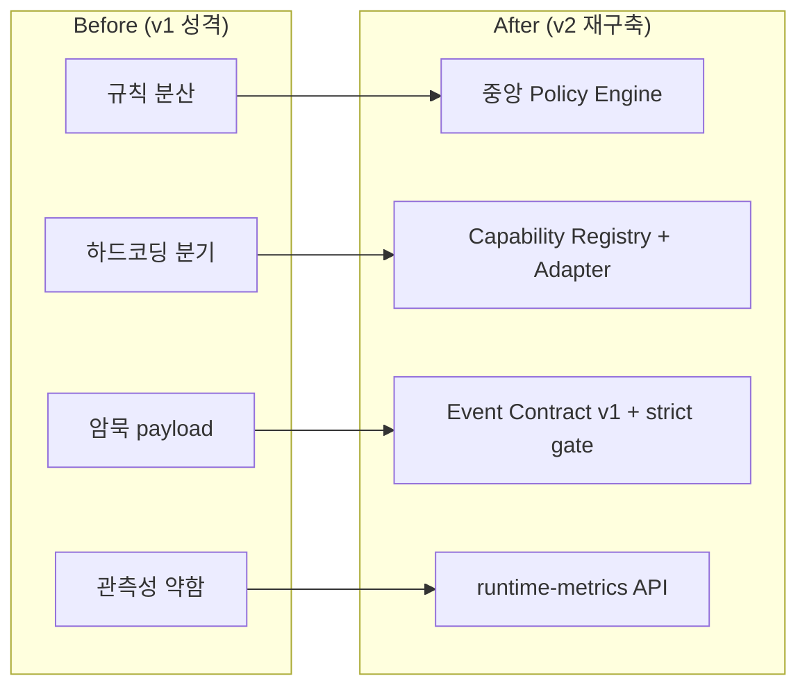
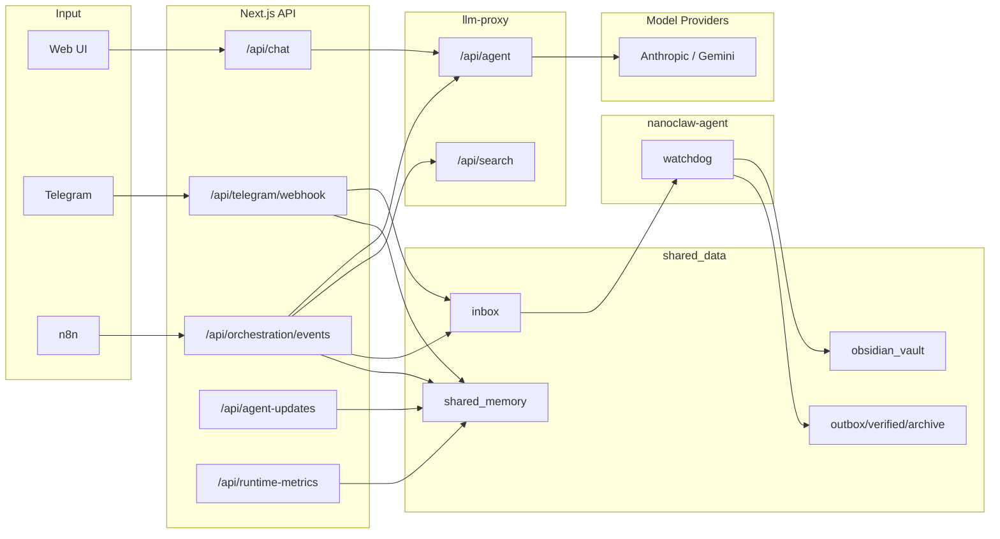
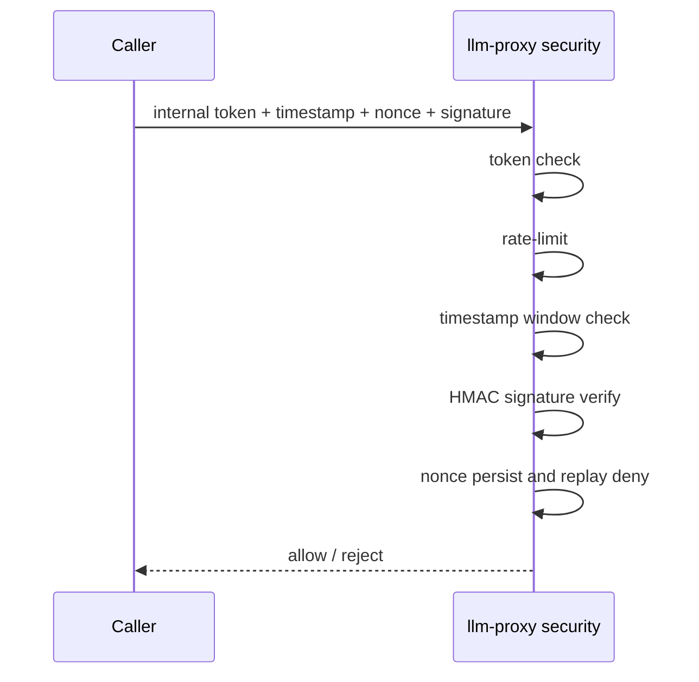
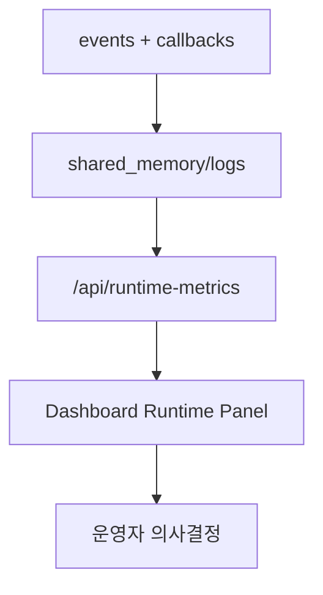

# NanoClaw v2 Rebuild Report

기준일: 2026-03-05
대상: NanoClaw v2 재구축 결과(구조/보안/운영/확장성)

이 문서는 "무엇이 왜 바뀌었는지"를 발표 자료처럼 빠르게 이해하기 위한 문서입니다.

## 1) Executive Summary

NanoClaw v2 재구축의 핵심은 아래 3가지입니다.

1. 역할 분리 고정
- `minerva`: 오케스트레이션/우선순위/결정
- `clio`: 문서화/지식 정리
- `hermes`: 수집/트렌드/브리핑

2. 보안 체인 강화
- llm-proxy 단일 게이트
- 내부 인증 체인(token/timestamp/nonce/signature)
- strict event contract 게이트
- Telegram 2단계 승인
- 최소 권한 컨테이너

3. 운영 가능성 강화
- 정책 중앙화
- capability 기반 확장 구조
- runtime-metrics 기반 관측성 확보

## 2) v1 -> v2 구조 변화 (핵심)

## 3) 왜 이렇게 바꿨는가 (의사결정 근거)

| 설계 결정 | 이유 | 실효 |
|---|---|---|
| Canonical ID 고정 | alias/중복 정의는 운영 중 드리프트를 유발 | 역할 혼선 제거 |
| LLM 게이트 단일화 | 인증/재시도/메트릭이 경로마다 달라지는 문제 해결 | 장애 분석 단순화 |
| Policy Engine 중앙화 | 이벤트/승인/번역 정책이 흩어지면 예외가 폭증 | 일관 동작 확보 |
| Event Contract 도입 | n8n/서버 변경 시 암묵 계약 파손 방지 | 배포 안정성 향상 |
| Capability 레이어 도입 | 기능 추가 때 코어 코드 파편화 방지 | 장기 확장 비용 절감 |
| 2단계 승인 큐 | 자동화 오동작의 마지막 안전장치 필요 | 고위험 액션 통제 |
| 2단계 메모리 압축 | 장기 운영에서 입력 토큰 비용 급증 | 비용/지연 안정화 |

## 4) 현재 시스템 구조

## 5) 보안 구조 (검증 체인)

Event 입력 게이트
- `ORCH_REQUIRE_SCHEMA_V1=true`
- envelope 누락 시 `schema_version_required`
- 필드 검증 실패 시 `invalid_event_contract + validationErrors`

Telegram 액션 게이트
- secret + allowlist + action allowlist
- 2단계 승인 + TTL(기본 5분)
- TTL 절반 시 프론트 에스컬레이션

## 6) 운영 구조 (지표 중심)

운영은 "체감"이 아니라 "지표"로 판단하도록 개편했습니다.

핵심 지표
- LLM: total/success/quota/fallback/latency(p95)
- Orchestration: decision 분포(send_now/queue/suppressed)
- Telegram: attempted/sent/successRate
- Approvals: pending_step1/pending_step2/approved/rejected/expired
- DeepL: attempts/translated/failed/chars

## 7) 확장성 구조

현재 확장 경로
1. capability 등록
2. adapter 구현체 연결
3. policy 값 조정

장점
- 채널/툴 추가 시 라우트 코드 직접 수정 최소화
- 기능별 테스트 범위 축소
- 병렬 작업 충돌 감소

## 8) 실제 적용된 주요 파일(핵심)

- 정책: `src/lib/orchestration/policy.ts`
- 이벤트 계약: `src/lib/orchestration/event-contract.ts`
- 승인: `src/lib/orchestration/approvals.ts`
- 확장 레이어: `src/lib/orchestration/capability-registry.ts`, `src/lib/orchestration/capability-adapters.ts`
- 오케스트레이션 라우트: `src/app/api/orchestration/events/route.ts`
- 운영 지표 API/패널: `src/app/api/runtime-metrics/route.ts`, `src/components/chat-dashboard/runtime-metrics-panel.tsx`
- 프록시 사용량/지연 기록: `proxy/app/main.py`
- 검증 스크립트: `scripts/verify/check-event-contract-strict.sh`, `scripts/verify/check-orchestration-flow.sh`, `scripts/verify/check-telegram-inline-actions.sh`

## 9) 지금 상태 평가

강점
- 보안 경계와 운영 검증이 코드/스크립트/문서로 일치
- strict contract + approval queue로 실운영 안전성 확보
- 확장 구조(capability/policy) 기반 마련 완료

남은 과제
1. capability 대상을 더 늘려 코어 의존 추가 축소
2. approval queue와 프론트 UX의 세부 정책(대량 승인/만료 처리) 고도화
3. 지표 기반 자동 알람(SLO 임계치) 연결

## 10) 결론

v2는 "기능 추가 가능한 구조"와 "운영 가능한 보안 체계"를 동시에 확보했습니다.
현재 구조는 이전 대비 스파게티 위험을 크게 줄였고, 이후 확장은 정책/계약/어댑터 레이어 위에서 예측 가능하게 진행할 수 있습니다.
