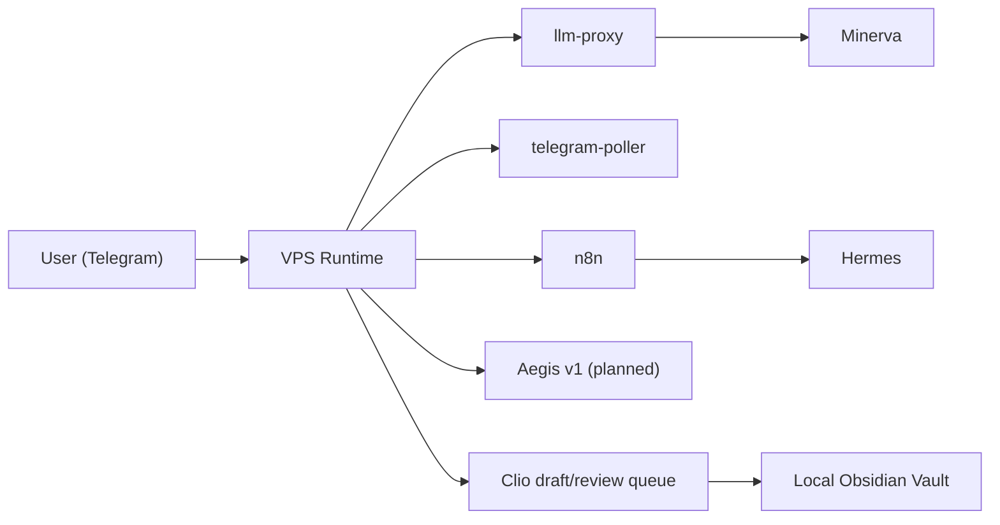

# VPS Operation Plan (기획 전용, 미배포)

상태: **Planning only**

이 문서는 현재 Telegram-first NanoClaw를 나중에 VPS로 옮길 때의 운영 범위를 고정합니다.
목표는 "지금 당장 배포"가 아니라, 비용과 보안을 통제한 상태에서 언제든 이전할 수 있는 기준선을 만드는 것입니다.

## 1) 현재 전제

현재 실제 작동 범위
- `llm-proxy`
- `telegram-poller`
- `n8n`
- `nanoclaw-agent`
- `shared_data/obsidian_vault` 기반 Clio draft/review/suggestion

현재 병목
- 맥북 잠자기 시 `telegram-poller`, `n8n`, `llm-proxy`가 함께 멈춤
- 그래서 `09:00 KST` daily briefing이 운영 환경에 종속됨
- 코드 문제가 아니라 "always-on 런타임 부재"가 주된 원인

## 2) VPS 도입 목적

목적
- morning briefing과 Telegram 응답 경로를 24/7로 유지
- 맥북 전원/잠자기 상태와 운영 성공률을 분리
- 로컬은 개발/지식관리, VPS는 always-on runtime으로 역할 분리

비목적
- 지금 당장 전체 시스템을 인터넷에 공개하지 않음
- 지금 당장 Clio user-facing vault까지 VPS로 이동하지 않음
- Aegis를 자율 복구 에이전트로 바로 배포하지 않음

## 3) 권장 이전 범위

### VPS에 먼저 둘 것
- `llm-proxy`
- `telegram-poller`
- `n8n`
- runtime logs / drift check / morning observation

### 당분간 로컬에 둘 것
- `shared_data/obsidian_vault`
- 개인 지식 노트
- Clio 최종 user-facing write
- 개발용 실험 자산

### 로컬/원격 중간 단계
- 목표 상태:
  - Clio는 VPS에서 `draft/review request`까지만 만들고,
  - 최종 user-facing write는 로컬 vault 또는 승인 기반 sync로 유지
- 현재 구현 상태:
  - review/suggestion 승인 시 같은 shared filesystem 안의 vault 파일을 직접 갱신한다
  - 즉, 아래 분리는 현재 구현이 아니라 VPS 이전 전 추가로 만들어야 할 경계다

## 4) 단계별 이전 계획

### Phase 0. 준비
- 현재 로컬 구조와 문서 정합성 확보
- `PRE_VPS_GATES` 통과 전에는 배포하지 않음

### Phase 1. always-on runtime만 VPS로 이동
- `llm-proxy`
- `telegram-poller`
- `n8n`
- 목적: `09:00 KST` briefing 안정화

### Phase 2. 관측/경보 추가
- runtime health check
- observation log
- drift audit
- Aegis v1 read-only 감시

### Phase 3. 제한적 Clio 연동
- local vault는 유지
- VPS는 review queue / suggestion queue / intermediate artifact만 관리

### Phase 4. 재평가
- 실제 사용 패턴과 비용을 본 뒤
- Clio user-facing write를 계속 로컬에 둘지, 부분 sync로 옮길지 판단

## 5) 추천 초기 사양

현재 구조 기준 권장 시작선
- `2 vCPU`
- `4 GB RAM`
- `40~80 GB disk`

이유
- 모델 추론은 외부 API 호출이라 CPU 집약도가 낮음
- 핵심은 `n8n + Docker + proxy + logs`의 안정 메모리
- `1~2 GB`는 운영 리스크가 커서 false economy에 가까움

## 6) 예상 월 비용 범위

보수적 기준
- VPS 인프라: `약 $20~25 / mo`
- API 비용(현재 모델 구성 기준): `약 $15~30 / mo`
- 전체 운영비: `약 $40~55 / mo`

참고
- 지금은 배포하지 않으므로 이 문서는 "예산 가드레일" 역할만 합니다.
- 실제 이전 시점에 공급자/가격은 다시 확인합니다.

## 7) 성공 기준

VPS 이전을 "성공"으로 볼 기준
- 7일 연속 morning briefing 성공
- Telegram 일반 대화 지연 증가가 체감되지 않음
- 로컬 vault와 runtime data 경계가 유지됨
- 실패 시 5분 안에 원인 파악 가능

## 8) 롤백 기준

즉시 로컬-only로 되돌리는 조건
- Telegram delivery failure 반복
- n8n schedule drift 반복
- 비용이 예산 상한 초과
- local vault 경계가 무너짐
- Aegis/정책 게이트 미도입 상태에서 외부 노출이 늘어남
