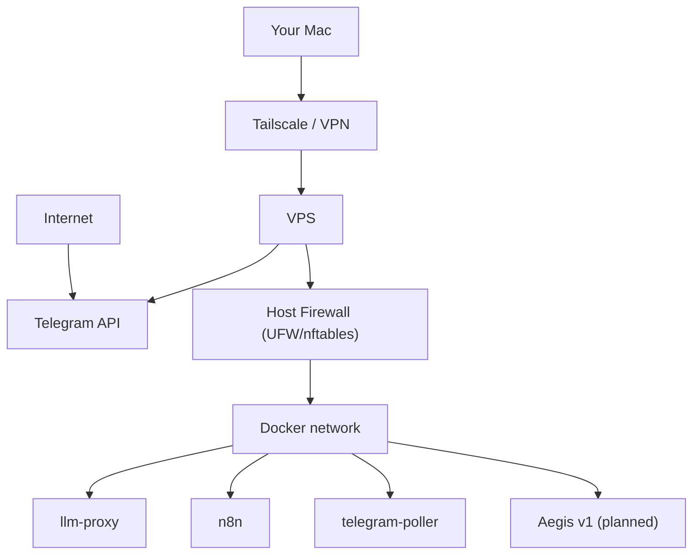
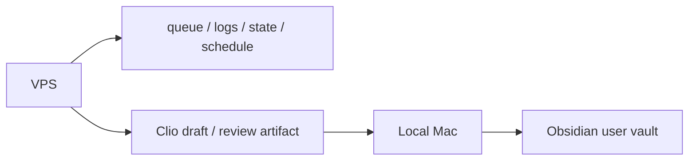
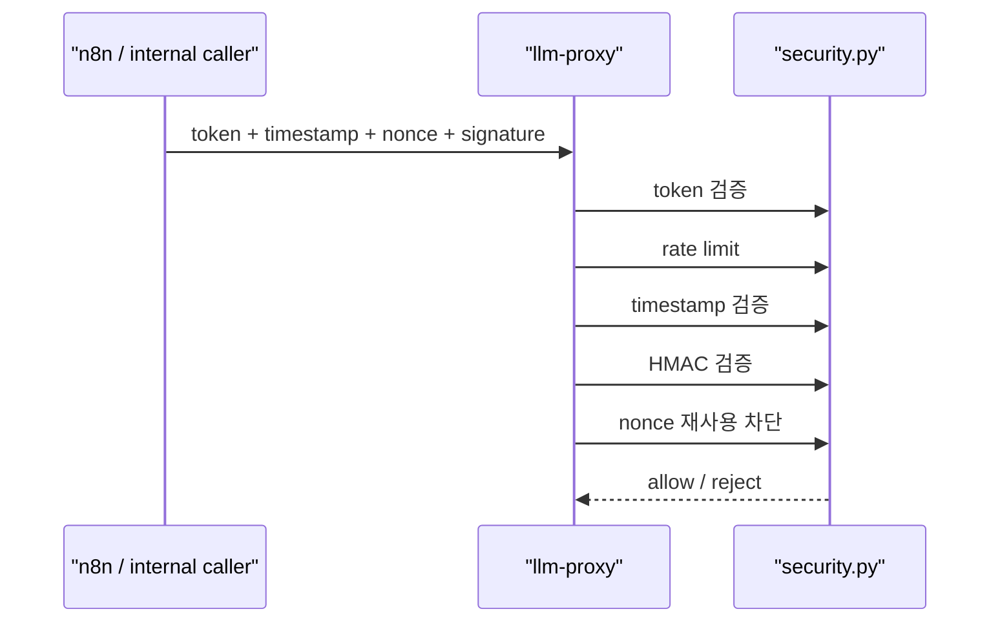
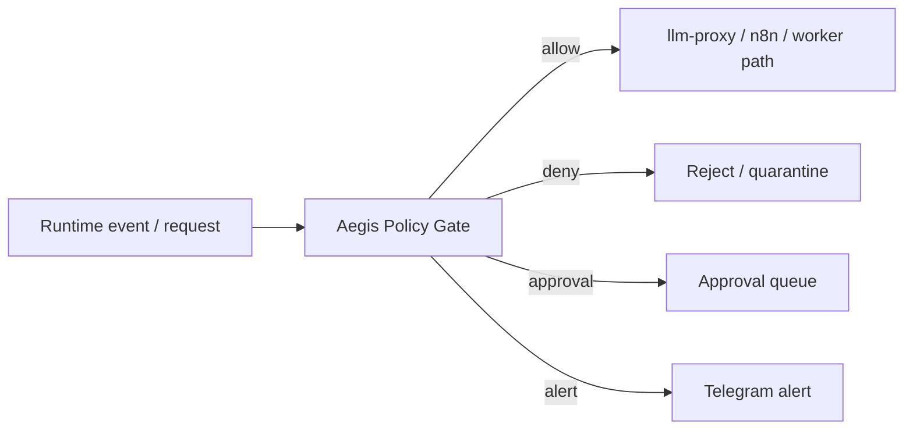

# VPS Security Architecture (기획 전용, 미배포)

상태: **Planning only**

이 문서는 NanoClaw를 VPS에 올릴 때의 보안 구조를 현재 코드 기준으로 설계한 문서입니다.
목표는 "잘 동작하는 서버"가 아니라, "공격면을 좁히고, 실패 반경을 제한하며, 복구 가능한 서버"를 만드는 것입니다.

## 1) 설계 원칙

- public ingress를 최소화한다
- Telegram은 가능하면 polling 유지로 inbound webhook를 줄인다
- `llm-proxy`, `n8n UI`, internal API는 기본적으로 외부 비공개
- SSH는 공용 인터넷이 아니라 `Tailscale/VPN only`
- user-facing vault는 로컬 유지
- 시크릿은 fail-closed + short-lived access 선호
- Aegis는 worker가 아니라 control plane으로 설계

## 2) 네트워크 경계

외부 공개 원칙
- Telegram polling이면 Telegram inbound webhook URL 불필요
- `llm-proxy`는 public bind 금지
- `n8n` UI는 public bind 금지
- SSH는 `22/tcp` 공용 개방 대신 VPN/Tailscale 경유만 허용

## 3) 데이터 경계

### VPS에 올라가도 되는 것
- schedule/workflow state
- runtime logs
- briefing observation
- signed orchestration payload
- review/suggestion queue

### 로컬 유지가 맞는 것
- Obsidian user-facing vault
- 개인 장기 지식
- 민감한 프로젝트 초안
- 실험용 노트/개인 자료

## 4) 인증/인가 구조

현재 유지해야 하는 통제
- internal token
- timestamp
- nonce
- HMAC signature
- allowlist / callback action allowlist

원칙
- 시크릿 기본값 금지
- 환경값 누락 시 fail-closed
- internal API는 로컬에서처럼 signed gate 뒤에만 둔다

## 5) 시크릿 관리

현재 로컬 기준
- `.env.local` + Keychain/1Password ref

VPS 기준 권장
- 앱 runtime에는 최소한의 환경변수만 주입
- 서비스별 env 분리 유지
- 장기적으로는 secret manager 또는 최소한 파일 권한 + root-only env 로드

최소 기준
- `0600` 권한
- `docker-compose` 서비스별 화이트리스트 주입
- 시크릿 rotate 절차 문서화

## 6) 컨테이너 보안 기준

현재 기준을 유지
- `read_only`
- `cap_drop: [ALL]`
- `no-new-privileges`
- `tmpfs`
- internal/external network 분리

VPS에서도 유지해야 하는 것
- docker socket 비노출
- host bind 최소화
- volume mount 최소화
- local vault direct mount 금지

## 7) Aegis v1 위치

Aegis는 "네 번째 업무 에이전트"가 아니라 control plane입니다.

초기 범위
- read-only 감시
- risk score
- allow / deny / require_approval

금지
- 자율 코드 수정
- 자율 재배포
- 자율 정책 rewrite
- broad shell access

## 8) 관측/복구

필수
- health
- runtime metrics
- morning observation
- drift audit
- failure bundle 수집

복구 원칙
- 자동 복구보다 containment 우선
- 고위험 조치는 human-in-the-loop
- 실패 원인과 조치 내역은 audit log로 남김

## 9) 공격면 관점 체크리스트

막아야 할 것
- public webhook 스캔
- signed gate 우회
- vault 직접 쓰기
- broad secret lateral movement
- n8n UI 무방비 노출

줄여야 할 것
- stale backup/log 무제한 보존
- 운영자 실수로 인한 env 노출
- 과도한 public port

## 10) 성공 기준

- public exposed surface가 Telegram outbound와 VPN 관리 경로로 제한됨
- `llm-proxy`, `n8n`, internal API가 공용 인터넷에 직접 노출되지 않음
- local vault compromise 없이 always-on briefing이 가능함
- 장애 시 5분 안에 원인과 containment 선택지가 보임
